# 採購模組 程式功能規格書 - 系統管理

## 文件基本資訊

| 項目 | 說明 |
|------|------|
| **文件名稱** | 採購模組程式功能規格書 - 系統管理 |
| **模組代號** | PR |
| **版本** | v1.0 |
| **建立日期** | 2024年12月21日 |
| **建立人員** | 系統分析師 |
| **審核人員** | 專案經理 |
| **文件狀態** | 初稿 |
| **最後更新** | 2024年12月21日 |

---

## 目錄

1. [基本資料](#基本資料)
2. [檔案架構與關聯圖](#檔案架構與關聯圖)
3. [檔案名稱與欄位規格](#檔案名稱與欄位規格)
4. [輸出/入螢幕布局與說明](#輸出入螢幕布局與說明)
5. [處理流程程序說明](#處理流程程序說明)
6. [子程序處理邏輯說明](#子程序處理邏輯說明)
7. [錯誤處理程序說明與訊息清冊](#錯誤處理程序說明與訊息清冊)
8. [備註](#備註)

---

## 基本資料

### 1.1 模組概述

#### 1.1.1 模組功能說明
採購模組的系統管理功能主要負責管理企業的採購參數設定、使用者權限管理、系統維護、資料備份、系統監控、日誌管理等業務。此功能為企業提供完整的採購系統管理能力，從系統參數配置、使用者權限控制、系統維護作業到系統監控分析，確保採購系統的穩定運行、安全性和可維護性，支援企業的採購業務持續運作目標。

#### 1.1.2 模組特色
- **完整的參數管理**：採購流程、審核規則、成本控制等參數設定
- **細緻的權限控制**：角色基礎權限、功能權限、資料權限等多層次權限管理
- **自動化系統維護**：定期備份、資料清理、效能監控等自動化維護作業
- **即時系統監控**：系統狀態、效能指標、異常警報等即時監控功能
- **完整的日誌記錄**：操作日誌、系統日誌、安全日誌等完整記錄
- **靈活的配置管理**：支援多公司、多語系、多時區等靈活配置

#### 1.1.3 適用範圍
適用於採購系統的系統管理作業，包括參數設定、權限管理、系統維護、資料備份、系統監控、日誌管理、安全控制等各類系統管理相關業務功能。

### 1.2 技術架構

#### 1.2.1 開發技術
- **程式語言**：RPG、CL、SQL
- **資料庫**：DB2 for i (IBM i)
- **開發工具**：IBM i 開發環境
- **報表工具**：IBM Cognos、Crystal Reports
- **部署環境**：IBM i 7.4

#### 1.2.2 系統需求
- **硬體需求**：IBM i 伺服器、終端機、印表機、備份設備
- **軟體需求**：IBM i 作業系統、DB2 for i、IBM i 開發環境、備份軟體
- **網路需求**：企業內部網路連線、終端機連線、備份網路

---

## 檔案架構與關聯圖

### 2.1 資料庫檔案架構

#### 2.1.1 主要資料表
```mermaid
erDiagram
    PRSYSF ||--o{ PRSYSF : "系統參數明細關聯"
    PRSYSF ||--o{ PRSYSF : "系統設定關聯"
    PRSYSF ||--o{ PRSYSF : "系統維護關聯"
    PRSYSF ||--o{ PRSYSF : "系統監控關聯"
    PRSYSF ||--o{ PRSYSF : "系統備份關聯"
    PRSYSF ||--o{ PRSYSF : "系統日誌關聯"
    PRSYSF ||--o{ PRSYSF : "系統安全關聯"
    PRSYSF ||--o{ PRUSRF : "使用者關聯"
    PRSYSF ||--o{ PRROLF : "角色關聯"
    PRSYSF ||--o{ PRPERF : "權限關聯"
    PRSYSF ||--o{ PRORGF : "組織關聯"
    PRSYSF ||--o{ NPLOGF : "系統管理日誌關聯"
    PRSYSF ||--o{ NPARF : "系統管理參數關聯"
    
    PRSYSF {
        string 系統編號 PK
        string 系統名稱 FK
        string 系統狀態
        string 系統版本
        string 系統類型
        timestamp 建立時間
    }
    
    PRSYSF {
        string 系統編號 PK,FK
        integer 序號 PK
        string 參數名稱
        string 參數值
        string 參數類型
        string 參數說明
        string 參數狀態
        string 備註
    }
    
    PRSYSF {
        string 設定編號 PK
        string 系統編號 FK
        string 設定名稱
        string 設定值
        string 設定類型
        string 設定說明
        string 設定狀態
        timestamp 更新時間
    }
    
    PRSYSF {
        string 維護編號 PK
        string 系統編號 FK
        string 維護類型
        string 維護內容
        string 維護狀態
        string 維護人員
        string 維護時間
        timestamp 完成時間
    }
    
    PRSYSF {
        string 監控編號 PK
        string 系統編號 FK
        string 監控項目
        string 監控值
        string 監控狀態
        string 警報等級
        string 監控時間
        timestamp 更新時間
    }
    
    PRSYSF {
        string 備份編號 PK
        string 系統編號 FK
        string 備份類型
        string 備份路徑
        string 備份狀態
        string 備份大小
        string 備份時間
        timestamp 完成時間
    }
    
    PRSYSF {
        string 日誌編號 PK
        string 系統編號 FK
        string 日誌類型
        string 日誌內容
        string 日誌等級
        string 記錄人員
        string 記錄時間
        timestamp 建立時間
    }
    
    PRSYSF {
        string 安全編號 PK
        string 系統編號 FK
        string 安全類型
        string 安全內容
        string 安全等級
        string 安全狀態
        string 處理人員
        timestamp 處理時間
    }
    
    PRUSRF {
        string 使用者代號 PK
        string 使用者名稱
        string 使用者權限
        string 使用者狀態
        string 部門代碼
        timestamp 建立時間
    }
    
    PRROLF {
        string 角色編號 PK
        string 角色名稱
        string 角色描述
        string 角色狀態
        string 建立人員
        timestamp 建立時間
    }
    
    PRPERF {
        string 權限編號 PK
        string 權限名稱
        string 權限描述
        string 權限類型
        string 權限狀態
        string 建立人員
        timestamp 建立時間
    }
    
    PRORGF {
        string 組織編號 PK
        string 組織名稱
        string 組織類型
        string 組織狀態
        string 上級組織
        timestamp 建立時間
    }
    
    NPLOGF {
        string 日誌編號 PK
        string 使用者代號 FK
        string 操作類型
        string 操作內容
        string 操作結果
        timestamp 操作時間
        string IP位址
    }
    
    NPARF {
        string 參數代號 PK
        string 參數名稱
        string 參數值
        string 參數類型
        string 參數狀態
        string 參數說明
        string 建立人員
        timestamp 建立時間
    }
```

#### 2.1.2 檔案關聯說明
- **PRSYSF (系統管理主檔)**：儲存系統的基本資料和狀態資訊
- **PRSYSF (系統管理明細檔)**：儲存系統的參數設定和配置資訊
- **PRSYSF (系統管理設定檔)**：儲存系統的各種設定值
- **PRSYSF (系統管理維護檔)**：儲存系統維護記錄
- **PRSYSF (系統管理監控檔)**：儲存系統監控資料
- **PRSYSF (系統管理備份檔)**：儲存系統備份記錄
- **PRSYSF (系統管理日誌檔)**：儲存系統日誌記錄
- **PRSYSF (系統管理安全檔)**：儲存系統安全相關記錄
- **PRUSRF (使用者檔)**：儲存使用者的基本資料和權限資訊
- **PRROLF (角色檔)**：儲存角色的基本資料和權限設定
- **PRPERF (權限檔)**：儲存權限的基本資料和設定
- **PRORGF (組織檔)**：儲存組織的基本資料和架構
- **NPLOGF (系統管理日誌檔)**：儲存系統管理相關的操作日誌記錄
- **NPARF (系統管理參數檔)**：儲存系統管理相關的系統參數

### 2.2 系統架構圖

#### 2.2.1 系統管理架構
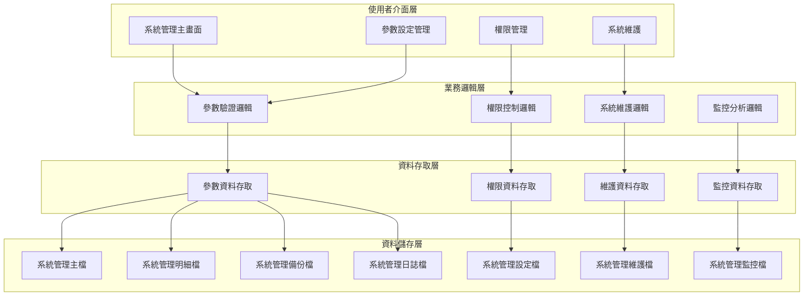

---

## 檔案名稱與欄位規格

### 3.1 主要檔案規格

#### 3.1.1 PRSYSF - 系統管理主檔

| 欄位代號 | 欄位名稱 | 位置 | 長度 | 型態 | 屬性 | 檢核說明 |
|----------|----------|------|------|------|------|----------|
| SYS01 | 公司代碼 | 1-3 | 3 | A | PK | 必填，公司唯一識別碼 |
| SYS02 | 系統編號 | 4-19 | 16 | A | PK | 必填，系統記錄唯一識別碼 |
| SYS03 | 系統名稱 | 20-69 | 50 | A | M | 必填，系統中文名稱 |
| SYS04 | 系統狀態 | 70-70 | 1 | A | M | 必填，值：A-啟用、I-停用、M-維護中、D-已刪除 |
| SYS05 | 系統版本 | 71-78 | 8 | A | M | 必填，系統版本號碼 |
| SYS06 | 系統類型 | 79-80 | 2 | A | M | 必填，值：01-採購系統、02-庫存系統、03-財務系統、04-人力系統 |
| SYS07 | 系統描述 | 81-180 | 100 | A | O | 選填，系統功能描述 |
| SYS08 | 系統負責人 | 181-185 | 5 | A | M | 必填，系統負責人代號 |
| SYS09 | 系統聯絡人 | 186-190 | 5 | A | O | 選填，系統聯絡人代號 |
| SYS10 | 系統聯絡電話 | 191-205 | 15 | A | O | 選填，系統聯絡電話 |
| SYS11 | 系統聯絡信箱 | 206-245 | 40 | A | O | 選填，系統聯絡信箱 |
| SYS12 | 建立人員 | 246-250 | 5 | A | M | 必填，建立系統記錄的使用者代號 |
| SYS13 | 建立時間 | 251-258 | 8 | T | M | 必填，系統自動產生 |
| SYS14 | 修改人員 | 259-263 | 5 | A | O | 選填，最後修改系統記錄的使用者代號 |
| SYS15 | 修改時間 | 264-271 | 8 | T | O | 選填，最後修改時間 |

#### 3.1.2 PRSYSF - 系統管理明細檔

| 欄位代號 | 欄位名稱 | 位置 | 長度 | 型態 | 屬性 | 檢核說明 |
|----------|----------|------|------|------|------|----------|
| SYSD01 | 系統編號 | 1-16 | 16 | A | PK,FK | 必填，參照PRSYSF.SYS02 |
| SYSD02 | 序號 | 17-19 | 3 | I | PK | 必填，1-999 |
| SYSD03 | 參數名稱 | 20-49 | 30 | A | M | 必填，參數英文名稱 |
| SYSD04 | 參數值 | 50-99 | 50 | A | M | 必填，參數設定值 |
| SYSD05 | 參數類型 | 100-101 | 2 | A | M | 必填，值：01-文字、02-數字、03-日期、04-布林值、05-下拉選單 |
| SYSD06 | 參數說明 | 102-151 | 50 | A | O | 選填，參數功能說明 |
| SYSD07 | 參數狀態 | 152-152 | 1 | A | M | 必填，值：A-啟用、I-停用 |
| SYSD08 | 參數分類 | 153-154 | 2 | A | M | 必填，值：01-系統參數、02-業務參數、03-安全參數、04-效能參數 |
| SYSD09 | 參數群組 | 155-164 | 10 | A | O | 選填，參數所屬群組 |
| SYSD10 | 備註 | 165-194 | 30 | A | O | 選填，最多30字元 |

#### 3.1.3 PRSYSF - 系統管理設定檔

| 欄位代號 | 欄位名稱 | 位置 | 長度 | 型態 | 屬性 | 檢核說明 |
|----------|----------|------|------|------|------|----------|
| SYSS01 | 設定編號 | 1-15 | 15 | A | PK | 必填，設定記錄唯一識別碼 |
| SYSS02 | 公司代碼 | 16-18 | 3 | A | M | 必填，公司代碼 |
| SYSS03 | 系統編號 | 19-34 | 16 | A | FK | 必填，參照系統管理主檔 |
| SYSS04 | 設定名稱 | 35-64 | 30 | A | M | 必填，設定名稱 |
| SYSS05 | 設定值 | 65-114 | 50 | A | M | 必填，設定值 |
| SYSS06 | 設定類型 | 115-116 | 2 | A | M | 必填，值：01-系統設定、02-使用者設定、03-業務設定、04-安全設定 |
| SYSS07 | 設定說明 | 117-166 | 50 | A | O | 選填，設定功能說明 |
| SYSS08 | 設定狀態 | 167-167 | 1 | A | M | 必填，值：A-啟用、I-停用 |
| SYSS09 | 更新人員 | 168-172 | 5 | A | M | 必填，更新設定的使用者代號 |
| SYSS10 | 更新時間 | 173-180 | 8 | T | M | 必填，系統自動產生 |
| SYSS11 | 備註 | 181-210 | 30 | A | O | 選填，最多30字元 |

#### 3.1.4 PRSYSF - 系統管理維護檔

| 欄位代號 | 欄位名稱 | 位置 | 長度 | 型態 | 屬性 | 檢核說明 |
|----------|----------|------|------|------|------|----------|
| SYSM01 | 維護編號 | 1-15 | 15 | A | PK | 必填，維護記錄唯一識別碼 |
| SYSM02 | 公司代碼 | 16-18 | 3 | A | M | 必填，公司代碼 |
| SYSM03 | 系統編號 | 19-34 | 16 | A | FK | 必填，參照系統管理主檔 |
| SYSM04 | 維護類型 | 35-36 | 2 | A | M | 必填，值：01-定期維護、02-故障維護、03-升級維護、04-預防維護 |
| SYSM05 | 維護內容 | 37-86 | 50 | A | M | 必填，維護內容說明 |
| SYSM06 | 維護狀態 | 87-87 | 1 | A | M | 必填，值：P-進行中、C-已完成、F-失敗、S-暫停 |
| SYSM07 | 維護人員 | 88-92 | 5 | A | M | 必填，執行維護的人員代號 |
| SYSM08 | 維護時間 | 93-100 | 8 | T | M | 必填，維護開始時間 |
| SYSM09 | 維護耗時 | 101-105 | 5 | I | M | 必填，維護耗時（分鐘） |
| SYSM10 | 維護結果 | 106-155 | 50 | A | O | 選填，維護結果說明 |
| SYSM11 | 完成時間 | 156-163 | 8 | T | O | 選填，維護完成時間 |
| SYSM12 | 備註 | 164-193 | 30 | A | O | 選填，最多30字元 |

#### 3.1.5 PRSYSF - 系統管理監控檔

| 欄位代號 | 欄位名稱 | 位置 | 長度 | 型態 | 屬性 | 檢核說明 |
|----------|----------|------|------|------|------|----------|
| SYSC01 | 監控編號 | 1-15 | 15 | A | PK | 必填，監控記錄唯一識別碼 |
| SYSC02 | 公司代碼 | 16-18 | 3 | A | M | 必填，公司代碼 |
| SYSC03 | 系統編號 | 19-34 | 16 | A | FK | 必填，參照系統管理主檔 |
| SYSC04 | 監控項目 | 35-64 | 30 | A | M | 必填，監控項目名稱 |
| SYSC05 | 監控值 | 65-114 | 50 | A | M | 必填，監控數值 |
| SYSC06 | 監控狀態 | 115-115 | 1 | A | M | 必填，值：N-正常、W-警告、E-錯誤、C-嚴重 |
| SYSC07 | 警報等級 | 116-116 | 1 | A | M | 必填，值：1-低、2-中、3-高、4-緊急 |
| SYSC08 | 監控時間 | 117-124 | 8 | T | M | 必填，監控執行時間 |
| SYSC09 | 監控週期 | 125-126 | 2 | A | M | 必填，值：01-即時、02-每分鐘、03-每5分鐘、04-每小時 |
| SYSC10 | 警報訊息 | 127-176 | 50 | A | O | 選填，警報訊息內容 |
| SYSC11 | 處理狀態 | 177-177 | 1 | A | M | 必填，值：U-未處理、P-處理中、R-已處理、I-忽略 |
| SYSC12 | 備註 | 178-207 | 30 | A | O | 選填，最多30字元 |

### 3.2 索引資料

#### 3.2.1 主要索引
- **PRSYSF 主鍵索引**：SYS01 + SYS02 (公司代碼 + 系統編號)
- **PRSYSF 系統名稱索引**：SYS03 (系統名稱)
- **PRSYSF 系統狀態索引**：SYS04 (系統狀態)
- **PRSYSF 系統類型索引**：SYS06 (系統類型)
- **PRSYSF 系統負責人索引**：SYS08 (系統負責人)

#### 3.2.2 次要索引
- **PRSYSF 主鍵索引**：SYSD01 + SYSD02 (系統編號 + 序號)
- **PRSYSF 系統編號索引**：SYSD01 (系統編號)
- **PRSYSF 參數名稱索引**：SYSD03 (參數名稱)
- **SYSS 主鍵索引**：SYSS01 (設定編號)
- **SYSS 系統編號索引**：SYSS03 (系統編號)
- **SYSM 主鍵索引**：SYSM01 (維護編號)
- **SYSM 系統編號索引**：SYSM03 (系統編號)
- **SYSC 主鍵索引**：SYSC01 (監控編號)
- **SYSC 系統編號索引**：SYSC03 (系統編號)

---

## 輸出/入螢幕布局與說明

### 4.1 系統管理主畫面

#### 4.1.1 畫面布局
```
┌─────────────────────────────────────────────────────────────┐
│                    系統管理系統                            │
├─────────────────────────────────────────────────────────────┤
│ 功能選項：                                                  │
│  [1]參數設定管理  [2]權限管理  [3]系統維護  [4]系統監控    │
│  [5]資料備份  [6]日誌管理  [7]安全控制  [8]離開            │
├─────────────────────────────────────────────────────────────┤
│ 系統狀態：                                                  │
│  系統總數：[12] 啟用：[10] 停用：[1] 維護中：[1]            │
│  今日維護：[3] 監控項目：[45] 警報：[2] 備份：[1]           │
│  最後更新：[2024/12/21 14:30:00] 更新人員：[ADMIN]        │
├─────────────────────────────────────────────────────────────┤
│ 快速功能：                                                  │
│  [參數設定] [權限管理] [系統維護] [系統監控]                │
├─────────────────────────────────────────────────────────────┤
│ 功能鍵：F1=說明  F3=離開  F4=設定  F6=管理  F8=維護  F12=取消│
└─────────────────────────────────────────────────────────────┘
```

#### 4.1.2 畫面說明
- **功能選項區**：提供系統管理的主要功能選項
- **系統狀態區**：顯示當前系統的狀態和統計資訊
- **快速功能區**：提供常用的快速操作功能
- **功能鍵區**：說明可使用的功能鍵

### 4.2 參數設定管理畫面

#### 4.2.1 畫面布局
```
┌─────────────────────────────────────────────────────────────┐
│                      參數設定管理                          │
├─────────────────────────────────────────────────────────────┤
│ 查詢條件：                                                  │
│  系統名稱：[全部 ▼] 參數分類：[全部 ▼] 參數狀態：[全部 ▼]   │
│  [查詢] [清除]                                              │
├─────────────────────────────────────────────────────────────┤
│ 參數清單：                                                  │
│ ┌─────┬────────────────┬──────────┬──────────┬──────────┬────────┐ │
│ │序號 │參數名稱        │參數值    │參數類型  │參數狀態  │更新時間 │ │
│ ├─────┼────────────────┼──────────┼──────────┼──────────┼────────┤ │
│ │  1  │採購審核層級    │3         │數字      │啟用      │2024/12/21│ │
│ │  2  │成本控制上限    │1000000   │數字      │啟用      │2024/12/21│ │
│ └─────┴────────────────┴──────────┴──────────┴──────────┴────────┘ │
├─────────────────────────────────────────────────────────────┤
│ 操作：[參數查詢] [參數新增] [參數修改] [參數刪除]            │
│ 功能鍵：F1=說明  F3=離開  F4=查詢  F6=新增  F8=修改  F12=取消│
└─────────────────────────────────────────────────────────────┘
```

---

## 處理流程程序說明

### 5.1 參數設定流程

#### 5.1.1 主要處理流程
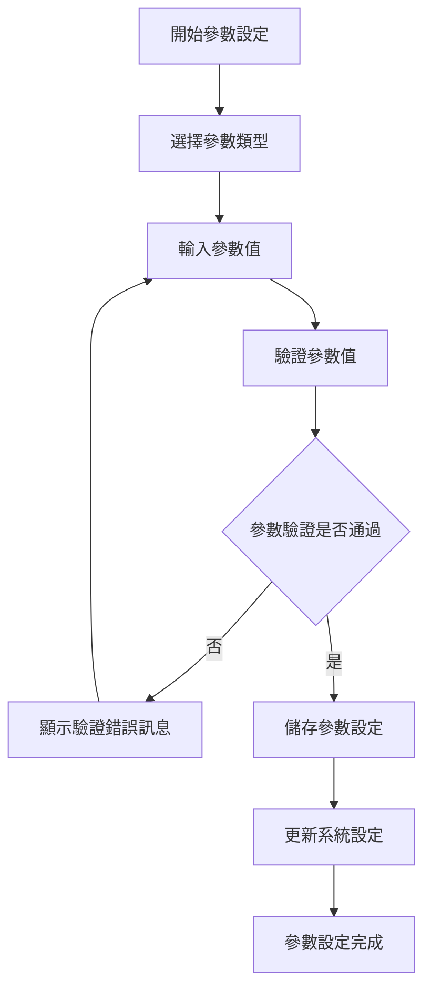

#### 5.1.2 資料驗證規則
1. **參數值驗證**：檢查參數值是否符合格式要求
2. **權限驗證**：檢查使用者是否有參數設定權限
3. **範圍驗證**：檢查參數值是否在有效範圍內
4. **系統狀態驗證**：檢查系統是否正常運行

### 5.2 權限管理流程

#### 5.2.1 主要處理流程
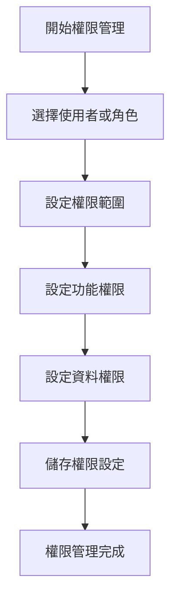

### 5.3 系統維護流程

#### 5.3.1 主要處理流程
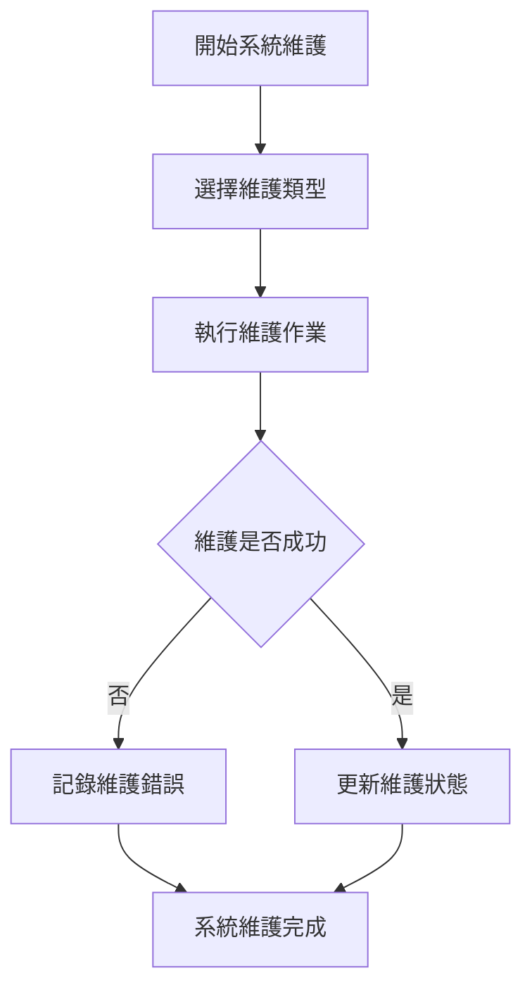

### 5.4 系統監控流程

#### 5.4.1 主要處理流程
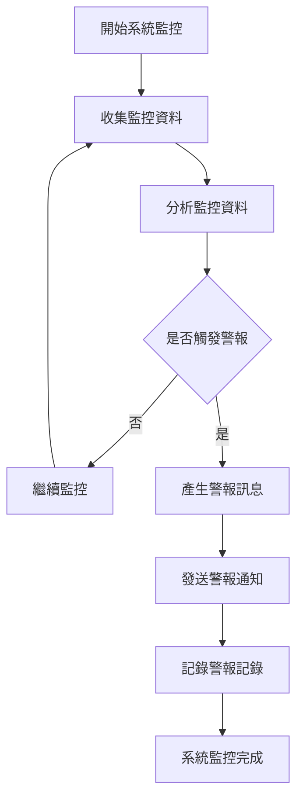

---

## 子程序處理邏輯說明

### 6.1 系統編號產生子程序

#### 6.1.1 編號產生邏輯
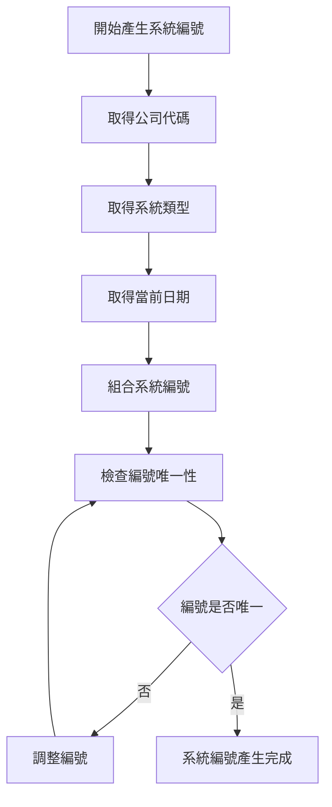

#### 6.1.2 編號格式說明
- **系統編號格式**：SYS + 系統類型(2位) + 日期(8位) + 序號(4位)
- **範例**：SYS + 01 + 20241221 + 0001 = SYS01202412210001

### 6.2 參數驗證子程序

#### 6.2.1 參數驗證邏輯
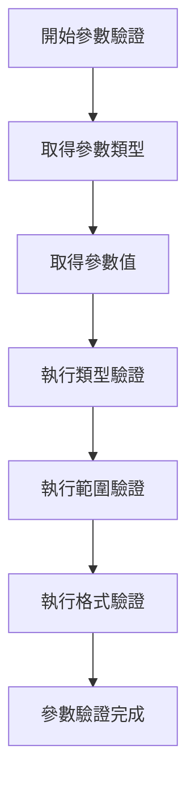

### 6.3 權限檢查子程序

#### 6.3.1 權限檢查邏輯
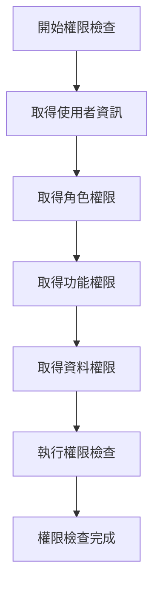

### 6.4 系統監控子程序

#### 6.4.1 系統監控邏輯
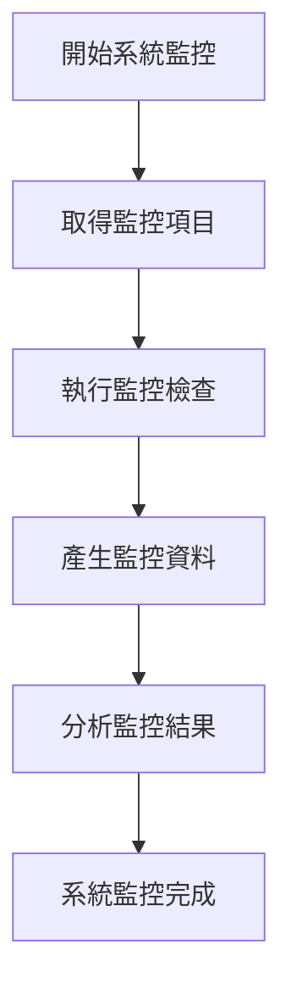

---

## 錯誤處理程序說明與訊息清冊

### 7.1 錯誤處理程序

#### 7.1.1 錯誤處理流程
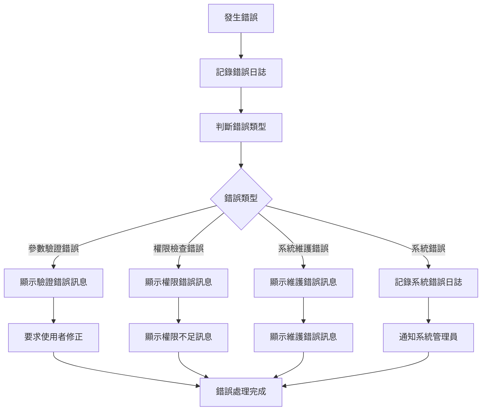

### 7.2 錯誤訊息清冊

#### 7.2.1 參數驗證錯誤訊息

| 錯誤代碼 | 錯誤訊息 | 錯誤原因 | 解決方法 |
|----------|----------|----------|----------|
| **PR701** | 系統編號不能為空 | 系統編號為必填欄位 | 請輸入系統編號 |
| **PR702** | 系統名稱不能為空 | 系統名稱為必填欄位 | 請輸入系統名稱 |
| **PR703** | 系統狀態不能為空 | 系統狀態為必填欄位 | 請選擇系統狀態 |
| **PR704** | 系統版本不能為空 | 系統版本為必填欄位 | 請輸入系統版本 |
| **PR705** | 系統類型不能為空 | 系統類型為必填欄位 | 請選擇系統類型 |

#### 7.2.2 權限檢查錯誤訊息

| 錯誤代碼 | 錯誤訊息 | 錯誤原因 | 解決方法 |
|----------|----------|----------|----------|
| **PR801** | 權限不足 | 使用者沒有執行該操作的權限 | 請聯繫系統管理員 |
| **PR802** | 角色權限不足 | 使用者角色權限不足 | 請聯繫系統管理員 |
| **PR803** | 功能權限不足 | 使用者沒有該功能的使用權限 | 請聯繫系統管理員 |
| **PR804** | 資料權限不足 | 使用者沒有該資料的存取權限 | 請聯繫系統管理員 |
| **PR805** | 權限檢查失敗 | 權限檢查操作執行失敗 | 請聯繫系統管理員 |

#### 7.2.3 系統維護錯誤訊息

| 錯誤代碼 | 錯誤訊息 | 錯誤原因 | 解決方法 |
|----------|----------|----------|----------|
| **PR901** | 系統記錄不存在 | 系統記錄未建立 | 請先建立系統記錄 |
| **PR902** | 維護作業失敗 | 維護作業執行失敗 | 請聯繫系統管理員 |
| **PR903** | 系統狀態異常 | 系統狀態不允許執行維護 | 請檢查系統狀態 |
| **PR904** | 維護權限不足 | 使用者沒有維護權限 | 請聯繫系統管理員 |
| **PR905** | 維護資源不足 | 系統資源不足以執行維護 | 請聯繫系統管理員 |

### 7.3 錯誤處理建議

#### 7.3.1 使用者操作建議
1. **檢查必填欄位**：確保所有必填欄位都已填寫
2. **驗證資料格式**：檢查資料格式是否符合要求
3. **檢查權限設定**：確認有執行該操作的權限
4. **檢查系統狀態**：確認系統運行正常

#### 7.3.2 系統管理建議
1. **監控系統錯誤**：定期檢查系統錯誤日誌
2. **檢查權限設定**：定期檢查使用者權限設定
3. **檢查系統設定**：定期檢查系統參數設定
4. **備份重要資料**：定期備份系統管理相關資料

---

## 備註

### 8.1 開發注意事項

#### 8.1.1 程式開發注意事項
1. **資料完整性**：確保系統管理資料的完整性和一致性
2. **權限控制**：實作嚴格的權限控制機制
3. **系統安全**：提供完整的系統安全保護功能
4. **效能監控**：實作有效的系統效能監控功能
5. **日誌記錄**：記錄詳細的操作日誌，便於問題診斷

#### 8.1.2 測試注意事項
1. **單元測試**：每個功能模組都必須進行單元測試
2. **整合測試**：測試各模組間的整合情況
3. **權限測試**：測試權限控制機制的完整性
4. **安全測試**：測試系統安全功能的完整性
5. **使用者接受度測試**：進行使用者接受度測試

### 8.2 維護注意事項

#### 8.2.1 日常維護注意事項
1. **監控系統狀態**：定期監控系統的運行狀態
2. **檢查權限設定**：定期檢查使用者權限設定
3. **檢查系統設定**：定期檢查系統參數設定
4. **清理過期資料**：定期清理過期的歷史資料
5. **備份重要資料**：定期備份重要的系統管理資料

#### 8.2.2 版本更新注意事項
1. **相容性檢查**：更新前必須檢查與現有系統的相容性
2. **資料遷移**：制定詳細的資料遷移計畫
3. **使用者通知**：提前通知使用者版本更新計畫
4. **回滾計畫**：制定詳細的回滾計畫
5. **測試驗證**：更新後必須進行充分的測試驗證

### 8.3 未來擴充建議

#### 8.3.1 功能擴充建議
1. **智慧化系統管理**：整合AI功能，提供智慧化系統管理建議
2. **行動化支援**：支援行動裝置系統管理作業
3. **自動化維護**：實作自動化系統維護機制
4. **預測性維護**：增加系統故障預測分析功能
5. **雲端管理**：提供雲端系統管理功能

#### 8.3.2 技術改進建議
1. **雲端部署**：考慮採用雲端部署模式
2. **微服務架構**：考慮採用微服務架構
3. **API整合**：提供標準化的API介面
4. **資料分析**：整合資料分析功能
5. **容器化技術**：整合容器化技術，提升系統部署和管理效率

---

## 附錄

### A.1 相關文件清單
- 採購模組程式功能規格書 - 採購管理
- 採購模組程式功能規格書 - 供應商管理
- 採購模組程式功能規格書 - 採購申請
- 採購模組程式功能規格書 - 採購訂單
- 採購模組程式功能規格書 - 收貨管理
- 採購模組程式功能規格書 - 付款管理
- 採購模組程式功能規格書 - 庫存管理
- 採購模組程式功能規格書 - 報表分析
- 採購模組業務邏輯分析與API設計
- 採購模組操作手冊 - 系統管理

### A.2 修訂記錄

| 版本 | 修訂日期 | 修訂人員 | 修訂內容 | 修訂原因 |
|------|----------|----------|----------|----------|
| v1.0 | 2024/12/21 | 系統分析師 | 初始版本建立 | 新功能開發 |

### A.3 聯絡資訊
- **專案經理**：[專案經理姓名]
- **系統分析師**：[系統分析師姓名]
- **技術支援**：[技術支援聯絡方式]
- **專案信箱**：[專案信箱地址]
