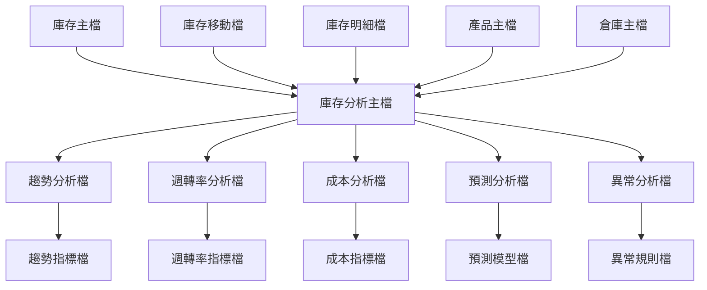
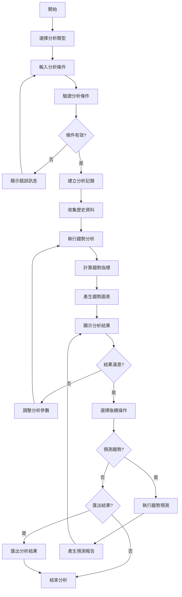
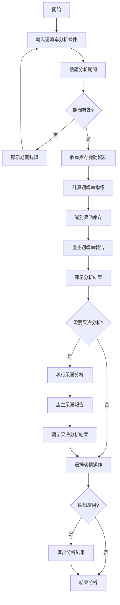
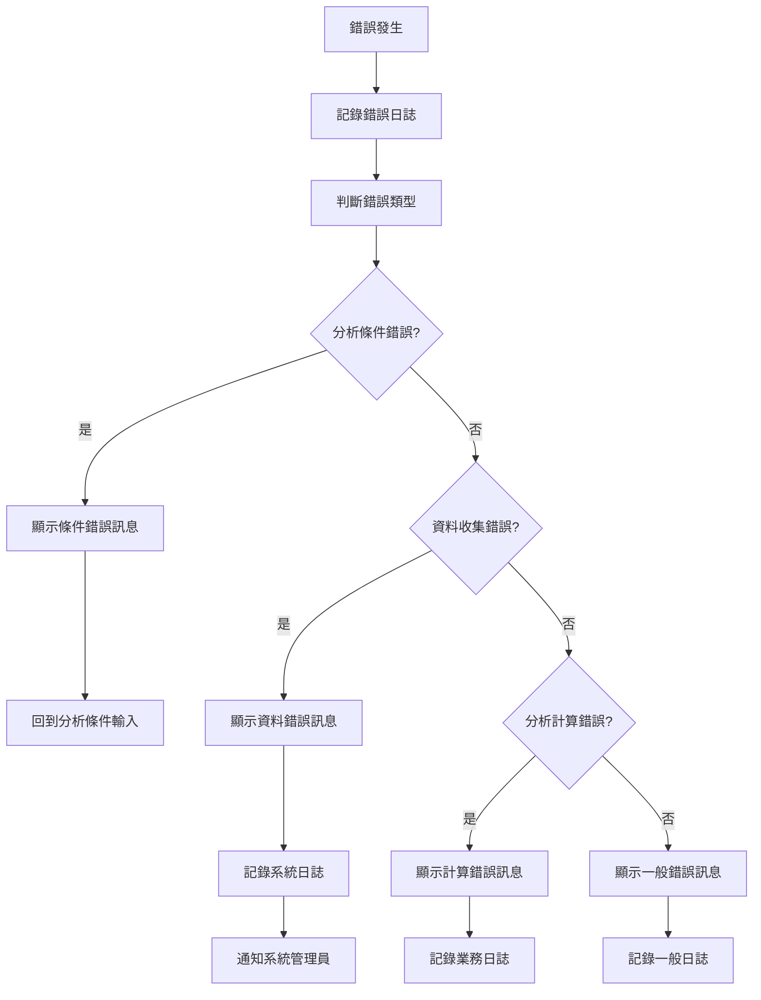

# 產品模組 程式功能規格書 - 庫存分析作業

## 文件基本資訊

| 項目 | 說明 |
|------|------|
| **文件名稱** | 產品模組程式功能規格書 - 庫存分析作業 |
| **模組代號** | PD |
| **版本** | v1.0 |
| **建立日期** | 2024年12月21日 |
| **建立人員** | 系統分析師 |
| **審核人員** | 專案經理 |
| **文件狀態** | 初稿 |
| **最後更新** | 2024年12月21日 |

---

## 目錄

1. [基本資料](#基本資料)
2. [檔案架構與關聯圖](#檔案架構與關聯圖)
3. [檔案名稱與欄位規格](#檔案名稱與欄位規格)
4. [輸出/入螢幕布局與說明](#輸出入螢幕布局與說明)
5. [處理流程程序說明](#處理流程程序說明)
6. [子程序處理邏輯說明](#子程序處理邏輯說明)
7. [錯誤處理程序說明與訊息清冊](#錯誤處理程序說明與訊息清冊)
8. [備註](#備註)
9. [附錄](#附錄)

---

## 基本資料

### 1.1 功能概述

庫存分析作業系統是產品模組庫存管理的進階分析功能，主要負責提供多維度的庫存分析能力，包括庫存趨勢分析、庫存週轉率分析、庫存成本分析、庫存預測分析等。系統運用統計學和機器學習技術，為企業提供深入的庫存洞察和決策支援，幫助優化庫存策略、降低庫存成本、提升庫存週轉效率。

### 1.2 主要功能

- **庫存趨勢分析**：分析庫存數量、價值、結構的歷史變動趨勢
- **庫存週轉率分析**：計算和分析產品庫存週轉率、呆滯庫存識別
- **庫存成本分析**：分析庫存持有成本、採購成本、總成本結構
- **庫存預測分析**：基於歷史資料預測未來庫存需求和趨勢
- **庫存異常分析**：識別庫存異常模式、庫存風險評估
- **分析報表產生**：產生各種分析報表和圖表

### 1.3 技術架構

- **開發語言**：RPG、CL、SQL、Python
- **資料庫**：DB2 for i (IBM i)
- **分析引擎**：統計分析工具、機器學習模型
- **報表工具**：IBM Cognos、Crystal Reports、Matplotlib
- **部署環境**：IBM i 7.4

---

## 檔案架構與關聯圖

### 2.1 檔案架構圖



### 2.2 檔案關聯說明

| 主檔 | 關聯檔 | 關聯類型 | 關聯說明 |
|------|--------|----------|----------|
| **庫存主檔(INV)** | 庫存分析主檔(INVA) | 1:1 | 一個庫存記錄對應一個分析主檔記錄 |
| **庫存移動檔(INVM)** | 庫存分析主檔(INVA) | 1:N | 多個移動記錄影響分析結果 |
| **庫存明細檔(INVD)** | 庫存分析主檔(INVA) | 1:N | 多個明細記錄提供分析資料 |
| **庫存分析主檔(INVA)** | 趨勢分析檔(INVA1) | 1:1 | 分析主檔對應趨勢分析結果 |
| **庫存分析主檔(INVA)** | 週轉率分析檔(INVA2) | 1:1 | 分析主檔對應週轉率分析結果 |

---

## 檔案名稱與欄位規格

### 3.1 庫存分析主檔 (INVA)

#### 3.1.1 檔案基本資訊

| 項目 | 說明 |
|------|------|
| **檔案名稱** | 庫存分析主檔 |
| **檔案代號** | INVA |
| **檔案描述** | 儲存庫存分析相關資訊的主檔 |
| **檔案類型** | 主檔 |
| **檔案大小** | 約 800MB |
| **記錄筆數** | 約 80,000 筆 |

#### 3.1.2 欄位規格

| 欄位代號 | 欄位名稱 | 位置 | 長度 | 型態 | 屬性 | 檢核說明 |
|----------|----------|------|------|------|------|----------|
| **INVAID** | 分析編號 | 1-20 | 20 | A | PK | 主鍵，不可重複 |
| **INVAPD** | 產品編號 | 21-40 | 20 | A | M | 必填，需存在於產品主檔 |
| **INVAWH** | 倉庫代號 | 41-60 | 20 | A | M | 必填，需存在於倉庫主檔 |
| **INVATY** | 分析類型 | 61-80 | 20 | A | M | 必填，趨勢/週轉率/成本/預測/異常 |
| **INVAST** | 分析狀態 | 81-90 | 10 | A | M | 必填，執行中/完成/失敗 |
| **INVACR** | 分析人員 | 91-110 | 20 | A | M | 必填，系統自動填入 |
| **INVACD** | 分析日期 | 111-120 | 10 | D | M | 必填，系統自動填入 |
| **INVATM** | 分析時間 | 121-130 | 10 | T | M | 必填，系統自動填入 |
| **INVARS** | 分析結果 | 131-230 | 100 | A | O | 可選填，分析結果摘要 |
| **INVAER** | 錯誤訊息 | 231-330 | 100 | A | O | 可選填，錯誤訊息內容 |

### 3.2 趨勢分析檔 (INVA1)

#### 3.2.1 檔案基本資訊

| 項目 | 說明 |
|------|------|
| **檔案名稱** | 趨勢分析檔 |
| **檔案代號** | INVA1 |
| **檔案描述** | 儲存庫存趨勢分析結果的檔案 |
| **檔案類型** | 明細檔 |
| **檔案大小** | 約 1.5GB |
| **記錄筆數** | 約 200,000 筆 |

#### 3.2.2 欄位規格

| 欄位代號 | 欄位名稱 | 位置 | 長度 | 型態 | 屬性 | 檢核說明 |
|----------|----------|------|------|------|------|----------|
| **INVA1ID** | 趨勢編號 | 1-20 | 20 | A | PK | 主鍵，不可重複 |
| **INVA1IN** | 分析編號 | 21-40 | 20 | A | M | 必填，需存在於分析主檔 |
| **INVA1DT** | 分析日期 | 41-50 | 10 | D | M | 必填，日期格式 |
| **INVA1QT** | 庫存數量 | 51-60 | 10 | N | M | 必填，數字格式 |
| **INVA1VA** | 庫存價值 | 61-70 | 10 | N | M | 必填，數字格式，小數2位 |
| **INVA1TR** | 趨勢方向 | 71-80 | 10 | A | M | 必填，上升/下降/穩定 |
| **INVA1RT** | 變動率 | 81-90 | 10 | N | M | 必填，數字格式，小數2位 |
| **INVA1CR** | 建立人員 | 91-110 | 20 | A | M | 必填，系統自動填入 |
| **INVA1CD** | 建立日期 | 111-120 | 10 | D | M | 必填，系統自動填入 |

### 3.3 週轉率分析檔 (INVA2)

#### 3.3.1 檔案基本資訊

| 項目 | 說明 |
|------|------|
| **檔案名稱** | 週轉率分析檔 |
| **檔案代號** | INVA2 |
| **檔案描述** | 儲存庫存週轉率分析結果的檔案 |
| **檔案類型** | 明細檔 |
| **檔案大小** | 約 1GB |
| **記錄筆數** | 約 150,000 筆 |

#### 3.3.2 欄位規格

| 欄位代號 | 欄位名稱 | 位置 | 長度 | 型態 | 屬性 | 檢核說明 |
|----------|----------|------|------|------|------|----------|
| **INVA2ID** | 週轉率編號 | 1-20 | 20 | A | PK | 主鍵，不可重複 |
| **INVA2IN** | 分析編號 | 21-40 | 20 | A | M | 必填，需存在於分析主檔 |
| **INVA2PD** | 期間 | 41-60 | 20 | A | M | 必填，年度/季度/月度 |
| **INVA2YR** | 年度 | 61-64 | 4 | N | M | 必填，4位數字 |
| **INVA2QT** | 季度 | 65-66 | 2 | N | O | 可選填，1-4 |
| **INVA2MN** | 月份 | 67-68 | 2 | N | O | 可選填，1-12 |
| **INVA2TR** | 週轉率 | 69-78 | 10 | N | M | 必填，數字格式，小數2位 |
| **INVA2DS** | 呆滯天數 | 79-88 | 10 | N | M | 必填，數字格式 |
| **INVA2ST** | 週轉狀態 | 89-98 | 10 | A | M | 必填，良好/一般/不良 |
| **INVA2CR** | 建立人員 | 99-118 | 20 | A | M | 必填，系統自動填入 |
| **INVA2CD** | 建立日期 | 119-128 | 10 | D | M | 必填，系統自動填入 |

---

## 輸出/入螢幕布局與說明

### 4.1 庫存分析主畫面

#### 4.1.1 畫面布局

```
┌─────────────────────────────────────────────────────────────┐
│                    庫存分析作業系統                          │
├─────────────────────────────────────────────────────────────┤
│ 分析類型選擇：                                              │
│  [1]趨勢分析作業  [2]週轉率分析  [3]成本分析作業            │
│  [4]預測分析作業  [5]異常分析作業  [6]綜合分析作業          │
│  [7]分析參數設定  [8]分析結果管理  [9]分析報表產生          │
│  [0]離開系統                                                │
├─────────────────────────────────────────────────────────────┤
│ 快速分析：                                                  │
│  產品編號：[PD20241221001    ] [分析]                       │
│  倉庫代號：[WH001           ] [分析]                       │
│  分析期間：[2024年度        ] [分析]                       │
├─────────────────────────────────────────────────────────────┤
│ 系統狀態：                                                  │
│  今日分析次數：[89] 分析成功率：[97.8%] 平均分析時間：[2.5秒] │
│  最後更新：[2024/12/21 14:30:00] 更新人員：[ADMIN]         │
├─────────────────────────────────────────────────────────────┤
│ 功能鍵：F1=說明  F3=離開  F4=分析  F6=新增  F8=修改  F12=取消│
└─────────────────────────────────────────────────────────────┘
```

#### 4.1.2 功能選項說明

| 選項 | 功能說明 |
|------|----------|
| **1** | 趨勢分析作業：分析庫存數量、價值、結構的歷史變動趨勢 |
| **2** | 週轉率分析：計算和分析產品庫存週轉率、呆滯庫存識別 |
| **3** | 成本分析作業：分析庫存持有成本、採購成本、總成本結構 |
| **4** | 預測分析作業：基於歷史資料預測未來庫存需求和趨勢 |
| **5** | 異常分析作業：識別庫存異常模式、庫存風險評估 |
| **6** | 綜合分析作業：多維度綜合分析庫存狀況 |
| **7** | 分析參數設定：設定各種分析參數和閾值 |
| **8** | 分析結果管理：管理分析結果和歷史記錄 |
| **9** | 分析報表產生：產生各種分析報表和圖表 |
| **0** | 離開系統 |

### 4.2 趨勢分析作業畫面

#### 4.2.1 畫面布局

```
┌─────────────────────────────────────────────────────────────┐
│                      趨勢分析作業                            │
├─────────────────────────────────────────────────────────────┤
│ 分析條件：                                                  │
│  產品編號：[PD20241221001    ] [查詢] [清除]               │
│  倉庫代號：[WH001           ] [查詢] [清除]               │
│  分析期間：[2024/01/01] 到 [2024/12/21] [分析]             │
│  分析維度：[數量 ▼] [分析]                                  │
│  趨勢類型：[線性趨勢 ▼] [分析]                              │
├─────────────────────────────────────────────────────────────┤
│ 分析結果：                                                  │
│ ┌─────┬──────────┬──────────┬──────────┬──────────┬────────┐ │
│ │序號 │分析日期  │庫存數量  │庫存價值  │趨勢方向  │變動率  │ │
│ ├─────┼──────────┼──────────┼──────────┼──────────┼────────┤ │
│ │  1  │[        ] [        ] [        ] [        ] [        ] │ │
│ │  2  │[        ] [        ] [        ] [        ] [        ] │ │
│ └─────┴──────────┴──────────┴──────────┴──────────┴────────┘ │
│ 趨勢圖表：[顯示庫存趨勢線圖]                                │
│ 趨勢摘要：整體趨勢[上升] 平均變動率[+5.2%] 趨勢強度[強]    │
├─────────────────────────────────────────────────────────────┤
│ 功能鍵：F1=說明  F3=離開  F4=分析  F8=修改  F12=取消      │
│ 特殊功能：F5=重新分析  F6=圖表顯示  F7=趨勢預測  F9=匯出   │
└─────────────────────────────────────────────────────────────┘
```

#### 4.2.2 分析條件說明

| 欄位名稱 | 說明 | 格式要求 |
|----------|------|----------|
| **產品編號** | 要分析的產品編號 | 最多20個字元，支援精確查詢 |
| **倉庫代號** | 要分析的倉庫代號 | 最多20個字元，支援精確查詢 |
| **分析期間** | 趨勢分析的時間範圍 | 日期格式，支援年度、季度、月度分析 |
| **分析維度** | 分析的主要維度 | 數量/價值/結構/綜合 |
| **趨勢類型** | 趨勢分析的方法 | 線性趨勢/指數趨勢/移動平均/季節性分析 |

---

## 處理流程程序說明

### 5.1 趨勢分析流程

#### 5.1.1 流程圖



#### 5.1.2 處理步驟說明

1. **選擇分析類型**
   - 使用者選擇要執行的分析類型
   - 系統根據選擇載入對應的分析畫面

2. **輸入分析條件**
   - 設定產品編號、倉庫代號、分析期間等條件
   - 選擇分析維度和趨勢類型

3. **驗證分析條件**
   - 檢查輸入條件的格式是否正確
   - 驗證產品編號、倉庫代號等是否存在

4. **建立分析記錄**
   - 在分析主檔中建立分析記錄
   - 記錄分析條件、分析人員、分析時間等

5. **收集歷史資料**
   - 從相關檔案收集指定期間的歷史資料
   - 對資料進行清洗和預處理

6. **執行趨勢分析**
   - 根據選擇的趨勢類型執行相應的分析算法
   - 計算趨勢線、變動率等指標

### 5.2 週轉率分析流程

#### 5.2.1 流程圖



#### 5.2.2 處理步驟說明

1. **輸入週轉率分析條件**
   - 設定產品編號、倉庫代號、分析期間等條件
   - 選擇分析粒度（年度、季度、月度）

2. **驗證分析期間**
   - 檢查分析期間是否合理
   - 驗證開始和結束期間的有效性

3. **收集庫存變動資料**
   - 從庫存移動檔收集指定期間的變動記錄
   - 計算期初庫存、期末庫存、平均庫存

4. **計算週轉率指標**
   - 計算庫存週轉率、週轉天數等指標
   - 與行業標準或歷史標準進行比較

5. **識別呆滯庫存**
   - 根據週轉率識別呆滯庫存項目
   - 分析呆滯原因和影響程度

---

## 子程序處理邏輯說明

### 6.1 趨勢分析計算子程序

#### 6.1.1 程序名稱
`CALTREND` - 趨勢分析計算子程序

#### 6.1.2 處理邏輯

```rpg
// 趨勢分析計算邏輯
// 計算線性趨勢線和變動率

DCLF FILE(INVA1) KEYED
DCL VAR(&ANALYSISID) TYPE(*CHAR) LEN(20)
DCL VAR(&TRENDDIR) TYPE(*CHAR) LEN(10)
DCL VAR(&CHANGERATE) TYPE(*PACKED) LEN(8 2)
DCL VAR(&SLOPE) TYPE(*PACKED) LEN(8 4)
DCL VAR(&INTERCEPT) TYPE(*PACKED) LEN(8 4)
DCL VAR(&CORRELATION) TYPE(*PACKED) LEN(8 4)

// 初始化變數
CHGVAR VAR(&SLOPE) VALUE(0)
CHGVAR VAR(&INTERCEPT) VALUE(0)
CHGVAR VAR(&CORRELATION) VALUE(0)

// 讀取趨勢分析資料
SETLL (&ANALYSISID) INVA1
READ INVA1
DO WHILE %EOF = *OFF
  IF &INVA1IN = &ANALYSISID
    // 執行線性回歸計算
    // 計算斜率、截距、相關係數
    CALLSUBR SUBR(CALCLINEAR) PARM(&SLOPE &INTERCEPT &CORRELATION)
    
    // 判斷趨勢方向
    IF &SLOPE > 0.01
      CHGVAR VAR(&TRENDDIR) VALUE('上升')
    ELSE
      IF &SLOPE < -0.01
        CHGVAR VAR(&TRENDDIR) VALUE('下降')
      ELSE
        CHGVAR VAR(&TRENDDIR) VALUE('穩定')
      ENDIF
    ENDIF
    
    // 計算變動率
    CHGVAR VAR(&CHANGERATE) VALUE(&SLOPE * 100)
  ENDIF
  READ INVA1
ENDDO
```

#### 6.1.3 參數說明

| 參數名稱 | 型態 | 長度 | 說明 |
|----------|------|------|------|
| **&ANALYSISID** | *CHAR | 20 | 分析編號 |
| **&TRENDDIR** | *CHAR | 10 | 趨勢方向 |
| **&CHANGERATE** | *PACKED | 8,2 | 變動率 |
| **&SLOPE** | *PACKED | 8,4 | 趨勢線斜率 |
| **&INTERCEPT** | *PACKED | 8,4 | 趨勢線截距 |
| **&CORRELATION** | *PACKED | 8,4 | 相關係數 |

### 6.2 週轉率計算子程序

#### 6.2.1 程序名稱
`CALCTURNOVER` - 週轉率計算子程序

#### 6.2.2 處理邏輯

```rpg
// 週轉率計算邏輯
// 計算庫存週轉率和週轉天數

DCLF FILE(INVA2) KEYED
DCL VAR(&ANALYSISID) TYPE(*CHAR) LEN(20)
DCL VAR(&TURNOVER) TYPE(*PACKED) LEN(8 2)
DCL VAR(&TURNDAYS) TYPE(*PACKED) LEN(5 0)
DCL VAR(&AVGINV) TYPE(*PACKED) LEN(10 0)
DCL VAR(&COGS) TYPE(*PACKED) LEN(10 0)

// 初始化變數
CHGVAR VAR(&AVGINV) VALUE(0)
CHGVAR VAR(&COGS) VALUE(0)

// 讀取週轉率分析資料
SETLL (&ANALYSISID) INVA2
READ INVA2
DO WHILE %EOF = *OFF
  IF &INVA2IN = &ANALYSISID
    // 計算平均庫存
    CHGVAR VAR(&AVGINV) VALUE(&AVGINV + &INVA2QT)
    
    // 累計銷貨成本
    CHGVAR VAR(&COGS) VALUE(&COGS + &INVA2VA)
  ENDIF
  READ INVA2
ENDDO

// 計算週轉率
IF &AVGINV > 0
  CHGVAR VAR(&TURNOVER) VALUE(&COGS / &AVGINV)
ENDIF

// 計算週轉天數
IF &TURNOVER > 0
  CHGVAR VAR(&TURNDAYS) VALUE(365 / &TURNOVER)
ENDIF
```

#### 6.2.3 參數說明

| 參數名稱 | 型態 | 長度 | 說明 |
|----------|------|------|------|
| **&ANALYSISID** | *CHAR | 20 | 分析編號 |
| **&TURNOVER** | *PACKED | 8,2 | 週轉率 |
| **&TURNDAYS** | *PACKED | 5,0 | 週轉天數 |
| **&AVGINV** | *PACKED | 10,0 | 平均庫存 |
| **&COGS** | *PACKED | 10,0 | 銷貨成本 |

---

## 錯誤處理程序說明與訊息清冊

### 7.1 錯誤處理流程

#### 7.1.1 錯誤處理流程圖



#### 7.1.2 錯誤處理原則

1. **錯誤預防優先**
   - 在分析條件輸入時進行即時驗證
   - 提供清楚的錯誤提示訊息

2. **錯誤記錄完整**
   - 記錄錯誤發生的時間、位置、原因
   - 記錄錯誤發生時的分析條件

3. **錯誤恢復機制**
   - 提供錯誤修正的建議
   - 支援錯誤分析的重新執行

### 7.2 錯誤訊息清冊

#### 7.2.1 分析條件錯誤

| 錯誤代碼 | 錯誤訊息 | 錯誤原因 | 解決方法 |
|----------|----------|----------|----------|
| **INVA001** | 分析條件不能為空 | 必填分析條件未填寫 | 請輸入必要的分析條件 |
| **INVA002** | 產品編號不存在 | 產品編號無效 | 請檢查產品編號 |
| **INVA003** | 倉庫代號不存在 | 倉庫代號無效 | 請檢查倉庫代號 |
| **INVA004** | 分析期間無效 | 開始期間大於結束期間 | 請調整分析期間 |
| **INVA005** | 分析維度不支援 | 選擇的分析維度不支援 | 請選擇支援的分析維度 |

#### 7.2.2 資料收集錯誤

| 錯誤代碼 | 錯誤訊息 | 錯誤原因 | 解決方法 |
|----------|----------|----------|----------|
| **INVA101** | 歷史資料不足 | 指定期間內資料不足 | 請擴大分析期間或選擇其他產品 |
| **INVA102** | 資料格式錯誤 | 資料格式不符合要求 | 請聯繫系統管理員 |
| **INVA103** | 資料庫連線失敗 | 資料庫服務異常 | 請聯繫系統管理員 |
| **INVA104** | 資料存取權限不足 | 使用者權限不足 | 請聯繫系統管理員 |
| **INVA105** | 資料不一致 | 相關資料不一致 | 請檢查資料完整性 |

#### 7.2.3 分析計算錯誤

| 錯誤代碼 | 錯誤訊息 | 錯誤原因 | 解決方法 |
|----------|----------|----------|----------|
| **INVA201** | 趨勢計算失敗 | 趨勢計算算法錯誤 | 請重新執行分析 |
| **INVA202** | 週轉率計算失敗 | 週轉率計算公式錯誤 | 請檢查庫存和銷貨資料 |
| **INVA203** | 成本分析失敗 | 成本計算邏輯錯誤 | 請檢查成本資料 |
| **INVA204** | 預測模型失敗 | 預測模型執行錯誤 | 請聯繫系統管理員 |
| **INVA205** | 異常檢測失敗 | 異常檢測算法錯誤 | 請重新執行分析 |

---

## 備註

### 8.1 系統限制

1. **分析條件限制**
   - 單次分析最多支援10個條件組合
   - 分析期間最大跨度為5年

2. **分析結果限制**
   - 單次分析結果最多顯示50,000筆記錄
   - 分析結果匯出檔案最大為100MB

3. **分析時間限制**
   - 單次分析執行時間最長為600秒
   - 分析歷史記錄保留期限為3年

4. **並發分析限制**
   - 同時執行的分析數量最多為50個
   - 單一使用者的並發分析數量最多為3個

### 8.2 效能考量

1. **分析優化**
   - 建議在常用分析欄位建立資料庫索引
   - 使用適當的分析條件減少資料掃描範圍

2. **快取機制**
   - 對常用的分析結果進行快取
   - 對分析統計資訊進行快取

3. **分析分頁**
   - 大量分析結果使用分頁顯示
   - 支援虛擬滾動提升顯示效能

### 8.3 安全性考量

1. **分析權限控制**
   - 根據使用者角色設定不同的分析權限
   - 記錄所有分析操作的日誌

2. **資料隱私保護**
   - 敏感資料分析需要額外授權
   - 分析結果中的敏感資訊進行遮罩處理

3. **分析審計**
   - 記錄所有分析條件的審計日誌
   - 定期分析異常分析行為

---

## 附錄

### A.1 相關文件清單

- 產品模組程式功能規格書 - 庫存管理
- 產品模組程式功能規格書 - 庫存查詢作業
- 庫存分析作業操作手冊
- 分析參數設定規範
- 系統整合測試報告

### A.2 修訂記錄

| 版本 | 修訂日期 | 修訂人員 | 修訂內容 | 修訂原因 |
|------|----------|----------|----------|----------|
| v1.0 | 2024/12/21 | 系統分析師 | 初始版本建立 | 新功能開發 |

### A.3 聯絡資訊

- **專案經理**：[專案經理姓名]
- **系統分析師**：[系統分析師姓名]
- **技術支援**：[技術支援聯絡方式]
- **專案信箱**：[專案信箱地址]

### A.4 常用縮寫說明

| 縮寫 | 全名 | 說明 |
|------|------|------|
| **INVA** | Inventory Analysis | 庫存分析 |
| **INVA1** | Inventory Analysis Trend | 庫存趨勢分析 |
| **INVA2** | Inventory Analysis Turnover | 庫存週轉率分析 |
| **INV** | Inventory | 庫存 |
| **PD** | Product | 產品 |
| **WH** | Warehouse | 倉庫 |
| **ERP** | Enterprise Resource Planning | 企業資源規劃 |

### A.5 系統訊息代碼

| 訊息代碼 | 訊息內容 | 說明 |
|----------|----------|------|
| **INVA001** | 分析執行成功 | 庫存分析已成功執行 |
| **INVA002** | 分析參數已儲存 | 分析參數已成功儲存 |
| **INVA003** | 分析結果已匯出 | 分析結果已成功匯出 |
| **INVA004** | 趨勢分析完成 | 趨勢分析已完成 |
| **INVA005** | 週轉率分析完成 | 週轉率分析已完成 |
| **INVA006** | 成本分析完成 | 成本分析已完成 |
| **INVA007** | 預測分析完成 | 預測分析已完成 |
| **INVA008** | 異常分析完成 | 異常分析已完成 |
| **INVA009** | 分析報表已產生 | 分析報表已成功產生 |
| **INVA010** | 分析快取已更新 | 分析快取已成功更新 |

### A.6 分析指標說明

#### A.6.1 趨勢分析指標

| 指標名稱 | 計算公式 | 說明 |
|----------|----------|------|
| **趨勢斜率** | (Y2-Y1)/(X2-X1) | 表示庫存變動的速度和方向 |
| **變動率** | (期末值-期初值)/期初值×100% | 表示庫存變動的百分比 |
| **相關係數** | Σ((X-X̄)(Y-Ȳ))/√(Σ(X-X̄)²×Σ(Y-Ȳ)²) | 表示變數間的相關程度 |
| **趨勢強度** | |相關係數| | 表示趨勢的可靠性 |

#### A.6.2 週轉率分析指標

| 指標名稱 | 計算公式 | 說明 |
|----------|----------|------|
| **庫存週轉率** | 銷貨成本/平均庫存 | 表示庫存的使用效率 |
| **週轉天數** | 365/週轉率 | 表示庫存平均持有天數 |
| **呆滯率** | 呆滯庫存/總庫存×100% | 表示呆滯庫存的比例 |
| **庫存效率** | 實際週轉率/標準週轉率 | 表示庫存效率的達成度 |

### A.7 分析結果範例

#### A.7.1 趨勢分析結果

| 序號 | 分析日期 | 庫存數量 | 庫存價值 | 趨勢方向 | 變動率 |
|------|----------|----------|----------|----------|--------|
| **1** | 2024/01/31 | 1,200 | 120,000 | 上升 | +8.5% |
| **2** | 2024/02/29 | 1,350 | 135,000 | 上升 | +12.5% |
| **3** | 2024/03/31 | 1,480 | 148,000 | 上升 | +9.6% |
| **4** | 2024/04/30 | 1,320 | 132,000 | 下降 | -10.8% |
| **5** | 2024/05/31 | 1,180 | 118,000 | 下降 | -10.6% |

#### A.7.2 週轉率分析結果

| 序號 | 期間 | 週轉率 | 週轉天數 | 呆滯天數 | 週轉狀態 |
|------|------|--------|----------|----------|----------|
| **1** | 2024Q1 | 4.2 | 87 | 15 | 良好 |
| **2** | 2024Q2 | 3.8 | 96 | 22 | 一般 |
| **3** | 2024Q3 | 3.5 | 104 | 28 | 一般 |
| **4** | 2024Q4 | 4.0 | 91 | 18 | 良好 |

### A.8 分析效能優化建議

#### A.8.1 資料庫索引建議

| 欄位名稱 | 索引類型 | 說明 |
|----------|----------|------|
| **產品編號** | 主鍵索引 | 產品編號是主鍵，自動建立索引 |
| **倉庫代號** | 單欄索引 | 常用於倉庫範圍分析 |
| **分析日期** | 單欄索引 | 常用於時間範圍分析 |
| **分析類型** | 單欄索引 | 常用於分析類型篩選 |
| **產品編號+倉庫代號** | 複合索引 | 常用於產品和倉庫組合分析 |
| **分析日期+分析類型** | 複合索引 | 常用於日期和類型組合分析 |

#### A.8.2 分析算法優化建議

| 優化項目 | 建議內容 | 說明 |
|----------|----------|------|
| **資料預處理** | 資料清洗和標準化 | 提高分析資料品質 |
| **算法選擇** | 根據資料特性選擇合適算法 | 提升分析準確性 |
| **參數調優** | 使用交叉驗證調優參數 | 優化分析效果 |
| **並行計算** | 使用多執行緒或分散式計算 | 提升分析速度 |
| **結果快取** | 對常用分析結果進行快取 | 減少重複計算 |
