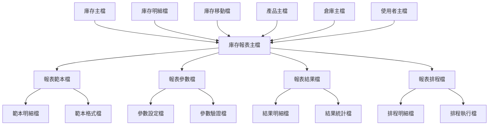
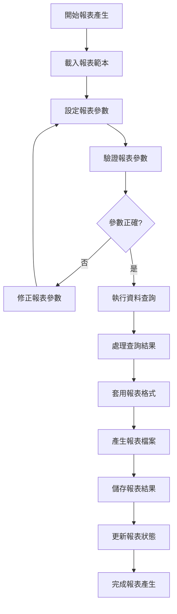
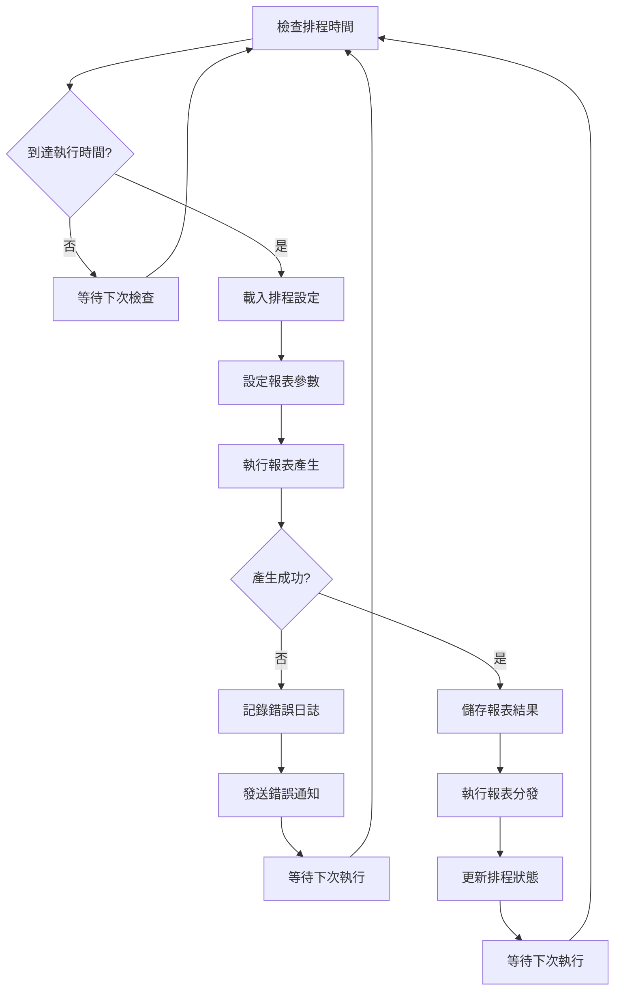
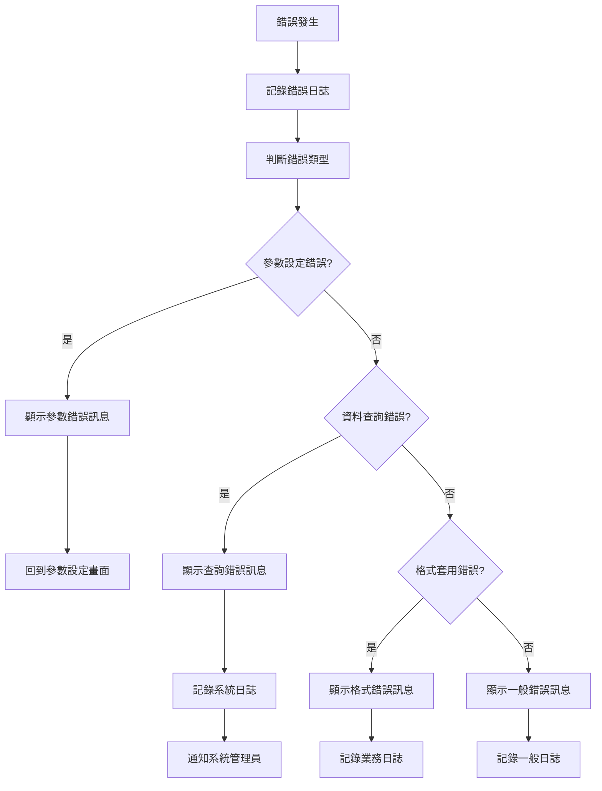

# 產品模組 程式功能規格書 - 庫存報表作業

## 文件基本資訊

| 項目 | 說明 |
|------|------|
| **文件名稱** | 產品模組程式功能規格書 - 庫存報表作業 |
| **模組代號** | PD |
| **版本** | v1.0 |
| **建立日期** | 2024年12月21日 |
| **建立人員** | 系統分析師 |
| **審核人員** | 專案經理 |
| **文件狀態** | 初稿 |
| **最後更新** | 2024年12月21日 |

---

## 目錄

1. [基本資料](#基本資料)
2. [檔案架構與關聯圖](#檔案架構與關聯圖)
3. [檔案名稱與欄位規格](#檔案名稱與欄位規格)
4. [輸出/入螢幕布局與說明](#輸出入螢幕布局與說明)
5. [處理流程程序說明](#處理流程程序說明)
6. [子程序處理邏輯說明](#子程序處理邏輯說明)
7. [錯誤處理程序說明與訊息清冊](#錯誤處理程序說明與訊息清冊)
8. [備註](#備註)
9. [附錄](#附錄)

---

## 基本資料

### 1.1 功能概述

庫存報表作業系統是產品模組庫存管理的重要報表功能，主要負責產生各種類型的庫存報表，包括庫存現況報表、庫存移動報表、庫存分析報表、庫存趨勢報表、庫存異常報表等。系統透過完整的報表引擎、多樣化的報表格式、靈活的查詢條件、豐富的統計分析，為企業提供全面的庫存資訊，幫助企業進行庫存決策和營運管理。

### 1.2 主要功能

- **庫存現況報表**：產生庫存現況報表，包括庫存數量、庫存價值、庫存狀態等
- **庫存移動報表**：產生庫存移動報表，包括入庫、出庫、調整、盤點等移動記錄
- **庫存分析報表**：產生庫存分析報表，包括庫存週轉率、庫存結構、庫存效率等
- **庫存趨勢報表**：產生庫存趨勢報表，包括庫存變化趨勢、預測分析等
- **庫存異常報表**：產生庫存異常報表，包括庫存警告、異常庫存、問題庫存等
- **報表管理功能**：管理報表範本、報表排程、報表分發等

### 1.3 技術架構

- **開發語言**：RPG、CL、SQL、Python
- **資料庫**：DB2 for i (IBM i)
- **報表引擎**：報表邏輯處理、資料查詢、格式轉換
- **分析工具**：統計分析、圖表產生、趨勢預測
- **部署環境**：IBM i 7.4

---

## 檔案架構與關聯圖

### 2.1 檔案架構圖



### 2.2 檔案關聯說明

| 主檔 | 關聯檔 | 關聯類型 | 關聯說明 |
|------|--------|----------|----------|
| **庫存主檔(INV)** | 庫存報表主檔(INVREP) | 1:1 | 一個庫存記錄對應一個報表主檔記錄 |
| **庫存明細檔(INVD)** | 庫存報表主檔(INVREP) | 1:N | 多個明細記錄可產生報表 |
| **庫存移動檔(INVM)** | 庫存報表主檔(INVREP) | 1:N | 移動記錄用於產生移動報表 |
| **庫存報表主檔(INVREP)** | 報表範本檔(INVREP1) | 1:N | 一個報表可有多個範本 |
| **庫存報表主檔(INVREP)** | 報表參數檔(INVREP2) | 1:N | 一個報表可有多個參數設定 |

---

## 檔案名稱與欄位規格

### 3.1 庫存報表主檔 (INVREP)

#### 3.1.1 檔案基本資訊

| 項目 | 說明 |
|------|------|
| **檔案名稱** | 庫存報表主檔 |
| **檔案代號** | INVREP |
| **檔案描述** | 儲存庫存報表相關資訊的主檔 |
| **檔案類型** | 主檔 |
| **檔案大小** | 約 500MB |
| **記錄筆數** | 約 50,000 筆 |

#### 3.1.2 欄位規格

| 欄位代號 | 欄位名稱 | 位置 | 長度 | 型態 | 屬性 | 檢核說明 |
|----------|----------|------|------|------|------|----------|
| **INVREPID** | 報表編號 | 1-20 | 20 | A | PK | 主鍵，不可重複 |
| **INVREPTY** | 報表類型 | 21-40 | 20 | A | M | 必填，現況/移動/分析/趨勢/異常 |
| **INVREPST** | 報表狀態 | 41-50 | 10 | A | M | 必填，草稿/已產生/已分發/已歸檔 |
| **INVREPTP** | 報表範本 | 51-70 | 20 | A | M | 必填，需存在於報表範本檔 |
| **INVREPWH** | 倉庫代號 | 71-90 | 20 | A | O | 可選填，特定倉庫報表 |
| **INVREPPD** | 產品類別 | 91-110 | 20 | A | O | 可選填，特定產品類別 |
| **INVREPCR** | 建立人員 | 111-130 | 20 | A | M | 必填，需存在於使用者主檔 |
| **INVREPCD** | 建立日期 | 131-140 | 10 | D | M | 必填，系統自動填入 |
| **INVREPTM** | 建立時間 | 141-150 | 10 | T | M | 必填，系統自動填入 |
| **INVREPDS** | 報表描述 | 151-250 | 100 | A | O | 可選填，報表詳細描述 |

### 3.2 報表範本檔 (INVREP1)

#### 3.2.1 檔案基本資訊

| 項目 | 說明 |
|------|------|
| **檔案名稱** | 報表範本檔 |
| **檔案代號** | INVREP1 |
| **檔案描述** | 儲存庫存報表範本的檔案 |
| **檔案類型** | 明細檔 |
| **檔案大小** | 約 300MB |
| **記錄筆數** | 約 30,000 筆 |

#### 3.2.2 欄位規格

| 欄位代號 | 欄位名稱 | 位置 | 長度 | 型態 | 屬性 | 檢核說明 |
|----------|----------|------|------|------|------|----------|
| **INVREP1ID** | 範本編號 | 1-20 | 20 | A | PK | 主鍵，不可重複 |
| **INVREP1TY** | 範本類型 | 21-40 | 20 | A | M | 必填，現況/移動/分析/趨勢/異常 |
| **INVREP1NM** | 範本名稱 | 41-80 | 40 | A | M | 必填，範本顯示名稱 |
| **INVREP1DS** | 範本描述 | 81-180 | 100 | A | O | 可選填，範本詳細描述 |
| **INVREP1FT** | 輸出格式 | 181-200 | 20 | A | M | 必填，PDF/Excel/HTML/CSV |
| **INVREP1ST** | 範本狀態 | 201-210 | 10 | A | M | 必填，啟用/停用/測試 |
| **INVREP1CR** | 建立人員 | 211-230 | 20 | A | M | 必填，系統自動填入 |
| **INVREP1CD** | 建立日期 | 231-240 | 10 | D | M | 必填，系統自動填入 |

### 3.3 報表參數檔 (INVREP2)

#### 3.3.1 檔案基本資訊

| 項目 | 說明 |
|------|------|
| **檔案名稱** | 報表參數檔 |
| **檔案代號** | INVREP2 |
| **檔案描述** | 儲存庫存報表參數設定的檔案 |
| **檔案類型** | 明細檔 |
| **檔案大小** | 約 400MB |
| **記錄筆數** | 約 60,000 筆 |

#### 3.3.2 欄位規格

| 欄位代號 | 欄位名稱 | 位置 | 長度 | 型態 | 屬性 | 檢核說明 |
|----------|----------|------|------|------|------|----------|
| **INVREP2ID** | 參數編號 | 1-20 | 20 | A | PK | 主鍵，不可重複 |
| **INVREP2RE** | 報表編號 | 21-40 | 20 | A | M | 必填，需存在於報表主檔 |
| **INVREP2NM** | 參數名稱 | 41-80 | 40 | A | M | 必填，參數顯示名稱 |
| **INVREP2CD** | 參數代碼 | 81-100 | 20 | A | M | 必填，參數系統代碼 |
| **INVREP2TY** | 參數類型 | 101-120 | 20 | A | M | 必填，文字/數字/日期/下拉 |
| **INVREP2VL** | 參數值 | 121-200 | 80 | A | M | 必填，參數的預設值或選擇值 |
| **INVREP2RE** | 必填標誌 | 201-210 | 10 | A | M | 必填，是/否 |
| **INVREP2DS** | 參數說明 | 211-310 | 100 | A | O | 可選填，參數詳細說明 |

---

## 輸出/入螢幕布局與說明

### 4.1 庫存報表主畫面

#### 4.1.1 畫面布局

```
┌─────────────────────────────────────────────────────────────┐
│                    庫存報表作業系統                          │
├─────────────────────────────────────────────────────────────┤
│ 報表功能選擇：                                              │
│  [1]庫存現況報表  [2]庫存移動報表  [3]庫存分析報表          │
│  [4]庫存趨勢報表  [5]庫存異常報表  [6]報表範本管理          │
│  [7]報表排程管理  [8]報表分發管理  [9]系統參數設定          │
│  [0]離開系統                                                │
├─────────────────────────────────────────────────────────────┤
│ 快速報表：                                                  │
│  報表類型：[庫存現況 ▼] [產生]                               │
│  倉庫代號：[WH001           ] [選擇]                       │
│  產品類別：[全部 ▼] [選擇]                                  │
├─────────────────────────────────────────────────────────────┤
│ 系統狀態：                                                  │
│  今日報表數：[45] 進行中報表：[3] 已完成報表：[42]          │
│  最後更新：[2024/12/21 14:30:00] 更新人員：[ADMIN]         │
├─────────────────────────────────────────────────────────────┤
│ 功能鍵：F1=說明  F3=離開  F4=產生  F6=新增  F8=修改  F12=取消│
└─────────────────────────────────────────────────────────────┘
```

#### 4.1.2 功能選項說明

| 選項 | 功能說明 |
|------|----------|
| **1** | 庫存現況報表：產生庫存現況報表，包括庫存數量、庫存價值、庫存狀態等 |
| **2** | 庫存移動報表：產生庫存移動報表，包括入庫、出庫、調整、盤點等移動記錄 |
| **3** | 庫存分析報表：產生庫存分析報表，包括庫存週轉率、庫存結構、庫存效率等 |
| **4** | 庫存趨勢報表：產生庫存趨勢報表，包括庫存變化趨勢、預測分析等 |
| **5** | 庫存異常報表：產生庫存異常報表，包括庫存警告、異常庫存、問題庫存等 |
| **6** | 報表範本管理：管理報表範本，包括範本建立、修改、刪除、啟用等 |
| **7** | 報表排程管理：管理報表排程，包括排程設定、執行監控、結果管理等 |
| **8** | 報表分發管理：管理報表分發，包括分發設定、接收管理、通知管理等 |
| **9** | 系統參數設定：設定報表系統的技術參數和配置 |
| **0** | 離開系統 |

### 4.2 報表參數設定畫面

#### 4.2.1 畫面布局

```
┌─────────────────────────────────────────────────────────────┐
│                      報表參數設定                            │
├─────────────────────────────────────────────────────────────┤
│ 報表基本資料：                                              │
│  報表編號：[REP20241221001   ] [查詢] [清除]               │
│  報表類型：[庫存現況報表    ] [顯示]                       │
│  報表範本：[現況報表範本01  ] [選擇]                       │
│  輸出格式：[PDF ▼] [選擇]                                   │
│  報表狀態：[草稿            ] [顯示]                       │
├─────────────────────────────────────────────────────────────┤
│ 報表參數設定：                                              │
│ ┌─────┬──────────┬──────────┬──────────┬──────────┬────────┐ │
│ │序號 │參數名稱  │參數代碼  │參數類型  │參數值    │必填    │ │
│ ├─────┼──────────┼──────────┼──────────┼──────────┼────────┤ │
│ │  1  │[        ] [        ] [        ] [        ] [        ] │ │
│ │  2  │[        ] [        ] [        ] [        ] [        ] │ │
│ └─────┴──────────┴──────────┴──────────┴──────────┴────────┘ │
│ 報表摘要：                                                  │
│  報表描述：[庫存現況報表，顯示各倉庫的庫存現況]              │
│  參數數量：[8] 必填參數：[5] 可選參數：[3]                  │
├─────────────────────────────────────────────────────────────┤
│ 功能鍵：F1=說明  F3=離開  F4=儲存  F8=修改  F12=取消      │
│ 特殊功能：F5=新增參數  F6=刪除參數  F7=參數驗證  F9=預覽報表│
└─────────────────────────────────────────────────────────────┘
```

#### 4.2.2 參數設定說明

| 欄位名稱 | 說明 | 格式要求 |
|----------|------|----------|
| **報表編號** | 要設定的報表編號 | 最多20個字元，支援精確查詢 |
| **報表類型** | 報表的主要類型 | 現況/移動/分析/趨勢/異常 |
| **報表範本** | 使用的報表範本 | 從報表範本檔選擇 |
| **輸出格式** | 報表的輸出格式 | PDF/Excel/HTML/CSV |
| **參數名稱** | 參數的顯示名稱 | 最多40個字元，使用者友善名稱 |
| **參數代碼** | 參數的系統代碼 | 最多20個字元，系統識別用 |
| **參數類型** | 參數的資料類型 | 文字/數字/日期/下拉 |
| **參數值** | 參數的預設值或選擇值 | 根據參數類型設定格式 |

---

## 處理流程程序說明

### 5.1 報表產生流程

#### 5.1.1 流程圖



#### 5.1.2 處理步驟說明

1. **開始報表產生**
   - 使用者選擇要產生的報表類型
   - 系統載入對應的報表範本

2. **載入報表範本**
   - 從報表範本檔載入報表範本
   - 設定報表的基本格式和樣式

3. **設定報表參數**
   - 使用者設定報表的查詢條件
   - 包括時間範圍、倉庫範圍、產品範圍等

4. **驗證報表參數**
   - 系統驗證報表參數的正確性
   - 檢查必填參數是否完整

5. **執行資料查詢**
   - 根據報表參數執行資料庫查詢
   - 取得報表所需的資料

6. **處理查詢結果**
   - 對查詢結果進行資料處理
   - 包括資料排序、分組、計算等

### 5.2 報表排程執行流程

#### 5.2.1 流程圖



#### 5.2.2 處理步驟說明

1. **檢查排程時間**
   - 系統定期檢查是否有需要執行的報表排程
   - 根據排程設定判斷是否到達執行時間

2. **載入排程設定**
   - 從報表排程檔載入排程設定
   - 包括報表類型、執行時間、參數設定等

3. **設定報表參數**
   - 根據排程設定自動設定報表參數
   - 包括時間範圍、倉庫範圍等

4. **執行報表產生**
   - 自動執行報表產生流程
   - 不需要人工介入

5. **執行報表分發**
   - 根據分發設定自動分發報表
   - 包括郵件發送、檔案上傳等

---

## 子程序處理邏輯說明

### 6.1 報表資料查詢子程序

#### 6.1.1 程序名稱
`QUERYDATA` - 報表資料查詢子程序

#### 6.1.2 處理邏輯

```rpg
// 報表資料查詢邏輯
// 根據報表參數查詢報表所需的資料

DCLF FILE(INV) KEYED
DCLF FILE(INVD) KEYED
DCLF FILE(INVM) KEYED
DCL VAR(&REPORTID) TYPE(*CHAR) LEN(20)
DCL VAR(&REPORTTYPE) TYPE(*CHAR) LEN(20)
DCL VAR(&WAREHOUSEID) TYPE(*CHAR) LEN(20)
DCL VAR(&PRODUCTCAT) TYPE(*CHAR) LEN(20)
DCL VAR(&STARTDATE) TYPE(*CHAR) LEN(10)
DCL VAR(&ENDDATE) TYPE(*CHAR) LEN(10)
DCL VAR(&QUERYFLAG) TYPE(*CHAR) LEN(1)

// 初始化變數
CHGVAR VAR(&QUERYFLAG) VALUE('Y')

// 根據報表類型執行不同的查詢邏輯
SELECT
  WHEN &REPORTTYPE = '庫存現況'
    // 查詢庫存現況資料
    SETLL ('') INV
    READ INV
    DO WHILE %EOF = *OFF
      // 檢查倉庫條件
      IF &WAREHOUSEID = '' OR &INVWH = &WAREHOUSEID
        // 檢查產品類別條件
        IF &PRODUCTCAT = '' OR &INVPC = &PRODUCTCAT
          // 處理庫存現況資料
          // ... 資料處理邏輯
        ENDIF
      ENDIF
      READ INV
    ENDDO
    
  WHEN &REPORTTYPE = '庫存移動'
    // 查詢庫存移動資料
    SETLL ('') INVM
    READ INVM
    DO WHILE %EOF = *OFF
      // 檢查日期範圍
      IF &INVMCD >= &STARTDATE AND &INVMCD <= &ENDDATE
        // 檢查倉庫條件
        IF &WAREHOUSEID = '' OR &INVMWH = &WAREHOUSEID
          // 處理庫存移動資料
          // ... 資料處理邏輯
        ENDIF
      ENDIF
      READ INVM
    ENDDO
    
  WHEN &REPORTTYPE = '庫存分析'
    // 查詢庫存分析資料
    // 包括庫存週轉率、庫存結構等
    // ... 分析資料查詢邏輯
    
  OTHERWISE
    CHGVAR VAR(&QUERYFLAG) VALUE('N')
ENDSELECT
```

#### 6.1.3 參數說明

| 參數名稱 | 型態 | 長度 | 說明 |
|----------|------|------|------|
| **&REPORTID** | *CHAR | 20 | 報表編號 |
| **&REPORTTYPE** | *CHAR | 20 | 報表類型 |
| **&WAREHOUSEID** | *CHAR | 20 | 倉庫代號 |
| **&PRODUCTCAT** | *CHAR | 20 | 產品類別 |
| **&STARTDATE** | *CHAR | 10 | 開始日期 |
| **&ENDDATE** | *CHAR | 10 | 結束日期 |
| **&QUERYFLAG** | *CHAR | 1 | 查詢結果標誌 |

### 6.2 報表格式套用子程序

#### 6.2.1 程序名稱
`APPLYFORMAT` - 報表格式套用子程序

#### 6.2.2 處理邏輯

```rpg
// 報表格式套用邏輯
// 將查詢結果套用到報表範本格式

DCLF FILE(INVREP1) KEYED
DCL VAR(&TEMPLATEID) TYPE(*CHAR) LEN(20)
DCL VAR(&OUTPUTFORMAT) TYPE(*CHAR) LEN(20)
DCL VAR(&FORMATFLAG) TYPE(*CHAR) LEN(1)
DCL VAR(&REPORTDATA) TYPE(*CHAR) LEN(1000)

// 初始化變數
CHGVAR VAR(&FORMATFLAG) VALUE('Y')

// 讀取報表範本
SETLL (&TEMPLATEID) INVREP1
READ INVREP1
IF %EOF = *OFF
  // 取得輸出格式
  CHGVAR VAR(&OUTPUTFORMAT) VALUE(&INVREP1FT)
  
  // 根據輸出格式套用不同的格式處理
  SELECT
    WHEN &OUTPUTFORMAT = 'PDF'
      // 套用PDF格式
      CALL PGM(PDFFORMAT) PARM(&REPORTDATA &TEMPLATEID)
      
    WHEN &OUTPUTFORMAT = 'Excel'
      // 套用Excel格式
      CALL PGM(EXCELFORMAT) PARM(&REPORTDATA &TEMPLATEID)
      
    WHEN &OUTPUTFORMAT = 'HTML'
      // 套用HTML格式
      CALL PGM(HTMLFORMAT) PARM(&REPORTDATA &TEMPLATEID)
      
    WHEN &OUTPUTFORMAT = 'CSV'
      // 套用CSV格式
      CALL PGM(CSVFORMAT) PARM(&REPORTDATA &TEMPLATEID)
      
    OTHERWISE
      CHGVAR VAR(&FORMATFLAG) VALUE('N')
  ENDSELECT
ELSE
  CHGVAR VAR(&FORMATFLAG) VALUE('N')
ENDIF
```

#### 6.2.3 參數說明

| 參數名稱 | 型態 | 長度 | 說明 |
|----------|------|------|------|
| **&TEMPLATEID** | *CHAR | 20 | 範本編號 |
| **&OUTPUTFORMAT** | *CHAR | 20 | 輸出格式 |
| **&FORMATFLAG** | *CHAR | 1 | 格式套用結果標誌 |
| **&REPORTDATA** | *CHAR | 1000 | 報表資料 |

---

## 錯誤處理程序說明與訊息清冊

### 7.1 錯誤處理流程

#### 7.1.1 錯誤處理流程圖



#### 7.1.2 錯誤處理原則

1. **錯誤預防優先**
   - 在報表參數設定時進行即時驗證
   - 提供清楚的錯誤提示訊息

2. **錯誤記錄完整**
   - 記錄錯誤發生的時間、位置、原因
   - 記錄錯誤發生時的報表條件

3. **錯誤恢復機制**
   - 提供錯誤修正的建議
   - 支援錯誤報表的重新產生

### 7.2 錯誤訊息清冊

#### 7.2.1 參數設定錯誤

| 錯誤代碼 | 錯誤訊息 | 錯誤原因 | 解決方法 |
|----------|----------|----------|----------|
| **INVREP001** | 報表參數資料不完整 | 必填參數未設定 | 請設定所有必填參數 |
| **INVREP002** | 報表範本不存在 | 報表範本代碼無效 | 請檢查報表範本設定 |
| **INVREP003** | 參數值格式錯誤 | 參數值格式不符合要求 | 請檢查參數值格式 |
| **INVREP004** | 參數範圍設定錯誤 | 參數範圍設定不合理 | 請檢查參數範圍設定 |
| **INVREP005** | 參數驗證失敗 | 參數驗證邏輯錯誤 | 請檢查參數驗證設定 |

#### 7.2.2 資料查詢錯誤

| 錯誤代碼 | 錯誤訊息 | 錯誤原因 | 解決方法 |
|----------|----------|----------|----------|
| **INVREP101** | 資料查詢失敗 | 資料庫查詢錯誤 | 請檢查資料庫連線 |
| **INVREP102** | 查詢條件錯誤 | 查詢條件設定錯誤 | 請檢查查詢條件 |
| **INVREP103** | 資料處理失敗 | 資料處理邏輯錯誤 | 請重新執行查詢 |
| **INVREP104** | 查詢權限不足 | 使用者查詢權限不足 | 請聯繫系統管理員 |
| **INVREP105** | 查詢服務異常 | 查詢服務執行異常 | 請聯繫系統管理員 |

#### 7.2.3 格式套用錯誤

| 錯誤代碼 | 錯誤訊息 | 錯誤原因 | 解決方法 |
|----------|----------|----------|----------|
| **INVREP201** | 格式套用失敗 | 格式套用邏輯錯誤 | 請重新套用格式 |
| **INVREP202** | 範本格式錯誤 | 範本格式設定錯誤 | 請檢查範本格式 |
| **INVREP203** | 輸出格式不支援 | 輸出格式不支援 | 請選擇支援的輸出格式 |
| **INVREP204** | 檔案產生失敗 | 檔案產生過程錯誤 | 請重新產生檔案 |
| **INVREP205** | 格式轉換失敗 | 格式轉換過程錯誤 | 請檢查格式轉換設定 |

---

## 備註

### 8.1 系統限制

1. **報表產生限制**
   - 單次報表最多處理100,000筆記錄
   - 單次報表最多支援50個參數
   - 報表檔案最大大小為500MB

2. **報表範本限制**
   - 單一報表最多支援10個範本
   - 範本描述最大長度為100個字元
   - 範本格式最大大小為10MB

3. **報表排程限制**
   - 單一報表最多支援20個排程
   - 排程執行記錄保留期限為3年

4. **報表分發限制**
   - 單次分發最多支援100個接收者
   - 分發記錄保留期限為2年

### 8.2 效能考量

1. **報表優化**
   - 建議在常用查詢欄位建立資料庫索引
   - 使用適當的查詢條件減少資料掃描範圍

2. **快取機制**
   - 對常用的報表範本進行快取
   - 對報表結果進行快取

3. **批次處理**
   - 大量報表使用批次處理
   - 支援非同步報表產生

### 8.3 安全性考量

1. **報表權限控制**
   - 根據使用者角色設定不同的報表權限
   - 記錄所有報表操作的日誌

2. **資料安全性保護**
   - 報表產生前後進行資料安全性檢查
   - 報表過程使用加密機制保護敏感資料

3. **報表審計**
   - 記錄所有報表條件的審計日誌
   - 定期分析異常報表行為

---

## 附錄

### A.1 相關文件清單

- 產品模組程式功能規格書 - 庫存管理
- 產品模組程式功能規格書 - 庫存分析作業
- 產品模組程式功能規格書 - 庫存調整作業
- 產品模組程式功能規格書 - 庫存盤點作業
- 庫存報表作業操作手冊
- 報表範本管理規範
- 系統整合測試報告

### A.2 修訂記錄

| 版本 | 修訂日期 | 修訂人員 | 修訂內容 | 修訂原因 |
|------|----------|----------|----------|----------|
| v1.0 | 2024/12/21 | 系統分析師 | 初始版本建立 | 新功能開發 |

### A.3 聯絡資訊

- **專案經理**：[專案經理姓名]
- **系統分析師**：[系統分析師姓名]
- **技術支援**：[技術支援聯絡方式]
- **專案信箱**：[專案信箱地址]

### A.4 常用縮寫說明

| 縮寫 | 全名 | 說明 |
|------|------|------|
| **INVREP** | Inventory Report | 庫存報表 |
| **INVREP1** | Inventory Report Template | 庫存報表範本 |
| **INVREP2** | Inventory Report Parameter | 庫存報表參數 |
| **INV** | Inventory | 庫存 |
| **INVM** | Inventory Movement | 庫存移動 |
| **PD** | Product | 產品 |
| **WH** | Warehouse | 倉庫 |
| **ERP** | Enterprise Resource Planning | 企業資源規劃 |

### A.5 系統訊息代碼

| 訊息代碼 | 訊息內容 | 說明 |
|----------|----------|------|
| **INVREP001** | 報表參數設定成功 | 庫存報表參數已成功設定 |
| **INVREP002** | 報表範本載入成功 | 報表範本已成功載入 |
| **INVREP003** | 資料查詢完成 | 報表資料查詢已完成 |
| **INVREP004** | 格式套用完成 | 報表格式套用已完成 |
| **INVREP005** | 報表產生成功 | 庫存報表已成功產生 |
| **INVREP006** | 報表儲存完成 | 報表結果已成功儲存 |
| **INVREP007** | 報表分發完成 | 報表分發已成功完成 |
| **INVREP008** | 排程執行完成 | 報表排程執行已完成 |
| **INVREP009** | 系統參數已設定 | 報表系統參數已成功設定 |
| **INVREP010** | 報表快取已更新 | 報表快取已成功更新 |

### A.6 報表類型說明

#### A.6.1 庫存現況報表

| 報表特點 | 報表內容 | 報表用途 | 產生頻率 |
|----------|----------|----------|----------|
| **即時現況** | 庫存數量、價值、狀態 | 庫存監控、決策支援 | 即時/每日 |
| **分類統計** | 按產品類別、倉庫分類 | 庫存結構分析、資源配置 | 每日/每週 |
| **異常提醒** | 庫存警告、異常庫存 | 問題識別、風險控制 | 即時/每日 |

#### A.6.2 庫存移動報表

| 報表特點 | 報表內容 | 報表用途 | 產生頻率 |
|----------|----------|----------|----------|
| **移動記錄** | 入庫、出庫、調整記錄 | 庫存變動追蹤、審計支援 | 每日/每週 |
| **移動統計** | 移動數量、金額統計 | 庫存流動性分析、效率評估 | 每週/每月 |
| **異常移動** | 異常移動記錄、問題分析 | 問題識別、流程改善 | 即時/每日 |

### A.7 報表流程範例

#### A.7.1 庫存現況報表流程

| 序號 | 流程步驟 | 操作內容 | 執行人員 |
|------|----------|----------|----------|
| **1** | 選擇報表類型 | 選擇庫存現況報表 | 使用者 |
| **2** | 設定報表參數 | 設定倉庫、產品類別等參數 | 使用者 |
| **3** | 執行資料查詢 | 查詢庫存現況資料 | 系統自動 |
| **4** | 套用報表格式 | 套用現況報表範本格式 | 系統自動 |
| **5** | 產生報表檔案 | 產生PDF/Excel等格式檔案 | 系統自動 |
| **6** | 儲存報表結果 | 儲存報表檔案和記錄 | 系統自動 |
| **7** | 完成報表產生 | 報表產生完成，可下載使用 | 使用者 |

#### A.7.2 報表排程執行流程

| 序號 | 流程步驟 | 操作內容 | 執行人員 |
|------|----------|----------|----------|
| **1** | 排程時間到達 | 系統檢查排程時間 | 系統自動 |
| **2** | 載入排程設定 | 載入報表排程參數 | 系統自動 |
| **3** | 執行報表產生 | 自動執行報表產生流程 | 系統自動 |
| **4** | 檢查產生結果 | 檢查報表產生是否成功 | 系統自動 |
| **5** | 執行報表分發 | 自動分發報表給指定人員 | 系統自動 |
| **6** | 更新排程狀態 | 更新排程執行狀態 | 系統自動 |

### A.8 報表效能優化建議

#### A.8.1 資料庫查詢優化建議

| 優化項目 | 建議內容 | 說明 |
|----------|----------|------|
| **索引建立** | 在常用查詢欄位建立索引 | 提升查詢效能 |
| **查詢條件** | 使用適當的查詢條件 | 減少資料掃描範圍 |
| **資料分區** | 根據時間或範圍進行資料分區 | 提升查詢效率 |
| **查詢快取** | 對常用查詢結果進行快取 | 減少重複查詢 |

#### A.8.2 報表產生優化建議

| 優化項目 | 建議內容 | 說明 |
|----------|----------|------|
| **批次處理** | 大量報表使用批次處理 | 提升處理效率 |
| **非同步處理** | 支援非同步報表產生 | 改善使用者體驗 |
| **格式優化** | 選擇適當的輸出格式 | 平衡檔案大小和品質 |
| **資源管理** | 合理分配系統資源 | 避免系統負載過重 |
