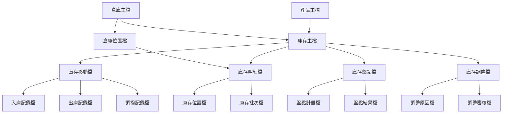
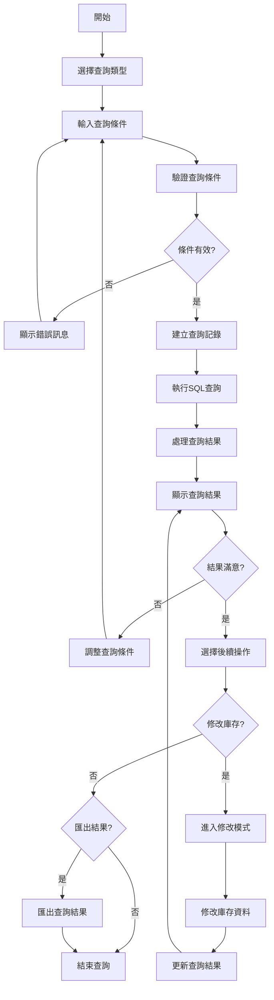
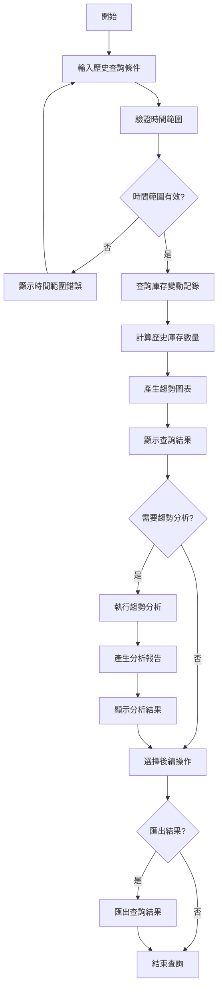
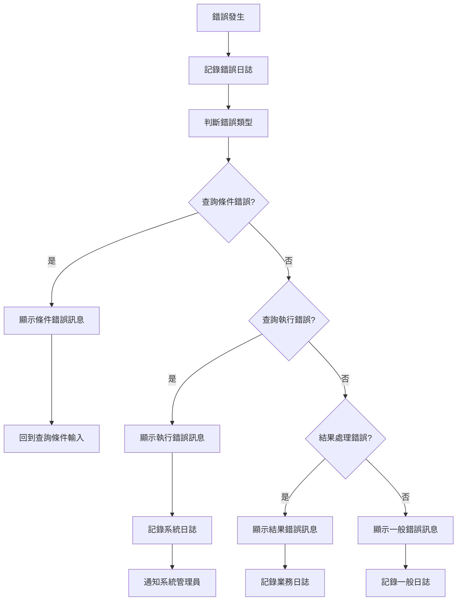

# 產品模組 程式功能規格書 - 庫存查詢作業

## 文件基本資訊

| 項目 | 說明 |
|------|------|
| **文件名稱** | 產品模組程式功能規格書 - 庫存查詢作業 |
| **模組代號** | PD |
| **版本** | v1.0 |
| **建立日期** | 2024年12月21日 |
| **建立人員** | 系統分析師 |
| **審核人員** | 專案經理 |
| **文件狀態** | 初稿 |
| **最後更新** | 2024年12月21日 |

---

## 目錄

1. [基本資料](#基本資料)
2. [檔案架構與關聯圖](#檔案架構與關聯圖)
3. [檔案名稱與欄位規格](#檔案名稱與欄位規格)
4. [輸出/入螢幕布局與說明](#輸出入螢幕布局與說明)
5. [處理流程程序說明](#處理流程程序說明)
6. [子程序處理邏輯說明](#子程序處理邏輯說明)
7. [錯誤處理程序說明與訊息清冊](#錯誤處理程序說明與訊息清冊)
8. [備註](#備註)
9. [附錄](#附錄)

---

## 基本資料

### 1.1 功能概述

庫存查詢作業系統是產品模組庫存管理的核心查詢功能，主要負責提供多種庫存查詢方式，包括即時庫存查詢、庫存歷史查詢、庫存變動查詢、庫存統計查詢等。系統支援多條件組合查詢、模糊查詢、範圍查詢等進階查詢功能，為使用者提供快速、準確的庫存資訊檢索服務。

### 1.2 主要功能

- **即時庫存查詢**：查詢產品當前庫存狀況、庫存位置、庫存狀態
- **庫存歷史查詢**：查詢產品庫存變動歷史、庫存趨勢分析
- **庫存變動查詢**：查詢入庫、出庫、調撥、調整等庫存變動記錄
- **庫存統計查詢**：查詢庫存統計資訊、庫存分析報表
- **多條件查詢**：支援產品、倉庫、時間、數量等多條件組合查詢
- **查詢結果匯出**：支援查詢結果匯出為Excel、PDF等格式

### 1.3 技術架構

- **開發語言**：RPG、CL、SQL
- **資料庫**：DB2 for i (IBM i)
- **開發環境**：IBM i
- **查詢引擎**：SQL查詢優化器
- **報表工具**：IBM Cognos、Crystal Reports
- **部署環境**：IBM i 7.4

---

## 檔案架構與關聯圖

### 2.1 檔案架構圖



### 2.2 檔案關聯說明

| 主檔 | 關聯檔 | 關聯類型 | 關聯說明 |
|------|--------|----------|----------|
| **產品主檔(PD)** | 庫存主檔(INV) | 1:1 | 一個產品對應一個庫存主檔記錄 |
| **庫存主檔(INV)** | 庫存明細檔(INVD) | 1:N | 一個庫存記錄可有多個明細記錄 |
| **庫存主檔(INV)** | 庫存移動檔(INVM) | 1:N | 一個庫存記錄可有多個移動記錄 |
| **庫存主檔(INV)** | 庫存盤點檔(INVP) | 1:N | 一個庫存記錄可有多個盤點記錄 |
| **庫存主檔(INV)** | 庫存調整檔(INVA) | 1:N | 一個庫存記錄可有多個調整記錄 |
| **倉庫主檔(WH)** | 庫存主檔(INV) | 1:N | 一個倉庫可有多個庫存記錄 |
| **倉庫主檔(WH)** | 倉庫位置檔(WHL) | 1:N | 一個倉庫可有多個位置 |

---

## 檔案名稱與欄位規格

### 3.1 庫存查詢主檔 (INVQ)

#### 3.1.1 檔案基本資訊

| 項目 | 說明 |
|------|------|
| **檔案名稱** | 庫存查詢主檔 |
| **檔案代號** | INVQ |
| **檔案描述** | 儲存庫存查詢相關資訊的主檔 |
| **檔案類型** | 主檔 |
| **檔案大小** | 約 500MB |
| **記錄筆數** | 約 50,000 筆 |

#### 3.1.2 欄位規格

| 欄位代號 | 欄位名稱 | 位置 | 長度 | 型態 | 屬性 | 檢核說明 |
|----------|----------|------|------|------|------|----------|
| **INVQID** | 查詢編號 | 1-20 | 20 | A | PK | 主鍵，不可重複 |
| **INVQPD** | 產品編號 | 21-40 | 20 | A | M | 必填，需存在於產品主檔 |
| **INVQWH** | 倉庫代號 | 41-60 | 20 | A | M | 必填，需存在於倉庫主檔 |
| **INVQTY** | 查詢類型 | 61-80 | 20 | A | M | 必填，即時/歷史/變動/統計 |
| **INVQST** | 查詢狀態 | 81-90 | 10 | A | M | 必填，執行中/完成/失敗 |
| **INVQCR** | 查詢人員 | 91-110 | 20 | A | M | 必填，系統自動填入 |
| **INVQCD** | 查詢日期 | 111-120 | 10 | D | M | 必填，系統自動填入 |
| **INVQTM** | 查詢時間 | 121-130 | 10 | T | M | 必填，系統自動填入 |
| **INVQRS** | 查詢結果 | 131-230 | 100 | A | O | 可選填，查詢結果摘要 |
| **INVQER** | 錯誤訊息 | 231-330 | 100 | A | O | 可選填，錯誤訊息內容 |

### 3.2 庫存查詢條件檔 (INVQC)

#### 3.2.1 檔案基本資訊

| 項目 | 說明 |
|------|------|
| **檔案名稱** | 庫存查詢條件檔 |
| **檔案代號** | INVQC |
| **檔案描述** | 儲存庫存查詢條件的檔案 |
| **檔案類型** | 明細檔 |
| **檔案大小** | 約 200MB |
| **記錄筆數** | 約 100,000 筆 |

#### 3.2.2 欄位規格

| 欄位代號 | 欄位名稱 | 位置 | 長度 | 型態 | 屬性 | 檢核說明 |
|----------|----------|------|------|------|------|----------|
| **INVQCID** | 條件編號 | 1-20 | 20 | A | PK | 主鍵，不可重複 |
| **INVQCIN** | 查詢編號 | 21-40 | 20 | A | M | 必填，需存在於查詢主檔 |
| **INVQCFD** | 欄位名稱 | 41-90 | 50 | A | M | 必填，查詢條件欄位名稱 |
| **INVQCOP** | 運算符號 | 91-110 | 20 | A | M | 必填，等於/大於/小於/包含等 |
| **INVQCVL** | 條件值 | 111-210 | 100 | A | M | 必填，查詢條件的值 |
| **INVQCLG** | 邏輯符號 | 211-220 | 10 | A | M | 必填，AND/OR |
| **INVQCR** | 建立人員 | 221-240 | 20 | A | M | 必填，系統自動填入 |
| **INVQCD** | 建立日期 | 241-250 | 10 | D | M | 必填，系統自動填入 |

### 3.3 庫存查詢結果檔 (INVQR)

#### 3.3.1 檔案基本資訊

| 項目 | 說明 |
|------|------|
| **檔案名稱** | 庫存查詢結果檔 |
| **檔案代號** | INVQR |
| **檔案描述** | 儲存庫存查詢結果的檔案 |
| **檔案類型** | 明細檔 |
| **檔案大小** | 約 1GB |
| **記錄筆數** | 約 500,000 筆 |

#### 3.3.2 欄位規格

| 欄位代號 | 欄位名稱 | 位置 | 長度 | 型態 | 屬性 | 檢核說明 |
|----------|----------|------|------|------|------|----------|
| **INVQRID** | 結果編號 | 1-20 | 20 | A | PK | 主鍵，不可重複 |
| **INVQRIN** | 查詢編號 | 21-40 | 20 | A | M | 必填，需存在於查詢主檔 |
| **INVQRPD** | 產品編號 | 41-60 | 20 | A | M | 必填，產品編號 |
| **INVQRWH** | 倉庫代號 | 61-80 | 20 | A | M | 必填，倉庫代號 |
| **INVQRQT** | 庫存數量 | 81-90 | 10 | N | M | 必填，數字格式 |
| **INVQRUN** | 庫存單位 | 91-110 | 20 | A | M | 必填，庫存單位 |
| **INVQRST** | 庫存狀態 | 111-120 | 10 | A | M | 必填，庫存狀態 |
| **INVQRDT** | 資料日期 | 121-130 | 10 | D | M | 必填，資料日期 |
| **INVQRCR** | 建立人員 | 131-150 | 20 | A | M | 必填，系統自動填入 |
| **INVQRCD** | 建立日期 | 151-160 | 10 | D | M | 必填，系統自動填入 |

---

## 輸出/入螢幕布局與說明

### 4.1 庫存查詢主畫面

#### 4.1.1 畫面布局

```
┌─────────────────────────────────────────────────────────────┐
│                    庫存查詢作業系統                          │
├─────────────────────────────────────────────────────────────┤
│ 查詢類型選擇：                                              │
│  [1]即時庫存查詢  [2]庫存歷史查詢  [3]庫存變動查詢          │
│  [4]庫存統計查詢  [5]庫存位置查詢  [6]庫存批次查詢          │
│  [7]查詢條件管理  [8]查詢結果管理  [9]查詢報表產生          │
│  [0]離開系統                                                │
├─────────────────────────────────────────────────────────────┤
│ 快速查詢：                                                  │
│  產品編號：[PD20241221001    ] [查詢]                       │
│  產品名稱：[智慧型手機      ] [查詢]                       │
│  倉庫代號：[WH001           ] [查詢]                       │
├─────────────────────────────────────────────────────────────┤
│ 系統狀態：                                                  │
│  今日查詢次數：[156] 查詢成功率：[98.5%] 平均查詢時間：[0.8秒] │
│  最後更新：[2024/12/21 14:30:00] 更新人員：[ADMIN]         │
├─────────────────────────────────────────────────────────────┤
│ 功能鍵：F1=說明  F3=離開  F4=查詢  F6=新增  F8=修改  F12=取消│
└─────────────────────────────────────────────────────────────┘
```

#### 4.1.2 功能選項說明

| 選項 | 功能說明 |
|------|----------|
| **1** | 即時庫存查詢：查詢產品當前庫存狀況 |
| **2** | 庫存歷史查詢：查詢產品庫存變動歷史 |
| **3** | 庫存變動查詢：查詢入庫、出庫、調撥等變動記錄 |
| **4** | 庫存統計查詢：查詢庫存統計資訊和分析報表 |
| **5** | 庫存位置查詢：查詢產品在倉庫中的具體位置 |
| **6** | 庫存批次查詢：查詢產品批次相關的庫存資訊 |
| **7** | 查詢條件管理：管理常用的查詢條件組合 |
| **8** | 查詢結果管理：管理查詢結果和歷史記錄 |
| **9** | 查詢報表產生：產生各種查詢結果報表 |
| **0** | 離開系統 |

### 4.2 即時庫存查詢畫面

#### 4.2.1 畫面布局

```
┌─────────────────────────────────────────────────────────────┐
│                      即時庫存查詢                            │
├─────────────────────────────────────────────────────────────┤
│ 查詢條件：                                                  │
│  產品編號：[PD20241221001    ] [查詢] [清除]               │
│  產品名稱：[智慧型手機      ] [模糊查詢] [清除]             │
│  倉庫代號：[WH001           ] [查詢] [清除]               │
│  庫存狀態：[全部 ▼] [查詢]                                  │
│  庫存範圍：[全部 ▼] [查詢]                                  │
│  數量範圍：[    ] 到 [    ] [查詢]                          │
├─────────────────────────────────────────────────────────────┤
│ 查詢結果：                                                  │
│ ┌─────┬──────────┬──────────┬──────────┬──────────┬────────┐ │
│ │序號 │產品編號  │產品名稱  │倉庫代號  │庫存數量  │庫存狀態│ │
│ ├─────┼──────────┼──────────┼──────────┼──────────┼────────┤ │
│ │  1  │[        ] [        ] [        ] [        ] [        ] │ │
│ │  2  │[        ] [        ] [        ] [        ] [        ] │ │
│ └─────┴──────────┴──────────┴──────────┴──────────┴────────┘ │
│ 查詢統計：總筆數：[25] 總數量：[1,250] 平均數量：[50]        │
├─────────────────────────────────────────────────────────────┤
│ 功能鍵：F1=說明  F3=離開  F4=查詢  F8=修改  F12=取消      │
│ 特殊功能：F5=重新整理  F6=新增條件  F7=刪除條件  F9=匯出   │
└─────────────────────────────────────────────────────────────┘
```

#### 4.2.2 查詢條件說明

| 欄位名稱 | 說明 | 格式要求 |
|----------|------|----------|
| **產品編號** | 要查詢的產品編號 | 最多20個字元，支援精確查詢 |
| **產品名稱** | 要查詢的產品名稱 | 最多50個字元，支援模糊查詢 |
| **倉庫代號** | 要查詢的倉庫代號 | 最多20個字元，支援精確查詢 |
| **庫存狀態** | 庫存的狀態 | 全部/正常/凍結/停用/不足/過剩 |
| **庫存範圍** | 庫存數量範圍 | 全部/不足/正常/過剩 |
| **數量範圍** | 庫存數量的範圍 | 數字格式，支援範圍查詢 |

### 4.3 庫存歷史查詢畫面

#### 4.3.1 畫面布局

```
┌─────────────────────────────────────────────────────────────┐
│                      庫存歷史查詢                            │
├─────────────────────────────────────────────────────────────┤
│ 查詢條件：                                                  │
│  產品編號：[PD20241221001    ] [查詢]                       │
│  倉庫代號：[WH001           ] [查詢]                       │
│  時間範圍：[2024/01/01] 到 [2024/12/21] [查詢]             │
│  變動類型：[全部 ▼] [查詢]                                  │
│  數量範圍：[    ] 到 [    ] [查詢]                          │
├─────────────────────────────────────────────────────────────┤
│ 查詢結果：                                                  │
│ ┌─────┬──────────┬──────────┬──────────┬──────────┬────────┐ │
│ │序號 │日期      │變動類型  │變動數量  │變動前數量│變動後數量│ │
│ ├─────┼──────────┼──────────┼──────────┼──────────┼────────┤ │
│ │  1  │[        ] [        ] [        ] [        ] [        ] │ │
│ │  2  │[        ] [        ] [        ] [        ] [        ] │ │
│ └─────┴──────────┴──────────┴──────────┴──────────┴────────┘ │
│ 趨勢圖表：[顯示庫存變動趨勢圖]                              │
├─────────────────────────────────────────────────────────────┤
│ 功能鍵：F1=說明  F3=離開  F4=查詢  F8=修改  F12=取消      │
│ 特殊功能：F5=重新整理  F6=圖表顯示  F7=趨勢分析  F9=匯出   │
└─────────────────────────────────────────────────────────────┘
```

---

## 處理流程程序說明

### 5.1 即時庫存查詢流程

#### 5.1.1 流程圖



#### 5.1.2 處理步驟說明

1. **選擇查詢類型**
   - 使用者選擇要執行的查詢類型
   - 系統根據選擇載入對應的查詢畫面

2. **輸入查詢條件**
   - 使用者輸入各種查詢條件
   - 支援單一條件或多條件組合查詢

3. **驗證查詢條件**
   - 檢查輸入條件的格式是否正確
   - 驗證產品編號、倉庫代號等是否存在

4. **建立查詢記錄**
   - 在查詢主檔中建立查詢記錄
   - 記錄查詢條件、查詢人員、查詢時間等

5. **執行SQL查詢**
   - 根據查詢條件動態產生SQL查詢語句
   - 執行查詢並取得結果集

6. **處理查詢結果**
   - 對查詢結果進行排序、篩選、統計
   - 計算總數量、平均數量等統計資訊

### 5.2 庫存歷史查詢流程

#### 5.2.1 流程圖



#### 5.2.2 處理步驟說明

1. **輸入歷史查詢條件**
   - 設定產品編號、倉庫代號、時間範圍等條件
   - 選擇要查詢的變動類型

2. **驗證時間範圍**
   - 檢查時間範圍是否合理
   - 驗證開始日期和結束日期的有效性

3. **查詢庫存變動記錄**
   - 從庫存移動檔查詢指定時間範圍內的變動記錄
   - 按時間順序排序變動記錄

4. **計算歷史庫存數量**
   - 根據期初庫存和變動記錄計算各時點的庫存數量
   - 產生庫存數量時間序列

5. **產生趨勢圖表**
   - 根據庫存數量時間序列產生趨勢圖表
   - 支援多種圖表類型（折線圖、柱狀圖等）

---

## 子程序處理邏輯說明

### 6.1 庫存查詢條件組合子程序

#### 6.1.1 程序名稱
`BLDINVQCOND` - 庫存查詢條件組合子程序

#### 6.1.2 處理邏輯

```rpg
// 庫存查詢條件組合邏輯
// 將多個查詢條件組合成SQL WHERE子句

DCLF FILE(INVQC) KEYED
DCL VAR(&QUERYID) TYPE(*CHAR) LEN(20)
DCL VAR(&SQLWHERE) TYPE(*CHAR) LEN(1000)
DCL VAR(&CONDCOUNT) TYPE(*PACKED) LEN(3 0)
DCL VAR(&FIRSTCOND) TYPE(*CHAR) LEN(1)

// 初始化變數
CHGVAR VAR(&SQLWHERE) VALUE('')
CHGVAR VAR(&CONDCOUNT) VALUE(0)
CHGVAR VAR(&FIRSTCOND) VALUE('Y')

// 查詢條件記錄
SETLL (&QUERYID) INVQC
READ INVQC
DO WHILE %EOF = *OFF
  IF &INVQCIN = &QUERYID
    // 增加條件計數
    CHGVAR VAR(&CONDCOUNT) VALUE(&CONDCOUNT + 1)
    
    // 組合SQL條件
    IF &FIRSTCOND = 'Y'
      CHGVAR VAR(&SQLWHERE) VALUE('WHERE ')
      CHGVAR VAR(&FIRSTCOND) VALUE('N')
    ELSE
      CHGVAR VAR(&SQLWHERE) VALUE(&SQLWHERE + ' ' + &INVQCLG + ' ')
    ENDIF
    
    // 組合欄位條件
    CHGVAR VAR(&SQLWHERE) VALUE(&SQLWHERE + &INVQCFD + ' ' + &INVQCOP + ' ''' + &INVQCVL + '''')
  ENDIF
  READ INVQC
ENDDO

// 如果沒有條件，設定預設條件
IF &CONDCOUNT = 0
  CHGVAR VAR(&SQLWHERE) VALUE('WHERE 1=1')
ENDIF
```

#### 6.1.3 參數說明

| 參數名稱 | 型態 | 長度 | 說明 |
|----------|------|------|------|
| **&QUERYID** | *CHAR | 20 | 查詢編號 |
| **&SQLWHERE** | *CHAR | 1000 | 組合後的SQL WHERE子句 |
| **&CONDCOUNT** | *PACKED | 3,0 | 條件數量 |
| **&FIRSTCOND** | *CHAR | 1 | 是否為第一個條件 |

### 6.2 庫存查詢結果統計子程序

#### 6.2.1 程序名稱
`CALINVQSTAT` - 庫存查詢結果統計子程序

#### 6.2.2 處理邏輯

```rpg
// 庫存查詢結果統計邏輯
// 計算查詢結果的統計資訊

DCLF FILE(INVQR) KEYED
DCL VAR(&QUERYID) TYPE(*CHAR) LEN(20)
DCL VAR(&TOTALREC) TYPE(*PACKED) LEN(5 0)
DCL VAR(&TOTALQTY) TYPE(*PACKED) LEN(10 0)
DCL VAR(&AVGQTY) TYPE(*PACKED) LEN(8 2)
DCL VAR(&MINQTY) TYPE(*PACKED) LEN(10 0)
DCL VAR(&MAXQTY) TYPE(*PACKED) LEN(10 0)

// 初始化變數
CHGVAR VAR(&TOTALREC) VALUE(0)
CHGVAR VAR(&TOTALQTY) VALUE(0)
CHGVAR VAR(&MINQTY) VALUE(999999999)
CHGVAR VAR(&MAXQTY) VALUE(0)

// 查詢結果記錄
SETLL (&QUERYID) INVQR
READ INVQR
DO WHILE %EOF = *OFF
  IF &INVQRIN = &QUERYID
    // 增加記錄計數
    CHGVAR VAR(&TOTALREC) VALUE(&TOTALREC + 1)
    
    // 累計數量
    CHGVAR VAR(&TOTALQTY) VALUE(&TOTALQTY + &INVQRQT)
    
    // 計算最小數量
    IF &INVQRQT < &MINQTY
      CHGVAR VAR(&MINQTY) VALUE(&INVQRQT)
    ENDIF
    
    // 計算最大數量
    IF &INVQRQT > &MAXQTY
      CHGVAR VAR(&MAXQTY) VALUE(&INVQRQT)
    ENDIF
  ENDIF
  READ INVQR
ENDDO

// 計算平均數量
IF &TOTALREC > 0
  CHGVAR VAR(&AVGQTY) VALUE(&TOTALQTY / &TOTALREC)
ENDIF
```

#### 6.2.3 參數說明

| 參數名稱 | 型態 | 長度 | 說明 |
|----------|------|------|------|
| **&QUERYID** | *CHAR | 20 | 查詢編號 |
| **&TOTALREC** | *PACKED | 5,0 | 總記錄數 |
| **&TOTALQTY** | *PACKED | 10,0 | 總數量 |
| **&AVGQTY** | *PACKED | 8,2 | 平均數量 |
| **&MINQTY** | *PACKED | 10,0 | 最小數量 |
| **&MAXQTY** | *PACKED | 10,0 | 最大數量 |

---

## 錯誤處理程序說明與訊息清冊

### 7.1 錯誤處理流程

#### 7.1.1 錯誤處理流程圖



#### 7.1.2 錯誤處理原則

1. **錯誤預防優先**
   - 在查詢條件輸入時進行即時驗證
   - 提供清楚的錯誤提示訊息

2. **錯誤記錄完整**
   - 記錄錯誤發生的時間、位置、原因
   - 記錄錯誤發生時的查詢條件

3. **錯誤恢復機制**
   - 提供錯誤修正的建議
   - 支援錯誤查詢的重新執行

### 7.2 錯誤訊息清冊

#### 7.2.1 查詢條件錯誤

| 錯誤代碼 | 錯誤訊息 | 錯誤原因 | 解決方法 |
|----------|----------|----------|----------|
| **INVQ001** | 查詢條件不能為空 | 必填查詢條件未填寫 | 請輸入必要的查詢條件 |
| **INVQ002** | 產品編號不存在 | 產品編號無效 | 請檢查產品編號或使用模糊查詢 |
| **INVQ003** | 倉庫代號不存在 | 倉庫代號無效 | 請檢查倉庫代號 |
| **INVQ004** | 時間範圍無效 | 開始日期大於結束日期 | 請調整時間範圍 |
| **INVQ005** | 數量範圍無效 | 最小數量大於最大數量 | 請調整數量範圍 |

#### 7.2.2 查詢執行錯誤

| 錯誤代碼 | 錯誤訊息 | 錯誤原因 | 解決方法 |
|----------|----------|----------|----------|
| **INVQ101** | 查詢執行失敗 | SQL查詢語法錯誤 | 請聯繫系統管理員 |
| **INVQ102** | 查詢超時 | 查詢執行時間過長 | 請縮小查詢範圍或聯繫系統管理員 |
| **INVQ103** | 查詢結果過多 | 查詢結果超過限制 | 請增加查詢條件縮小範圍 |
| **INVQ104** | 資料庫連線失敗 | 資料庫服務異常 | 請聯繫系統管理員 |
| **INVQ105** | 查詢權限不足 | 使用者查詢權限不足 | 請聯繫系統管理員 |

#### 7.2.3 結果處理錯誤

| 錯誤代碼 | 錯誤訊息 | 錯誤原因 | 解決方法 |
|----------|----------|----------|----------|
| **INVQ201** | 結果統計失敗 | 統計計算錯誤 | 請重新執行查詢 |
| **INVQ202** | 圖表產生失敗 | 圖表產生工具異常 | 請聯繫系統管理員 |
| **INVQ203** | 結果匯出失敗 | 匯出格式不支援 | 請選擇支援的匯出格式 |
| **INVQ204** | 結果排序失敗 | 排序欄位不存在 | 請選擇有效的排序欄位 |
| **INVQ205** | 結果篩選失敗 | 篩選條件無效 | 請檢查篩選條件 |

---

## 備註

### 8.1 系統限制

1. **查詢條件限制**
   - 單次查詢最多支援20個條件組合
   - 查詢條件值最大長度為100個字元

2. **查詢結果限制**
   - 單次查詢結果最多顯示10,000筆記錄
   - 查詢結果匯出檔案最大為50MB

3. **查詢時間限制**
   - 單次查詢執行時間最長為300秒
   - 查詢歷史記錄保留期限為2年

4. **並發查詢限制**
   - 同時執行的查詢數量最多為100個
   - 單一使用者的並發查詢數量最多為5個

### 8.2 效能考量

1. **查詢優化**
   - 建議在常用查詢欄位建立資料庫索引
   - 使用適當的查詢條件減少資料掃描範圍

2. **快取機制**
   - 對常用的查詢結果進行快取
   - 對查詢統計資訊進行快取

3. **查詢分頁**
   - 大量查詢結果使用分頁顯示
   - 支援虛擬滾動提升顯示效能

### 8.3 安全性考量

1. **查詢權限控制**
   - 根據使用者角色設定不同的查詢權限
   - 記錄所有查詢操作的日誌

2. **資料隱私保護**
   - 敏感資料查詢需要額外授權
   - 查詢結果中的敏感資訊進行遮罩處理

3. **查詢審計**
   - 記錄所有查詢條件的審計日誌
   - 定期分析異常查詢行為

---

## 附錄

### A.1 相關文件清單

- 產品模組程式功能規格書 - 庫存管理
- 產品模組程式功能規格書 - 產品管理
- 庫存查詢作業操作手冊
- 查詢條件管理規範
- 系統整合測試報告

### A.2 修訂記錄

| 版本 | 修訂日期 | 修訂人員 | 修訂內容 | 修訂原因 |
|------|----------|----------|----------|----------|
| v1.0 | 2024/12/21 | 系統分析師 | 初始版本建立 | 新功能開發 |

### A.3 聯絡資訊

- **專案經理**：[專案經理姓名]
- **系統分析師**：[系統分析師姓名]
- **技術支援**：[技術支援聯絡方式]
- **專案信箱**：[專案信箱地址]

### A.4 常用縮寫說明

| 縮寫 | 全名 | 說明 |
|------|------|------|
| **INVQ** | Inventory Query | 庫存查詢 |
| **INVQC** | Inventory Query Condition | 庫存查詢條件 |
| **INVQR** | Inventory Query Result | 庫存查詢結果 |
| **INV** | Inventory | 庫存 |
| **PD** | Product | 產品 |
| **WH** | Warehouse | 倉庫 |
| **ERP** | Enterprise Resource Planning | 企業資源規劃 |

### A.5 系統訊息代碼

| 訊息代碼 | 訊息內容 | 說明 |
|----------|----------|------|
| **INVQ001** | 查詢執行成功 | 庫存查詢已成功執行 |
| **INVQ002** | 查詢條件已儲存 | 查詢條件已成功儲存 |
| **INVQ003** | 查詢結果已匯出 | 查詢結果已成功匯出 |
| **INVQ004** | 查詢統計完成 | 查詢結果統計已完成 |
| **INVQ005** | 圖表產生完成 | 查詢結果圖表已產生 |
| **INVQ006** | 查詢歷史已清除 | 查詢歷史記錄已清除 |
| **INVQ007** | 查詢條件已更新 | 查詢條件已成功更新 |
| **INVQ008** | 查詢權限已設定 | 查詢權限已成功設定 |
| **INVQ009** | 查詢報表已產生 | 查詢報表已成功產生 |
| **INVQ010** | 查詢快取已更新 | 查詢快取已成功更新 |

### A.6 查詢條件範例

#### A.6.1 基本查詢條件

| 查詢類型 | 條件欄位 | 運算符號 | 條件值 | 說明 |
|----------|----------|----------|--------|------|
| **精確查詢** | 產品編號 | = | PD20241221001 | 查詢特定產品 |
| **模糊查詢** | 產品名稱 | LIKE | %手機% | 查詢名稱包含"手機"的產品 |
| **範圍查詢** | 庫存數量 | BETWEEN | 100 AND 500 | 查詢庫存數量在100-500之間的產品 |
| **比較查詢** | 庫存數量 | > | 0 | 查詢庫存數量大於0的產品 |
| **列表查詢** | 倉庫代號 | IN | WH001,WH002 | 查詢特定倉庫的產品 |

#### A.6.2 進階查詢條件

| 查詢類型 | 條件欄位 | 運算符號 | 條件值 | 說明 |
|----------|----------|----------|--------|------|
| **日期範圍** | 最後異動日期 | BETWEEN | 2024/01/01 AND 2024/12/21 | 查詢特定日期範圍內異動的庫存 |
| **狀態組合** | 庫存狀態 | IN | 正常,凍結 | 查詢特定狀態的庫存 |
| **數量統計** | 庫存數量 | HAVING | SUM(庫存數量) > 1000 | 查詢總庫存數量超過1000的產品 |
| **關聯查詢** | 產品分類 | EXISTS | (SELECT 1 FROM 產品分類 WHERE 分類名稱='電子產品') | 查詢特定分類的產品庫存 |
| **子查詢** | 產品編號 | IN | (SELECT 產品編號 FROM 產品主檔 WHERE 產品狀態='啟用') | 查詢啟用狀態產品的庫存 |

### A.7 查詢結果範例

#### A.7.1 即時庫存查詢結果

| 序號 | 產品編號 | 產品名稱 | 倉庫代號 | 庫存數量 | 庫存單位 | 庫存狀態 | 最後異動日期 |
|------|----------|----------|----------|----------|----------|----------|--------------|
| **1** | PD001 | 智慧型手機 | WH001 | 150 | 個 | 正常 | 2024/12/21 |
| **2** | PD002 | 筆記型電腦 | WH001 | 75 | 台 | 正常 | 2024/12/21 |
| **3** | PD003 | 平板電腦 | WH001 | 0 | 台 | 庫存不足 | 2024/12/20 |
| **4** | PD004 | 印表機 | WH002 | 200 | 台 | 庫存過剩 | 2024/12/19 |
| **5** | PD005 | 掃描器 | WH002 | 25 | 台 | 正常 | 2024/12/21 |

#### A.7.2 庫存歷史查詢結果

| 序號 | 日期 | 變動類型 | 變動數量 | 變動前數量 | 變動後數量 | 變動原因 | 操作人員 |
|------|------|----------|----------|------------|------------|----------|----------|
| **1** | 2024/12/21 | 入庫 | +100 | 50 | 150 | 採購入庫 | 張三 |
| **2** | 2024/12/20 | 出庫 | -25 | 75 | 50 | 銷售出庫 | 李四 |
| **3** | 2024/12/19 | 調撥 | -50 | 250 | 200 | 倉庫調撥 | 王五 |
| **4** | 2024/12/18 | 調整 | +10 | 40 | 50 | 盤點調整 | 趙六 |
| **5** | 2024/12/17 | 入庫 | +200 | 0 | 200 | 採購入庫 | 孫七 |

### A.8 查詢效能優化建議

#### A.8.1 資料庫索引建議

| 欄位名稱 | 索引類型 | 說明 |
|----------|----------|------|
| **產品編號** | 主鍵索引 | 產品編號是主鍵，自動建立索引 |
| **倉庫代號** | 單欄索引 | 常用於倉庫範圍查詢 |
| **庫存數量** | 單欄索引 | 常用於數量範圍查詢 |
| **最後異動日期** | 單欄索引 | 常用於時間範圍查詢 |
| **產品編號+倉庫代號** | 複合索引 | 常用於產品和倉庫組合查詢 |
| **庫存狀態+庫存數量** | 複合索引 | 常用於狀態和數量組合查詢 |

#### A.8.2 查詢語句優化建議

| 優化項目 | 建議內容 | 說明 |
|----------|----------|------|
| **SELECT欄位** | 只選擇必要的欄位 | 避免SELECT *，減少資料傳輸量 |
| **WHERE條件** | 使用索引欄位作為條件 | 優先使用有索引的欄位進行查詢 |
| **JOIN操作** | 使用適當的JOIN類型 | 根據資料關係選擇INNER JOIN、LEFT JOIN等 |
| **ORDER BY** | 使用索引欄位排序 | 避免對大量資料進行非索引欄位排序 |
| **LIMIT分頁** | 使用分頁查詢 | 避免一次查詢大量資料，使用分頁機制 |
| **子查詢** | 考慮使用JOIN替代 | 某些情況下JOIN比子查詢效能更好 |
