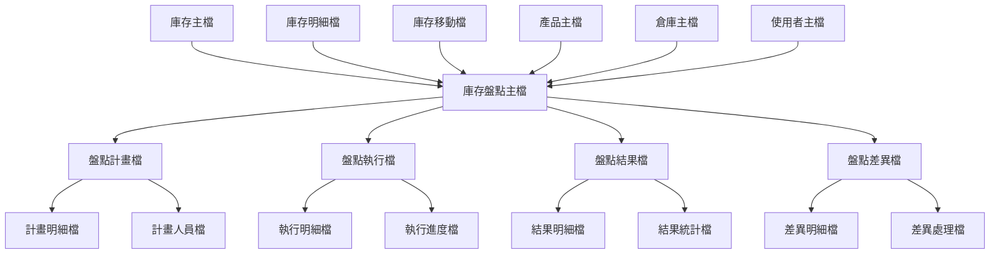
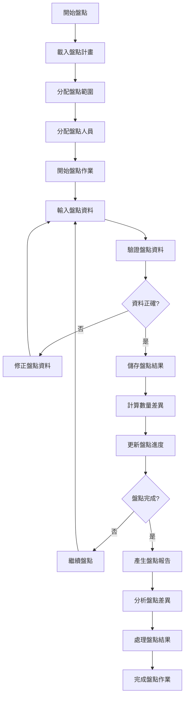
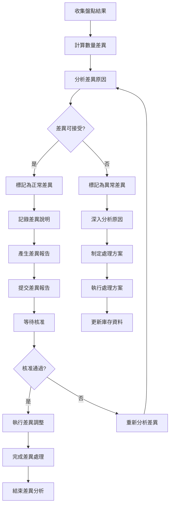
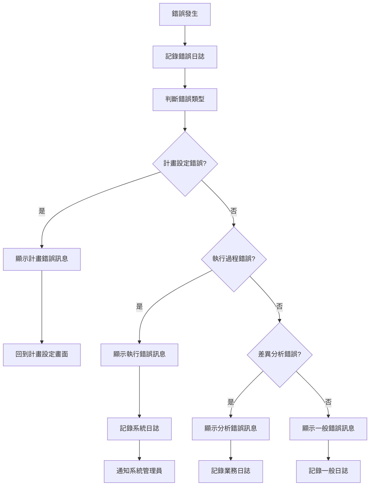

# 產品模組 程式功能規格書 - 庫存盤點作業

## 文件基本資訊

| 項目 | 說明 |
|------|------|
| **文件名稱** | 產品模組程式功能規格書 - 庫存盤點作業 |
| **模組代號** | PD |
| **版本** | v1.0 |
| **建立日期** | 2024年12月21日 |
| **建立人員** | 系統分析師 |
| **審核人員** | 專案經理 |
| **文件狀態** | 初稿 |
| **最後更新** | 2024年12月21日 |

---

## 目錄

1. [基本資料](#基本資料)
2. [檔案架構與關聯圖](#檔案架構與關聯圖)
3. [檔案名稱與欄位規格](#檔案名稱與欄位規格)
4. [輸出/入螢幕布局與說明](#輸出入螢幕布局與說明)
5. [處理流程程序說明](#處理流程程序說明)
6. [子程序處理邏輯說明](#子程序處理邏輯說明)
7. [錯誤處理程序說明與訊息清冊](#錯誤處理程序說明與訊息清冊)
8. [備註](#備註)
9. [附錄](#附錄)

---

## 基本資料

### 1.1 功能概述

庫存盤點作業系統是產品模組庫存管理的重要盤點功能，主要負責執行各種類型的庫存盤點作業，包括年度盤點、月度盤點、循環盤點、抽樣盤點等。系統透過完整的盤點流程、精確的盤點執行、詳細的差異分析、完整的結果處理，確保庫存資料的準確性和一致性，幫助企業維護庫存資料的正確性和完整性。

### 1.2 主要功能

- **盤點計畫管理**：制定和管理各種盤點計畫，包括盤點範圍、時間安排、人員分配
- **盤點執行作業**：執行實際的盤點作業，包括盤點資料輸入、盤點進度追蹤
- **盤點差異分析**：分析盤點結果與系統資料的差異，識別盤點問題
- **盤點結果處理**：處理盤點差異，包括差異確認、調整申請、結果核准
- **盤點報表產生**：產生各種盤點報表和統計分析
- **盤點歷史管理**：管理盤點歷史記錄，支援盤點趨勢分析

### 1.3 技術架構

- **開發語言**：RPG、CL、SQL
- **資料庫**：DB2 for i (IBM i)
- **盤點引擎**：盤點邏輯處理、差異計算、結果分析
- **報表系統**：盤點報表產生、統計分析、圖表展示
- **部署環境**：IBM i 7.4

---

## 檔案架構與關聯圖

### 2.1 檔案架構圖



### 2.2 檔案關聯說明

| 主檔 | 關聯檔 | 關聯類型 | 關聯說明 |
|------|--------|----------|----------|
| **庫存主檔(INV)** | 庫存盤點主檔(INVPH) | 1:1 | 一個庫存記錄對應一個盤點主檔記錄 |
| **庫存明細檔(INVD)** | 庫存盤點主檔(INVPH) | 1:N | 多個明細記錄可進行盤點 |
| **庫存移動檔(INVM)** | 庫存盤點主檔(INVPH) | 1:N | 盤點操作產生移動記錄 |
| **庫存盤點主檔(INVPH)** | 盤點計畫檔(INVPH1) | 1:N | 一個盤點可有多個計畫 |
| **庫存盤點主檔(INVPH)** | 盤點執行檔(INVPH2) | 1:N | 一個盤點可有多個執行記錄 |

---

## 檔案名稱與欄位規格

### 3.1 庫存盤點主檔 (INVPH)

#### 3.1.1 檔案基本資訊

| 項目 | 說明 |
|------|------|
| **檔案名稱** | 庫存盤點主檔 |
| **檔案代號** | INVPH |
| **檔案描述** | 儲存庫存盤點相關資訊的主檔 |
| **檔案類型** | 主檔 |
| **檔案大小** | 約 800MB |
| **記錄筆數** | 約 80,000 筆 |

#### 3.1.2 欄位規格

| 欄位代號 | 欄位名稱 | 位置 | 長度 | 型態 | 屬性 | 檢核說明 |
|----------|----------|------|------|------|------|----------|
| **INVPHID** | 盤點編號 | 1-20 | 20 | A | PK | 主鍵，不可重複 |
| **INVPHPD** | 產品編號 | 21-40 | 20 | A | M | 必填，需存在於產品主檔 |
| **INVPHWH** | 倉庫代號 | 41-60 | 20 | A | M | 必填，需存在於倉庫主檔 |
| **INVPHTP** | 盤點類型 | 61-80 | 20 | A | M | 必填，年度/月度/循環/抽樣 |
| **INVPHST** | 盤點狀態 | 81-90 | 10 | A | M | 必填，計畫中/執行中/已完成/已取消 |
| **INVPHPL** | 盤點計畫 | 91-110 | 20 | A | M | 必填，需存在於盤點計畫檔 |
| **INVPHCR** | 建立人員 | 111-130 | 20 | A | M | 必填，需存在於使用者主檔 |
| **INVPHCD** | 建立日期 | 131-140 | 10 | D | M | 必填，系統自動填入 |
| **INVPHTM** | 建立時間 | 141-150 | 10 | T | M | 必填，系統自動填入 |
| **INVPHDS** | 盤點描述 | 151-250 | 100 | A | O | 可選填，盤點詳細描述 |

### 3.2 盤點計畫檔 (INVPH1)

#### 3.2.1 檔案基本資訊

| 項目 | 說明 |
|------|------|
| **檔案名稱** | 盤點計畫檔 |
| **檔案代號** | INVPH1 |
| **檔案描述** | 儲存庫存盤點計畫的檔案 |
| **檔案類型** | 明細檔 |
| **檔案大小** | 約 600MB |
| **記錄筆數** | 約 100,000 筆 |

#### 3.2.2 欄位規格

| 欄位代號 | 欄位名稱 | 位置 | 長度 | 型態 | 屬性 | 檢核說明 |
|----------|----------|------|------|------|------|----------|
| **INVPH1ID** | 計畫編號 | 1-20 | 20 | A | PK | 主鍵，不可重複 |
| **INVPH1TP** | 計畫類型 | 21-40 | 20 | A | M | 必填，年度/月度/循環/抽樣 |
| **INVPH1WH** | 倉庫代號 | 41-60 | 20 | A | O | 可選填，特定倉庫計畫 |
| **INVPH1PD** | 產品類別 | 61-80 | 20 | A | O | 可選填，特定產品類別 |
| **INVPH1SD** | 開始日期 | 81-90 | 10 | D | M | 必填，盤點開始日期 |
| **INVPH1ED** | 結束日期 | 91-100 | 10 | D | M | 必填，盤點結束日期 |
| **INVPH1ST** | 計畫狀態 | 101-110 | 10 | A | M | 必填，草稿/已核准/執行中/已完成 |
| **INVPH1CR** | 建立人員 | 111-130 | 20 | A | M | 必填，系統自動填入 |
| **INVPH1CD** | 建立日期 | 131-140 | 10 | D | M | 必填，系統自動填入 |

### 3.3 盤點執行檔 (INVPH2)

#### 3.3.1 檔案基本資訊

| 項目 | 說明 |
|------|------|
| **檔案名稱** | 盤點執行檔 |
| **檔案代號** | INVPH2 |
| **檔案描述** | 儲存庫存盤點執行記錄的檔案 |
| **檔案類型** | 明細檔 |
| **檔案大小** | 約 1.5GB |
| **記錄筆數** | 約 300,000 筆 |

#### 3.3.2 欄位規格

| 欄位代號 | 欄位名稱 | 位置 | 長度 | 型態 | 屬性 | 檢核說明 |
|----------|----------|------|------|------|------|----------|
| **INVPH2ID** | 執行編號 | 1-20 | 20 | A | PK | 主鍵，不可重複 |
| **INVPH2PH** | 盤點編號 | 21-40 | 20 | A | M | 必填，需存在於盤點主檔 |
| **INVPH2PD** | 產品編號 | 41-60 | 20 | A | M | 必填，需存在於產品主檔 |
| **INVPH2WH** | 倉庫代號 | 61-80 | 20 | A | M | 必填，需存在於倉庫主檔 |
| **INVPH2QT** | 系統數量 | 81-90 | 10 | N | M | 必填，系統記錄的庫存數量 |
| **INVPH2PQ** | 盤點數量 | 91-100 | 10 | N | M | 必填，實際盤點的數量 |
| **INVPH2DF** | 數量差異 | 101-110 | 10 | N | M | 必填，盤點數量-系統數量 |
| **INVPH2OP** | 盤點人員 | 111-130 | 20 | A | M | 必填，執行盤點的人員 |
| **INVPH2DT** | 盤點日期 | 131-140 | 10 | D | M | 必填，盤點執行日期 |
| **INVPH2TM** | 盤點時間 | 141-150 | 10 | T | M | 必填，盤點執行時間 |

---

## 輸出/入螢幕布局與說明

### 4.1 庫存盤點主畫面

#### 4.1.1 畫面布局

```
┌─────────────────────────────────────────────────────────────┐
│                    庫存盤點作業系統                          │
├─────────────────────────────────────────────────────────────┤
│ 盤點功能選擇：                                              │
│  [1]盤點計畫管理  [2]盤點執行作業  [3]盤點差異分析          │
│  [4]盤點結果處理  [5]盤點報表作業  [6]盤點設定作業          │
│  [7]盤點歷史查詢  [8]盤點統計分析  [9]系統參數設定          │
│  [0]離開系統                                                │
├─────────────────────────────────────────────────────────────┤
│ 快速盤點：                                                  │
│  產品編號：[PD20241221001    ] [盤點]                       │
│  倉庫代號：[WH001           ] [盤點]                       │
│  盤點類型：[年度 ▼] [盤點]                                  │
├─────────────────────────────────────────────────────────────┤
│ 系統狀態：                                                  │
│  今日盤點數：[156] 進行中盤點：[8] 已完成盤點：[148]        │
│  最後更新：[2024/12/21 14:30:00] 更新人員：[ADMIN]         │
├─────────────────────────────────────────────────────────────┤
│ 功能鍵：F1=說明  F3=離開  F4=盤點  F6=新增  F8=修改  F12=取消│
└─────────────────────────────────────────────────────────────┘
```

#### 4.1.2 功能選項說明

| 選項 | 功能說明 |
|------|----------|
| **1** | 盤點計畫管理：制定和管理各種盤點計畫，包括盤點範圍、時間安排、人員分配 |
| **2** | 盤點執行作業：執行實際的盤點作業，包括盤點資料輸入、盤點進度追蹤 |
| **3** | 盤點差異分析：分析盤點結果與系統資料的差異，識別盤點問題 |
| **4** | 盤點結果處理：處理盤點差異，包括差異確認、調整申請、結果核准 |
| **5** | 盤點報表作業：產生各種盤點報表和統計分析 |
| **6** | 盤點設定作業：設定盤點系統的各種參數和配置 |
| **7** | 盤點歷史查詢：查詢盤點歷史記錄，支援盤點趨勢分析 |
| **8** | 盤點統計分析：分析盤點統計資料，包括盤點效率、差異趨勢等 |
| **9** | 系統參數設定：設定盤點系統的技術參數和配置 |
| **0** | 離開系統 |

### 4.2 盤點執行作業畫面

#### 4.2.1 畫面布局

```
┌─────────────────────────────────────────────────────────────┐
│                      盤點執行作業                            │
├─────────────────────────────────────────────────────────────┤
│ 盤點基本資料：                                              │
│  盤點編號：[PH20241221001    ] [查詢] [清除]               │
│  盤點類型：[年度盤點        ] [顯示]                       │
│  倉庫代號：[WH001           ] [查詢] [清除]               │
│  倉庫名稱：[台北主倉庫      ] [顯示]                       │
│  盤點狀態：[執行中          ] [顯示]                       │
│  執行進度：[45%             ] [顯示]                       │
├─────────────────────────────────────────────────────────────┤
│ 盤點執行內容：                                              │
│ ┌─────┬──────────┬──────────┬──────────┬──────────┬────────┐ │
│ │序號 │產品編號  │系統數量  │盤點數量  │數量差異  │盤點人員│ │
│ ├─────┼──────────┼──────────┼──────────┼──────────┼────────┤ │
│ │  1  │[        ] [        ] [        ] [        ] [        ] │ │
│ │  2  │[        ] [        ] [        ] [        ] [        ] │ │
│ └─────┴──────────┴──────────┴──────────┴──────────┴────────┘ │
│ 盤點摘要：                                                  │
│  總盤點項目：[1,250] 已完成：[562] 進行中：[688]            │
│  差異項目：[45] 差異率：[3.6%] 盤點準確率：[96.4%]          │
├─────────────────────────────────────────────────────────────┤
│ 功能鍵：F1=說明  F3=離開  F4=儲存  F8=修改  F12=取消      │
│ 特殊功能：F5=新增盤點  F6=刪除盤點  F7=差異分析  F9=完成盤點│
└─────────────────────────────────────────────────────────────┘
```

#### 4.2.2 盤點內容說明

| 欄位名稱 | 說明 | 格式要求 |
|----------|------|----------|
| **盤點編號** | 要執行的盤點編號 | 最多20個字元，支援精確查詢 |
| **盤點類型** | 盤點的主要類型 | 年度/月度/循環/抽樣 |
| **倉庫代號** | 要盤點的倉庫代號 | 最多20個字元，支援精確查詢 |
| **產品編號** | 要盤點的產品編號 | 最多20個字元，支援精確查詢 |
| **系統數量** | 系統記錄的庫存數量 | 數字格式，系統自動填入 |
| **盤點數量** | 實際盤點的數量 | 數字格式，盤點人員輸入 |
| **數量差異** | 盤點數量與系統數量的差異 | 數字格式，系統自動計算 |
| **盤點人員** | 執行盤點的人員 | 從使用者主檔選擇 |

---

## 處理流程程序說明

### 5.1 盤點執行流程

#### 5.1.1 流程圖



#### 5.1.2 處理步驟說明

1. **開始盤點**
   - 系統載入已核准的盤點計畫
   - 初始化盤點執行環境

2. **載入盤點計畫**
   - 從盤點計畫檔載入盤點範圍和時間安排
   - 設定盤點執行的參數和規則

3. **分配盤點範圍**
   - 根據盤點計畫分配盤點範圍
   - 設定盤點項目的優先級和順序

4. **分配盤點人員**
   - 根據盤點範圍分配適當的盤點人員
   - 設定盤點人員的權限和責任

5. **開始盤點作業**
   - 盤點人員開始執行盤點作業
   - 系統記錄盤點開始時間和人員

6. **輸入盤點資料**
   - 盤點人員輸入實際盤點的數量
   - 系統自動填入系統記錄的數量

### 5.2 盤點差異分析流程

#### 5.2.1 流程圖



#### 5.2.2 處理步驟說明

1. **收集盤點結果**
   - 系統收集所有盤點執行的結果
   - 整理盤點資料和相關資訊

2. **計算數量差異**
   - 計算每個產品的盤點數量與系統數量的差異
   - 識別差異的類型和程度

3. **分析差異原因**
   - 分析造成數量差異的可能原因
   - 包括系統誤差、人為錯誤、實際損耗等

4. **差異分類處理**
   - 根據差異程度和原因進行分類
   - 設定不同的處理流程和優先級

5. **制定處理方案**
   - 針對異常差異制定具體的處理方案
   - 包括調整申請、原因調查、預防措施等

---

## 子程序處理邏輯說明

### 6.1 盤點差異計算子程序

#### 6.1.1 程序名稱
`CALCDIFF` - 盤點差異計算子程序

#### 6.1.2 處理邏輯

```rpg
// 盤點差異計算邏輯
// 計算盤點數量與系統數量的差異

DCLF FILE(INVPH2) KEYED
DCL VAR(&PHYSICALID) TYPE(*CHAR) LEN(20)
DCL VAR(&DIFFERENCE) TYPE(*PACKED) LEN(10 0)
DCL VAR(&DIFFPERCENT) TYPE(*PACKED) LEN(8 2)
DCL VAR(&SYSTEMQTY) TYPE(*PACKED) LEN(10 0)
DCL VAR(&PHYSICALQTY) TYPE(*PACKED) LEN(10 0)
DCL VAR(&DIFFTYPE) TYPE(*CHAR) LEN(10)

// 初始化變數
CHGVAR VAR(&DIFFERENCE) VALUE(0)
CHGVAR VAR(&DIFFPERCENT) VALUE(0)
CHGVAR VAR(&DIFFTYPE) VALUE('')

// 讀取盤點執行資料
SETLL (&PHYSICALID) INVPH2
READ INVPH2
DO WHILE %EOF = *OFF
  IF &INVPH2ID = &PHYSICALID
    // 取得系統數量和盤點數量
    CHGVAR VAR(&SYSTEMQTY) VALUE(&INVPH2QT)
    CHGVAR VAR(&PHYSICALQTY) VALUE(&INVPH2PQ)
    
    // 計算數量差異
    CHGVAR VAR(&DIFFERENCE) VALUE(&PHYSICALQTY - &SYSTEMQTY)
    
    // 計算差異百分比
    IF &SYSTEMQTY > 0
      CHGVAR VAR(&DIFFPERCENT) VALUE((&DIFFERENCE / &SYSTEMQTY) * 100)
    ENDIF
    
    // 判斷差異類型
    IF &DIFFERENCE = 0
      CHGVAR VAR(&DIFFTYPE) VALUE('無差異')
    ELSE
      IF &DIFFERENCE > 0
        CHGVAR VAR(&DIFFTYPE) VALUE('盤盈')
      ELSE
        CHGVAR VAR(&DIFFTYPE) VALUE('盤虧')
      ENDIF
    ENDIF
    
    // 更新盤點執行檔的差異欄位
    CHGVAR VAR(&INVPH2DF) VALUE(&DIFFERENCE)
    UPDATE INVPH2
  ENDIF
  READ INVPH2
ENDDO
```

#### 6.1.3 參數說明

| 參數名稱 | 型態 | 長度 | 說明 |
|----------|------|------|------|
| **&PHYSICALID** | *CHAR | 20 | 盤點編號 |
| **&DIFFERENCE** | *PACKED | 10,0 | 數量差異 |
| **&DIFFPERCENT** | *PACKED | 8,2 | 差異百分比 |
| **&SYSTEMQTY** | *PACKED | 10,0 | 系統數量 |
| **&PHYSICALQTY** | *PACKED | 10,0 | 盤點數量 |
| **&DIFFTYPE** | *CHAR | 10 | 差異類型 |

### 6.2 盤點進度追蹤子程序

#### 6.2.1 程序名稱
`TRACKPROGRESS` - 盤點進度追蹤子程序

#### 6.2.2 處理邏輯

```rpg
// 盤點進度追蹤邏輯
// 追蹤盤點執行的進度和狀態

DCLF FILE(INVPH2) KEYED
DCL VAR(&PHYSICALID) TYPE(*CHAR) LEN(20)
DCL VAR(&TOTALITEMS) TYPE(*PACKED) LEN(10 0)
DCL VAR(&COMPLETEDITEMS) TYPE(*PACKED) LEN(10 0)
DCL VAR(&PROGRESSPERCENT) TYPE(*PACKED) LEN(8 2)
DCL VAR(&STATUS) TYPE(*CHAR) LEN(10)

// 初始化變數
CHGVAR VAR(&TOTALITEMS) VALUE(0)
CHGVAR VAR(&COMPLETEDITEMS) VALUE(0)
CHGVAR VAR(&PROGRESSPERCENT) VALUE(0)

// 讀取盤點執行資料
SETLL (&PHYSICALID) INVPH2
READ INVPH2
DO WHILE %EOF = *OFF
  IF &INVPH2ID = &PHYSICALID
    // 累計總項目數
    CHGVAR VAR(&TOTALITEMS) VALUE(&TOTALITEMS + 1)
    
    // 檢查是否已完成盤點
    IF &INVPH2PQ > 0
      CHGVAR VAR(&COMPLETEDITEMS) VALUE(&COMPLETEDITEMS + 1)
    ENDIF
  ENDIF
  READ INVPH2
ENDDO

// 計算進度百分比
IF &TOTALITEMS > 0
  CHGVAR VAR(&PROGRESSPERCENT) VALUE((&COMPLETEDITEMS / &TOTALITEMS) * 100)
ENDIF

// 判斷盤點狀態
IF &PROGRESSPERCENT = 0
  CHGVAR VAR(&STATUS) VALUE('未開始')
ELSE
  IF &PROGRESSPERCENT = 100
    CHGVAR VAR(&STATUS) VALUE('已完成')
  ELSE
    CHGVAR VAR(&STATUS) VALUE('進行中')
  ENDIF
ENDIF
```

#### 6.2.3 參數說明

| 參數名稱 | 型態 | 長度 | 說明 |
|----------|------|------|------|
| **&PHYSICALID** | *CHAR | 20 | 盤點編號 |
| **&TOTALITEMS** | *PACKED | 10,0 | 總項目數 |
| **&COMPLETEDITEMS** | *PACKED | 10,0 | 已完成項目數 |
| **&PROGRESSPERCENT** | *PACKED | 8,2 | 進度百分比 |
| **&STATUS** | *CHAR | 10 | 盤點狀態 |

---

## 錯誤處理程序說明與訊息清冊

### 7.1 錯誤處理流程

#### 7.1.1 錯誤處理流程圖



#### 7.1.2 錯誤處理原則

1. **錯誤預防優先**
   - 在盤點計畫設定時進行即時驗證
   - 提供清楚的錯誤提示訊息

2. **錯誤記錄完整**
   - 記錄錯誤發生的時間、位置、原因
   - 記錄錯誤發生時的盤點條件

3. **錯誤恢復機制**
   - 提供錯誤修正的建議
   - 支援錯誤盤點的重新處理

### 7.2 錯誤訊息清冊

#### 7.2.1 計畫設定錯誤

| 錯誤代碼 | 錯誤訊息 | 錯誤原因 | 解決方法 |
|----------|----------|----------|----------|
| **INVPH001** | 盤點計畫資料不完整 | 必填欄位未填寫 | 請填寫所有必填欄位 |
| **INVPH002** | 盤點日期無效 | 盤點日期設定錯誤 | 請檢查盤點日期設定 |
| **INVPH003** | 倉庫代號不存在 | 倉庫代號無效 | 請檢查倉庫代號 |
| **INVPH004** | 盤點範圍設定錯誤 | 盤點範圍設定不合理 | 請檢查盤點範圍設定 |
| **INVPH005** | 盤點人員分配錯誤 | 盤點人員分配不合理 | 請檢查盤點人員分配 |

#### 7.2.2 執行過程錯誤

| 錯誤代碼 | 錯誤訊息 | 錯誤原因 | 解決方法 |
|----------|----------|----------|----------|
| **INVPH101** | 盤點執行失敗 | 盤點邏輯執行錯誤 | 請重新執行盤點 |
| **INVPH102** | 盤點資料輸入錯誤 | 盤點資料格式錯誤 | 請檢查盤點資料格式 |
| **INVPH103** | 盤點進度更新失敗 | 盤點進度更新錯誤 | 請檢查盤點進度 |
| **INVPH104** | 盤點權限不足 | 使用者盤點權限不足 | 請聯繫系統管理員 |
| **INVPH105** | 盤點服務異常 | 盤點服務執行異常 | 請聯繫系統管理員 |

#### 7.2.3 差異分析錯誤

| 錯誤代碼 | 錯誤訊息 | 錯誤原因 | 解決方法 |
|----------|----------|----------|----------|
| **INVPH201** | 差異計算失敗 | 差異計算邏輯錯誤 | 請重新計算差異 |
| **INVPH202** | 差異分析失敗 | 差異分析算法錯誤 | 請重新分析差異 |
| **INVPH203** | 差異報告產生失敗 | 差異報告產生錯誤 | 請重新產生報告 |
| **INVPH204** | 差異處理失敗 | 差異處理邏輯錯誤 | 請重新處理差異 |
| **INVPH205** | 差異核准失敗 | 差異核准流程錯誤 | 請檢查核准流程 |

---

## 備註

### 8.1 系統限制

1. **盤點計畫限制**
   - 單一倉庫單次最多支援1,000個產品盤點
   - 單一盤點計畫最多支援50個盤點人員
   - 盤點計畫描述最大長度為100個字元

2. **盤點執行限制**
   - 單次盤點最多產生10,000筆盤點記錄
   - 盤點歷史記錄保留期限為5年

3. **盤點差異限制**
   - 單次盤點最多處理5,000個差異項目
   - 差異處理記錄保留期限為3年

4. **盤點報表限制**
   - 單次報表最多顯示50,000筆記錄
   - 報表檔案最大大小為100MB

### 8.2 效能考量

1. **盤點優化**
   - 建議在常用盤點欄位建立資料庫索引
   - 使用適當的盤點條件減少資料掃描範圍

2. **快取機制**
   - 對常用的盤點計畫進行快取
   - 對盤點結果進行快取

3. **批次處理**
   - 大量盤點使用批次處理
   - 支援非同步盤點執行

### 8.3 安全性考量

1. **盤點權限控制**
   - 根據使用者角色設定不同的盤點權限
   - 記錄所有盤點操作的日誌

2. **資料完整性保護**
   - 盤點前後進行資料完整性檢查
   - 盤點過程使用交易機制確保一致性

3. **盤點審計**
   - 記錄所有盤點條件的審計日誌
   - 定期分析異常盤點行為

---

## 附錄

### A.1 相關文件清單

- 產品模組程式功能規格書 - 庫存管理
- 產品模組程式功能規格書 - 庫存分析作業
- 產品模組程式功能規格書 - 庫存調整作業
- 庫存盤點作業操作手冊
- 盤點計畫管理規範
- 系統整合測試報告

### A.2 修訂記錄

| 版本 | 修訂日期 | 修訂人員 | 修訂內容 | 修訂原因 |
|------|----------|----------|----------|----------|
| v1.0 | 2024/12/21 | 系統分析師 | 初始版本建立 | 新功能開發 |

### A.3 聯絡資訊

- **專案經理**：[專案經理姓名]
- **系統分析師**：[系統分析師姓名]
- **技術支援**：[技術支援聯絡方式]
- **專案信箱**：[專案信箱地址]

### A.4 常用縮寫說明

| 縮寫 | 全名 | 說明 |
|------|------|------|
| **INVPH** | Inventory Physical Count | 庫存盤點 |
| **INVPH1** | Inventory Physical Count Plan | 庫存盤點計畫 |
| **INVPH2** | Inventory Physical Count Execution | 庫存盤點執行 |
| **INV** | Inventory | 庫存 |
| **INVM** | Inventory Movement | 庫存移動 |
| **PD** | Product | 產品 |
| **WH** | Warehouse | 倉庫 |
| **ERP** | Enterprise Resource Planning | 企業資源規劃 |

### A.5 系統訊息代碼

| 訊息代碼 | 訊息內容 | 說明 |
|----------|----------|------|
| **INVPH001** | 盤點計畫建立成功 | 庫存盤點計畫已成功建立 |
| **INVPH002** | 盤點計畫已核准 | 盤點計畫已核准可以執行 |
| **INVPH003** | 盤點執行開始 | 盤點執行已開始 |
| **INVPH004** | 盤點執行完成 | 盤點執行已完成 |
| **INVPH005** | 盤點差異分析完成 | 盤點差異分析已完成 |
| **INVPH006** | 盤點結果已處理 | 盤點結果已成功處理 |
| **INVPH007** | 盤點報表已產生 | 盤點報表已成功產生 |
| **INVPH008** | 盤點統計完成 | 盤點統計分析已完成 |
| **INVPH009** | 系統參數已設定 | 盤點系統參數已成功設定 |
| **INVPH010** | 盤點快取已更新 | 盤點快取已成功更新 |

### A.6 盤點類型說明

#### A.6.1 年度盤點

| 盤點特點 | 盤點範圍 | 盤點頻率 | 適用場景 |
|----------|----------|----------|----------|
| **全面盤點** | 所有庫存項目 | 每年一次 | 年度財務結算、全面庫存清查 |
| **詳細盤點** | 逐項盤點 | 年度執行 | 庫存準確性要求高、財務審計需要 |
| **系統對帳** | 與系統資料對帳 | 年度執行 | 發現系統誤差、資料一致性檢查 |

#### A.6.2 月度盤點

| 盤點特點 | 盤點範圍 | 盤點頻率 | 適用場景 |
|----------|----------|----------|----------|
| **重點盤點** | 重點庫存項目 | 每月一次 | 高價值產品、重要物料 |
| **抽樣盤點** | 部分庫存項目 | 每月執行 | 庫存監控、問題識別 |
| **趨勢分析** | 庫存變動趨勢 | 月度分析 | 庫存管理改善、效率提升 |

### A.7 盤點流程範例

#### A.7.1 年度盤點流程

| 序號 | 流程步驟 | 操作內容 | 執行人員 |
|------|----------|----------|----------|
| **1** | 計畫制定 | 制定年度盤點計畫 | 庫存管理員 |
| **2** | 計畫核准 | 主管核准盤點計畫 | 部門主管 |
| **3** | 人員分配 | 分配盤點人員和範圍 | 庫存管理員 |
| **4** | 盤點執行 | 執行實際盤點作業 | 盤點人員 |
| **5** | 差異分析 | 分析盤點差異 | 系統自動 |
| **6** | 結果處理 | 處理盤點差異 | 庫存管理員 |
| **7** | 報告產生 | 產生盤點報告 | 系統自動 |

#### A.7.2 月度盤點流程

| 序號 | 流程步驟 | 操作內容 | 執行人員 |
|------|----------|----------|----------|
| **1** | 範圍確定 | 確定月度盤點範圍 | 庫存管理員 |
| **2** | 人員安排 | 安排盤點人員 | 庫存管理員 |
| **3** | 盤點執行 | 執行重點盤點 | 盤點人員 |
| **4** | 差異檢查 | 檢查盤點差異 | 系統自動 |
| **5** | 問題處理 | 處理發現的問題 | 庫存管理員 |
| **6** | 進度追蹤 | 追蹤盤點進度 | 系統自動 |

### A.8 盤點效能優化建議

#### A.8.1 資料庫索引建議

| 欄位名稱 | 索引類型 | 說明 |
|----------|----------|------|
| **盤點編號** | 主鍵索引 | 盤點編號是主鍵，自動建立索引 |
| **產品編號** | 單欄索引 | 常用於產品範圍盤點 |
| **倉庫代號** | 單欄索引 | 常用於倉庫範圍盤點 |
| **盤點狀態** | 單欄索引 | 常用於狀態篩選 |
| **盤點日期** | 單欄索引 | 常用於時間範圍查詢 |
| **產品編號+倉庫代號** | 複合索引 | 常用於產品和倉庫組合盤點 |

#### A.8.2 盤點流程優化建議

| 優化項目 | 建議內容 | 說明 |
|----------|----------|------|
| **流程簡化** | 根據盤點類型簡化流程 | 減少不必要的盤點環節 |
| **人員培訓** | 加強盤點人員培訓 | 提升盤點準確性和效率 |
| **工具支援** | 使用盤點工具和設備 | 提升盤點速度和準確性 |
| **批次處理** | 支援多個盤點的批次處理 | 提升大量盤點的處理效率 |
| **智慧提醒** | 根據盤點進度自動提醒 | 改善使用者體驗 |
