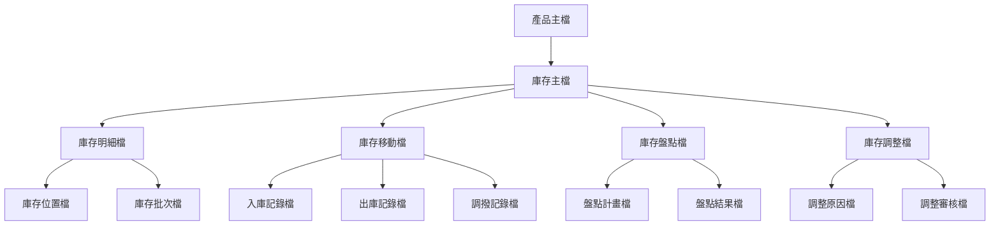
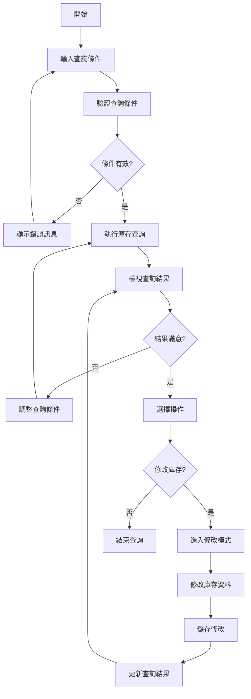
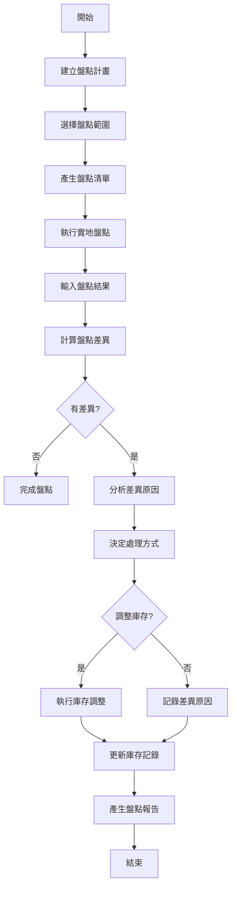
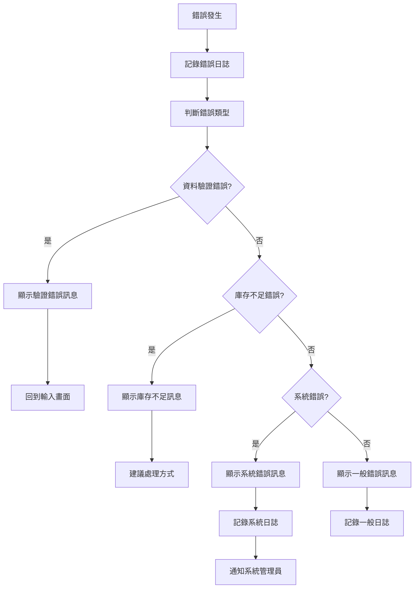
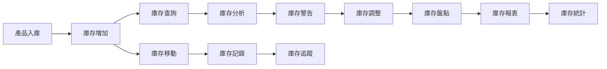
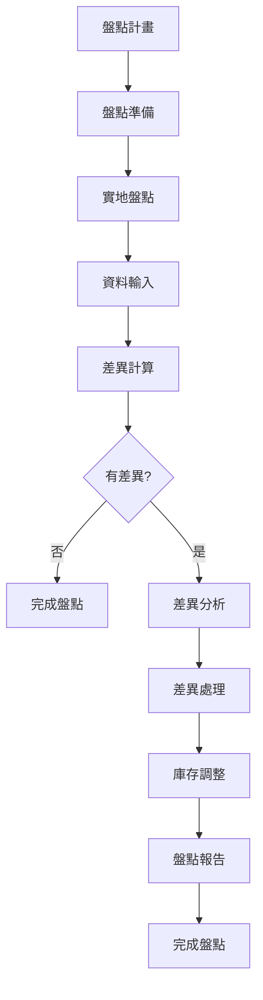

# 產品模組 程式功能規格書 - 庫存管理

## 文件基本資訊

| 項目 | 說明 |
|------|------|
| **文件名稱** | 產品模組程式功能規格書 - 庫存管理 |
| **模組代號** | PD |
| **版本** | v1.0 |
| **建立日期** | 2024年12月21日 |
| **建立人員** | 系統分析師 |
| **審核人員** | 專案經理 |
| **文件狀態** | 初稿 |
| **最後更新** | 2024年12月21日 |

---

## 目錄

1. [基本資料](#基本資料)
2. [檔案架構與關聯圖](#檔案架構與關聯圖)
3. [檔案名稱與欄位規格](#檔案名稱與欄位規格)
4. [輸出/入螢幕布局與說明](#輸出入螢幕布局與說明)
5. [處理流程程序說明](#處理流程程序說明)
6. [子程序處理邏輯說明](#子程序處理邏輯說明)
7. [錯誤處理程序說明與訊息清冊](#錯誤處理程序說明與訊息清冊)
8. [備註](#備註)
9. [附錄](#附錄)

---

## 基本資料

### 1.1 功能概述

庫存管理系統是產品模組的重要組成部分，主要負責管理企業產品的庫存資訊、庫存變動、庫存分析、庫存警告等業務。系統提供完整的庫存生命週期管理，從入庫、出庫、調撥到盤點的全程追蹤，確保庫存資料的準確性和即時性。

### 1.2 主要功能

- **庫存查詢作業**：查詢產品庫存狀況、庫存歷史、庫存變動記錄
- **庫存分析作業**：分析庫存趨勢、庫存週轉率、庫存成本分析
- **庫存警告作業**：設定庫存上下限、庫存不足警告、庫存過剩警告
- **庫存調整作業**：處理庫存差異、庫存調整、庫存報廢
- **庫存盤點作業**：執行庫存盤點、盤點差異處理、盤點報告產生
- **庫存報表作業**：產生各種庫存相關報表

### 1.3 技術架構

- **開發語言**：RPG、CL、SQL
- **資料庫**：DB2 for i (IBM i)
- **開發環境**：IBM i
- **報表工具**：IBM Cognos、Crystal Reports
- **部署環境**：IBM i 7.4

---

## 檔案架構與關聯圖

### 2.1 檔案架構圖



### 2.2 檔案關聯說明

| 主檔 | 關聯檔 | 關聯類型 | 關聯說明 |
|------|--------|----------|----------|
| **產品主檔(PD)** | 庫存主檔(INV) | 1:1 | 一個產品對應一個庫存主檔記錄 |
| **庫存主檔(INV)** | 庫存明細檔(INVD) | 1:N | 一個庫存記錄可有多個明細記錄 |
| **庫存主檔(INV)** | 庫存移動檔(INVM) | 1:N | 一個庫存記錄可有多個移動記錄 |
| **庫存主檔(INV)** | 庫存盤點檔(INVP) | 1:N | 一個庫存記錄可有多個盤點記錄 |
| **庫存主檔(INV)** | 庫存調整檔(INVA) | 1:N | 一個庫存記錄可有多個調整記錄 |

---

## 檔案名稱與欄位規格

### 3.1 庫存主檔 (INV)

#### 3.1.1 檔案基本資訊

| 項目 | 說明 |
|------|------|
| **檔案名稱** | 庫存主檔 |
| **檔案代號** | INV |
| **檔案描述** | 儲存產品庫存基本資訊的主檔 |
| **檔案類型** | 主檔 |
| **檔案大小** | 約 1GB |
| **記錄筆數** | 約 100,000 筆 |

#### 3.1.2 欄位規格

| 欄位代號 | 欄位名稱 | 位置 | 長度 | 型態 | 屬性 | 檢核說明 |
|----------|----------|------|------|------|------|----------|
| **INVID** | 庫存編號 | 1-20 | 20 | A | PK | 主鍵，不可重複 |
| **INVPD** | 產品編號 | 21-40 | 20 | A | M | 必填，需存在於產品主檔 |
| **INVWH** | 倉庫代號 | 41-60 | 20 | A | M | 必填，需存在於倉庫主檔 |
| **INVQT** | 庫存數量 | 61-70 | 10 | N | M | 必填，數字格式 |
| **INVUN** | 庫存單位 | 71-90 | 20 | A | M | 必填，需與產品單位一致 |
| **INVSA** | 安全庫存 | 91-100 | 10 | N | M | 必填，數字格式 |
| **INVMA** | 最大庫存 | 101-110 | 10 | N | M | 必填，數字格式 |
| **INVMI** | 最小庫存 | 111-120 | 10 | N | M | 必填，數字格式 |
| **INVCO** | 庫存成本 | 121-130 | 10 | N | M | 必填，數字格式，小數2位 |
| **INVVA** | 庫存價值 | 131-140 | 10 | N | M | 必填，數字格式，小數2位 |
| **INVST** | 庫存狀態 | 141-150 | 10 | A | M | 必填，正常/凍結/停用 |
| **INVLT** | 最後異動日期 | 151-160 | 10 | D | M | 必填，系統自動填入 |
| **INVCR** | 建立人員 | 161-180 | 20 | A | M | 必填，系統自動填入 |
| **INVCD** | 建立日期 | 181-190 | 10 | D | M | 必填，系統自動填入 |
| **INVUR** | 更新人員 | 191-210 | 20 | O | O | 可選填 |
| **INVUD** | 更新日期 | 211-220 | 10 | D | O | 可選填 |

### 3.2 庫存明細檔 (INVD)

#### 3.2.1 檔案基本資訊

| 項目 | 說明 |
|------|------|
| **檔案名稱** | 庫存明細檔 |
| **檔案代號** | INVD |
| **檔案描述** | 儲存庫存詳細資訊的明細檔 |
| **檔案類型** | 明細檔 |
| **檔案大小** | 約 2GB |
| **記錄筆數** | 約 500,000 筆 |

#### 3.2.2 欄位規格

| 欄位代號 | 欄位名稱 | 位置 | 長度 | 型態 | 屬性 | 檢核說明 |
|----------|----------|------|------|------|------|----------|
| **INVDID** | 明細編號 | 1-20 | 20 | A | PK | 主鍵，不可重複 |
| **INVDIN** | 庫存編號 | 21-40 | 20 | A | M | 必填，需存在於庫存主檔 |
| **INVDLO** | 庫位代號 | 41-60 | 20 | A | M | 必填，需存在於庫位主檔 |
| **INVDBT** | 批次號 | 61-80 | 20 | A | O | 可選填，批次管理用 |
| **INVDQT** | 數量 | 81-90 | 10 | N | M | 必填，數字格式 |
| **INVDUN** | 單位 | 91-110 | 20 | A | M | 必填，需與庫存單位一致 |
| **INVDCO** | 成本 | 111-120 | 10 | N | M | 必填，數字格式，小數2位 |
| **INVDVA** | 價值 | 121-130 | 10 | N | M | 必填，數字格式，小數2位 |
| **INVDEX** | 有效期限 | 131-140 | 10 | D | O | 可選填，日期格式 |
| **INVDST** | 狀態 | 141-150 | 10 | A | M | 必填，正常/凍結/報廢 |
| **INVDCR** | 建立人員 | 151-170 | 20 | A | M | 必填，系統自動填入 |
| **INVDCD** | 建立日期 | 171-180 | 10 | D | M | 必填，系統自動填入 |

### 3.3 庫存移動檔 (INVM)

#### 3.3.1 檔案基本資訊

| 項目 | 說明 |
|------|------|
| **檔案名稱** | 庫存移動檔 |
| **檔案代號** | INVM |
| **檔案描述** | 儲存庫存移動記錄的檔案 |
| **檔案類型** | 明細檔 |
| **檔案大小** | 約 3GB |
| **記錄筆數** | 約 1,000,000 筆 |

#### 3.3.2 欄位規格

| 欄位代號 | 欄位名稱 | 位置 | 長度 | 型態 | 屬性 | 檢核說明 |
|----------|----------|------|------|------|------|----------|
| **INVMID** | 移動編號 | 1-20 | 20 | A | PK | 主鍵，不可重複 |
| **INVMIN** | 庫存編號 | 21-40 | 20 | A | M | 必填，需存在於庫存主檔 |
| **INVMTY** | 移動類型 | 41-60 | 20 | A | M | 必填，入庫/出庫/調撥/調整 |
| **INVMQT** | 移動數量 | 61-70 | 10 | N | M | 必填，數字格式 |
| **INVMUN** | 移動單位 | 71-90 | 20 | A | M | 必填，需與庫存單位一致 |
| **INVMFW** | 來源倉庫 | 91-110 | 20 | A | O | 可選填，調撥時必填 |
| **INVMTO** | 目標倉庫 | 111-130 | 20 | A | O | 可選填，調撥時必填 |
| **INVMRF** | 參考單號 | 131-150 | 20 | A | O | 可選填，關聯單據號 |
| **INVMRT** | 參考類型 | 151-170 | 20 | A | O | 可選填，採購單/銷售單/調撥單 |
| **INVMCR** | 建立人員 | 171-190 | 20 | A | M | 必填，系統自動填入 |
| **INVMCD** | 建立日期 | 191-200 | 10 | D | M | 必填，系統自動填入 |
| **INVMTM** | 建立時間 | 201-210 | 10 | T | M | 必填，系統自動填入 |

---

## 輸出/入螢幕布局與說明

### 4.1 庫存管理主畫面

#### 4.1.1 畫面布局

```
┌─────────────────────────────────────────────────────────────┐
│                    庫存管理系統                              │
├─────────────────────────────────────────────────────────────┤
│ 功能選項：                                                  │
│  [1]庫存查詢作業  [2]庫存分析作業  [3]庫存警告作業          │
│  [4]庫存調整作業  [5]庫存盤點作業  [6]庫存報表作業          │
│  [7]庫存設定  [8]離開                                          │
├─────────────────────────────────────────────────────────────┤
│ 系統狀態：                                                  │
│  總庫存項目：[15,234] 正常庫存：[12,567] 凍結庫存：[2,667]  │
│  庫存不足：[156] 庫存過剩：[89] 庫存異常：[23]              │
│  最後更新：[2024/12/21 14:30:00] 更新人員：[ADMIN]         │
├─────────────────────────────────────────────────────────────┤
│ 快速功能：                                                  │
│  [庫存查詢] [庫存分析] [庫存警告] [庫存盤點]                │
├─────────────────────────────────────────────────────────────┤
│ 功能鍵：F1=說明  F3=離開  F4=查詢  F6=新增  F8=修改  F12=取消│
└─────────────────────────────────────────────────────────────┘
```

#### 4.1.2 功能選項說明

| 選項 | 功能說明 |
|------|----------|
| **1** | 庫存查詢作業：查詢產品庫存狀況 |
| **2** | 庫存分析作業：分析庫存趨勢和週轉率 |
| **3** | 庫存警告作業：設定和處理庫存警告 |
| **4** | 庫存調整作業：處理庫存差異和調整 |
| **5** | 庫存盤點作業：執行庫存盤點作業 |
| **6** | 庫存報表作業：產生庫存相關報表 |
| **7** | 庫存設定：設定庫存管理相關參數 |
| **8** | 離開系統 |

### 4.2 庫存查詢畫面

#### 4.2.1 畫面布局

```
┌─────────────────────────────────────────────────────────────┐
│                      庫存查詢作業                            │
├─────────────────────────────────────────────────────────────┤
│ 查詢條件：                                                  │
│  產品編號：[PD20241221001    ] [查詢]                       │
│  產品名稱：[智慧型手機      ]                               │
│  倉庫代號：[WH001           ] [查詢]                       │
│  庫存狀態：[全部 ▼] [查詢]                                  │
│  庫存範圍：[全部 ▼] [查詢]                                  │
├─────────────────────────────────────────────────────────────┤
│ 查詢結果：                                                  │
│ ┌─────┬──────────┬──────────┬──────────┬──────────┬────────┐ │
│ │序號 │產品編號  │產品名稱  │倉庫代號  │庫存數量  │庫存狀態│ │
│ ├─────┼──────────┼──────────┼──────────┼──────────┼────────┤ │
│ │  1  │[        ] [        ] [        ] [        ] [        ] │ │
│ │  2  │[        ] [        ] [        ] [        ] [        ] │ │
│ └─────┴──────────┴──────────┴──────────┴──────────┴────────┘ │
├─────────────────────────────────────────────────────────────┤
│ 功能鍵：F1=說明  F3=離開  F4=查詢  F8=修改  F12=取消      │
└─────────────────────────────────────────────────────────────┘
```

#### 4.2.2 查詢條件說明

| 欄位名稱 | 說明 | 格式要求 |
|----------|------|----------|
| **產品編號** | 要查詢的產品編號 | 最多20個字元 |
| **產品名稱** | 要查詢的產品名稱 | 最多50個字元，支援模糊查詢 |
| **倉庫代號** | 要查詢的倉庫代號 | 最多20個字元 |
| **庫存狀態** | 庫存的狀態 | 全部/正常/凍結/停用 |
| **庫存範圍** | 庫存數量範圍 | 全部/不足/正常/過剩 |

---

## 處理流程程序說明

### 5.1 庫存查詢流程

#### 5.1.1 流程圖



#### 5.1.2 處理步驟說明

1. **輸入查詢條件**
   - 使用者輸入產品編號、產品名稱、倉庫代號等查詢條件
   - 系統支援多條件組合查詢

2. **驗證查詢條件**
   - 檢查輸入條件的格式是否正確
   - 驗證產品編號、倉庫代號是否存在

3. **執行庫存查詢**
   - 根據查詢條件從資料庫檢索庫存資料
   - 支援模糊查詢和精確查詢

4. **檢視查詢結果**
   - 以表格形式顯示查詢結果
   - 支援結果排序和篩選

### 5.2 庫存盤點流程

#### 5.2.1 流程圖



#### 5.2.2 處理步驟說明

1. **建立盤點計畫**
   - 設定盤點範圍、盤點時間、盤點人員
   - 選擇盤點方式（全面盤點、循環盤點、抽樣盤點）

2. **產生盤點清單**
   - 根據盤點範圍產生盤點清單
   - 包含產品編號、產品名稱、理論庫存等資訊

3. **執行實地盤點**
   - 盤點人員根據清單進行實地盤點
   - 記錄實際庫存數量

4. **計算盤點差異**
   - 比較理論庫存與實際庫存
   - 計算差異數量和差異金額

5. **處理盤點差異**
   - 分析差異原因
   - 決定是否調整庫存或記錄差異

---

## 子程序處理邏輯說明

### 6.1 庫存數量計算子程序

#### 6.1.1 程序名稱
`CALINVQT` - 庫存數量計算子程序

#### 6.1.2 處理邏輯

```rpg
// 庫存數量計算邏輯
// 計算公式：期初庫存 + 入庫數量 - 出庫數量 + 調整數量

DCLF FILE(INV) KEYED
DCLF FILE(INVM) KEYED
DCL VAR(&INVID) TYPE(*CHAR) LEN(20)
DCL VAR(&INVQT) TYPE(*PACKED) LEN(10 0)
DCL VAR(&INBQT) TYPE(*PACKED) LEN(10 0)
DCL VAR(&INIQT) TYPE(*PACKED) LEN(10 0)
DCL VAR(&OUTQT) TYPE(*PACKED) LEN(10 0)
DCL VAR(&ADJQT) TYPE(*PACKED) LEN(10 0)

// 取得期初庫存
CHAIN (&INVID) INV
IF %FOUND
  CHGVAR VAR(&INBQT) VALUE(&INVQT)
ENDIF

// 計算入庫數量
SETLL (&INVID) INVM
READ INVM
DO WHILE %EOF = *OFF
  IF &INVMTY = 'IN' AND &INVMIN = &INVID
    CHGVAR VAR(&INIQT) VALUE(&INIQT + &INVMQT)
  ENDIF
  READ INVM
ENDDO

// 計算出庫數量
SETLL (&INVID) INVM
READ INVM
DO WHILE %EOF = *OFF
  IF &INVMTY = 'OUT' AND &INVMIN = &INVID
    CHGVAR VAR(&OUTQT) VALUE(&OUTQT + &INVMQT)
  ENDIF
  READ INVM
ENDDO

// 計算調整數量
SETLL (&INVID) INVM
READ INVM
DO WHILE %EOF = *OFF
  IF &INVMTY = 'ADJ' AND &INVMIN = &INVID
    CHGVAR VAR(&ADJQT) VALUE(&ADJQT + &INVMQT)
  ENDIF
  READ INVM
ENDDO

// 計算最終庫存
CHGVAR VAR(&INVQT) VALUE(&INBQT + &INIQT - &OUTQT + &ADJQT)
```

#### 6.1.3 參數說明

| 參數名稱 | 型態 | 長度 | 說明 |
|----------|------|------|------|
| **&INVID** | *CHAR | 20 | 庫存編號 |
| **&INVQT** | *PACKED | 10,0 | 計算後的庫存數量 |
| **&INBQT** | *PACKED | 10,0 | 期初庫存數量 |
| **&INIQT** | *PACKED | 10,0 | 入庫數量 |
| **&OUTQT** | *PACKED | 10,0 | 出庫數量 |
| **&ADJQT** | *PACKED | 10,0 | 調整數量 |

### 6.2 庫存警告檢查子程序

#### 6.2.1 程序名稱
`CHKINVWARN` - 庫存警告檢查子程序

#### 6.2.2 處理邏輯

```rpg
// 庫存警告檢查邏輯
// 檢查庫存是否低於最小庫存或超過最大庫存

DCLF FILE(INV) KEYED
DCL VAR(&INVID) TYPE(*CHAR) LEN(20)
DCL VAR(&INVQT) TYPE(*PACKED) LEN(10 0)
DCL VAR(&INVMI) TYPE(*PACKED) LEN(10 0)
DCL VAR(&INVMA) TYPE(*PACKED) LEN(10 0)
DCL VAR(&WARNTP) TYPE(*CHAR) LEN(10)
DCL VAR(&WARNMG) TYPE(*CHAR) LEN(100)

// 取得庫存資料
CHAIN (&INVID) INV
IF %FOUND
  CHGVAR VAR(&INVQT) VALUE(&INVQT)
  CHGVAR VAR(&INVMI) VALUE(&INVMI)
  CHGVAR VAR(&INVMA) VALUE(&INVMA)
  
  // 檢查庫存不足
  IF &INVQT < &INVMI
    CHGVAR VAR(&WARNTP) VALUE('LOW')
    CHGVAR VAR(&WARNMG) VALUE('庫存不足警告')
  ENDIF
  
  // 檢查庫存過剩
  IF &INVQT > &INVMA
    CHGVAR VAR(&WARNTP) VALUE('HIGH')
    CHGVAR VAR(&WARNMG) VALUE('庫存過剩警告')
  ENDIF
  
  // 檢查庫存正常
  IF &INVQT >= &INVMI AND &INVQT <= &INVMA
    CHGVAR VAR(&WARNTP) VALUE('NORMAL')
    CHGVAR VAR(&WARNMG) VALUE('庫存正常')
  ENDIF
ENDIF
```

#### 6.2.3 參數說明

| 參數名稱 | 型態 | 長度 | 說明 |
|----------|------|------|------|
| **&INVID** | *CHAR | 20 | 庫存編號 |
| **&INVQT** | *PACKED | 10,0 | 當前庫存數量 |
| **&INVMI** | *PACKED | 10,0 | 最小庫存數量 |
| **&INVMA** | *PACKED | 10,0 | 最大庫存數量 |
| **&WARNTP** | *CHAR | 10 | 警告類型 |
| **&WARNMG** | *CHAR | 100 | 警告訊息 |

---

## 錯誤處理程序說明與訊息清冊

### 7.1 錯誤處理流程

#### 7.1.1 錯誤處理流程圖



#### 7.1.2 錯誤處理原則

1. **錯誤預防優先**
   - 在資料輸入時進行即時驗證
   - 提供清楚的錯誤提示訊息

2. **錯誤記錄完整**
   - 記錄錯誤發生的時間、位置、原因
   - 記錄錯誤發生時的系統狀態

3. **錯誤恢復機制**
   - 提供錯誤修正的建議
   - 支援錯誤操作的復原

### 7.2 錯誤訊息清冊

#### 7.2.1 資料驗證錯誤

| 錯誤代碼 | 錯誤訊息 | 錯誤原因 | 解決方法 |
|----------|----------|----------|----------|
| **INV001** | 庫存編號不能為空 | 必填欄位未填寫 | 請輸入庫存編號 |
| **INV002** | 產品編號不存在 | 產品編號無效 | 請檢查產品編號 |
| **INV003** | 倉庫代號不存在 | 倉庫代號無效 | 請檢查倉庫代號 |
| **INV004** | 庫存數量格式錯誤 | 數量格式不正確 | 請輸入正確的數字格式 |
| **INV005** | 庫存單位不一致 | 單位與產品單位不符 | 請使用正確的單位 |

#### 7.2.2 庫存業務錯誤

| 錯誤代碼 | 錯誤訊息 | 錯誤原因 | 解決方法 |
|----------|----------|----------|----------|
| **INV101** | 庫存數量不足 | 庫存數量小於需求數量 | 請檢查庫存狀況或補充庫存 |
| **INV102** | 庫存已被凍結 | 庫存狀態為凍結 | 請先解除庫存凍結 |
| **INV103** | 庫存調整失敗 | 調整數量超過可用庫存 | 請檢查調整數量 |
| **INV104** | 盤點差異過大 | 盤點差異超過容許範圍 | 請重新盤點或檢查差異原因 |
| **INV105** | 庫存移動失敗 | 移動數量超過可用庫存 | 請檢查移動數量 |

#### 7.2.3 系統錯誤

| 錯誤代碼 | 錯誤訊息 | 錯誤原因 | 解決方法 |
|----------|----------|----------|----------|
| **INV201** | 資料庫連線失敗 | 資料庫服務異常 | 請聯繫系統管理員 |
| **INV202** | 檔案存取權限不足 | 使用者權限不足 | 請聯繫系統管理員 |
| **INV203** | 系統資源不足 | 記憶體或磁碟空間不足 | 請聯繫系統管理員 |
| **INV204** | 程式執行異常 | 程式邏輯錯誤 | 請聯繫系統管理員 |
| **INV205** | 網路連線異常 | 網路連線中斷 | 請檢查網路連線 |

---

## 備註

### 8.1 系統限制

1. **庫存數量限制**
   - 庫存數量最大為999,999,999
   - 庫存數量精度為整數

2. **庫存單位限制**
   - 庫存單位必須與產品單位一致
   - 支援單位轉換功能

3. **庫存移動限制**
   - 每次移動數量不能超過可用庫存
   - 移動後庫存不能為負數

4. **盤點差異限制**
   - 盤點差異容許範圍可設定
   - 差異超過容許範圍需特別處理

### 8.2 效能考量

1. **資料庫索引**
   - 建議在庫存編號、產品編號、倉庫代號等欄位建立索引
   - 定期維護資料庫統計資訊

2. **查詢優化**
   - 使用適當的查詢條件減少資料掃描範圍
   - 避免在大量資料上進行模糊查詢

3. **快取機制**
   - 對常用的庫存資料進行快取
   - 對庫存統計資訊進行快取

### 8.3 安全性考量

1. **資料存取控制**
   - 根據使用者角色設定不同的存取權限
   - 記錄所有資料存取和修改的日誌

2. **資料完整性**
   - 使用資料庫約束確保資料完整性
   - 定期檢查資料一致性

3. **備份策略**
   - 定期備份庫存相關資料
   - 建立資料恢復機制

---

## 附錄

### A.1 相關文件清單

- 產品模組程式功能規格書 - 產品管理
- 產品模組操作手冊 - 庫存管理
- 庫存管理規範
- 盤點作業規範
- 系統整合測試報告

### A.2 修訂記錄

| 版本 | 修訂日期 | 修訂人員 | 修訂內容 | 修訂原因 |
|------|----------|----------|----------|----------|
| v1.0 | 2024/12/21 | 系統分析師 | 初始版本建立 | 新功能開發 |

### A.3 聯絡資訊

- **專案經理**：[專案經理姓名]
- **系統分析師**：[系統分析師姓名]
- **技術支援**：[技術支援聯絡方式]
- **專案信箱**：[專案信箱地址]

### A.4 常用縮寫說明

| 縮寫 | 全名 | 說明 |
|------|------|------|
| **INV** | Inventory | 庫存 |
| **INVD** | Inventory Detail | 庫存明細 |
| **INVM** | Inventory Movement | 庫存移動 |
| **INVP** | Inventory Physical | 庫存盤點 |
| **INVA** | Inventory Adjustment | 庫存調整 |
| **PD** | Product | 產品 |
| **ERP** | Enterprise Resource Planning | 企業資源規劃 |

### A.5 系統訊息代碼

| 訊息代碼 | 訊息內容 | 說明 |
|----------|----------|------|
| **INV001** | 庫存查詢成功 | 庫存查詢作業已完成 |
| **INV002** | 庫存分析完成 | 庫存分析作業已完成 |
| **INV003** | 庫存警告設定成功 | 庫存警告已成功設定 |
| **INV004** | 庫存調整成功 | 庫存調整作業已完成 |
| **INV005** | 庫存盤點完成 | 庫存盤點作業已完成 |
| **INV006** | 庫存報表產生成功 | 庫存報表已成功產生 |
| **INV007** | 庫存設定更新成功 | 庫存設定已成功更新 |
| **INV008** | 庫存移動記錄成功 | 庫存移動已成功記錄 |
| **INV009** | 庫存差異處理完成 | 庫存差異已處理完成 |
| **INV010** | 庫存統計更新成功 | 庫存統計已成功更新 |

### A.6 庫存管理流程圖

#### A.6.1 基本庫存管理流程



#### A.6.2 庫存盤點流程



### A.7 庫存警告設定範例

#### A.7.1 庫存上下限設定

| 產品類型 | 最小庫存 | 最大庫存 | 安全庫存 | 說明 |
|----------|----------|----------|----------|------|
| **高價值產品** | 10 | 100 | 20 | 高單價產品，庫存控制嚴格 |
| **一般產品** | 50 | 500 | 100 | 一般產品，庫存控制適中 |
| **低價值產品** | 100 | 1000 | 200 | 低單價產品，庫存控制寬鬆 |
| **季節性產品** | 0 | 2000 | 50 | 季節性產品，庫存彈性較大 |

#### A.7.2 庫存警告等級

| 警告等級 | 庫存狀況 | 處理方式 | 通知方式 |
|----------|----------|----------|----------|
| **緊急警告** | 庫存為0或低於最小庫存 | 立即補充 | 簡訊+郵件+系統通知 |
| **重要警告** | 庫存低於安全庫存 | 儘快補充 | 郵件+系統通知 |
| **一般警告** | 庫存接近最小庫存 | 適時補充 | 系統通知 |
| **提醒通知** | 庫存接近最大庫存 | 控制進貨 | 系統通知 |

### A.8 庫存報表範例

#### A.8.1 庫存狀況報表

| 產品編號 | 產品名稱 | 倉庫代號 | 庫存數量 | 庫存單位 | 庫存狀態 | 最後異動日期 |
|----------|----------|----------|----------|----------|----------|--------------|
| **PD001** | 智慧型手機 | WH001 | 150 | 個 | 正常 | 2024/12/21 |
| **PD002** | 筆記型電腦 | WH001 | 75 | 台 | 正常 | 2024/12/21 |
| **PD003** | 平板電腦 | WH001 | 0 | 台 | 庫存不足 | 2024/12/20 |
| **PD004** | 印表機 | WH002 | 200 | 台 | 庫存過剩 | 2024/12/19 |
| **PD005** | 掃描器 | WH002 | 25 | 台 | 正常 | 2024/12/21 |
