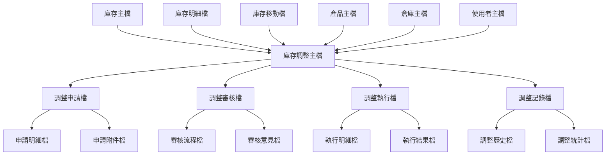
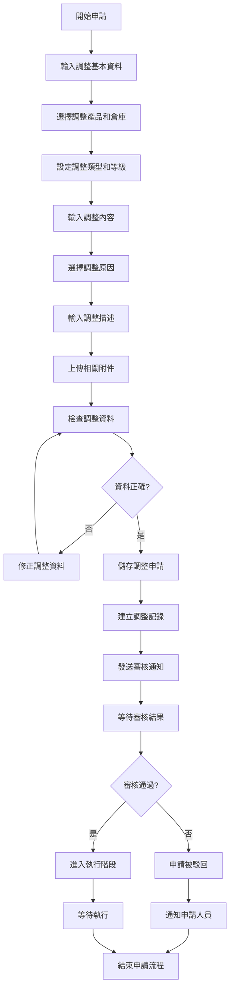
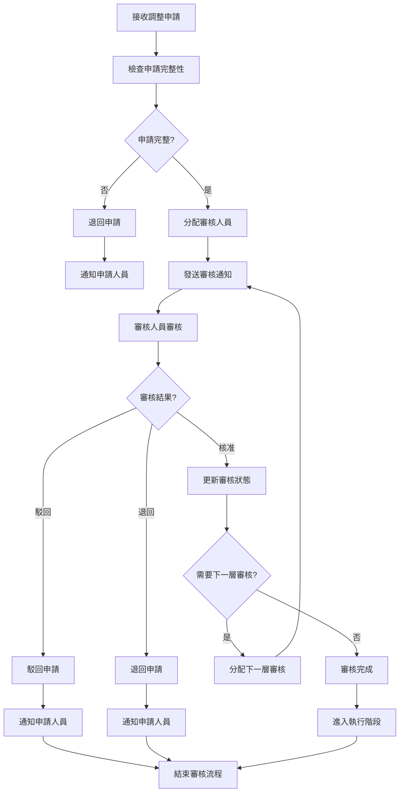
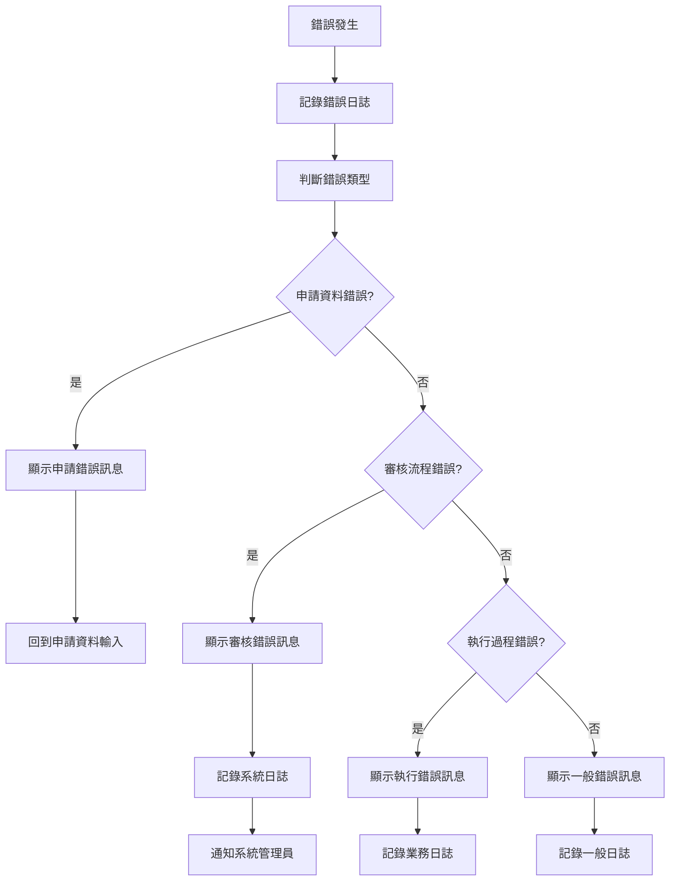

# 產品模組 程式功能規格書 - 庫存調整作業

## 文件基本資訊

| 項目 | 說明 |
|------|------|
| **文件名稱** | 產品模組程式功能規格書 - 庫存調整作業 |
| **模組代號** | PD |
| **版本** | v1.0 |
| **建立日期** | 2024年12月21日 |
| **建立人員** | 系統分析師 |
| **審核人員** | 專案經理 |
| **文件狀態** | 初稿 |
| **最後更新** | 2024年12月21日 |

---

## 目錄

1. [基本資料](#基本資料)
2. [檔案架構與關聯圖](#檔案架構與關聯圖)
3. [檔案名稱與欄位規格](#檔案名稱與欄位規格)
4. [輸出/入螢幕布局與說明](#輸出入螢幕布局與說明)
5. [處理流程程序說明](#處理流程程序說明)
6. [子程序處理邏輯說明](#子程序處理邏輯說明)
7. [錯誤處理程序說明與訊息清冊](#錯誤處理程序說明與訊息清冊)
8. [備註](#備註)
9. [附錄](#附錄)

---

## 基本資料

### 1.1 功能概述

庫存調整作業系統是產品模組庫存管理的核心調整功能，主要負責處理各種庫存調整需求，包括庫存數量調整、庫存價值調整、庫存狀態調整等。系統透過嚴格的調整流程、完整的審核機制、詳細的調整記錄，確保庫存調整的準確性、可追溯性和合規性，幫助企業維護庫存資料的正確性和完整性。

### 1.2 主要功能

- **庫存數量調整**：調整產品庫存數量，包括增加、減少、歸零等操作
- **庫存價值調整**：調整產品庫存價值，包括單價調整、總值調整等操作
- **庫存狀態調整**：調整產品庫存狀態，包括正常、凍結、停用等狀態變更
- **調整原因管理**：管理各種調整原因的分類、說明、審核要求
- **調整審核流程**：提供多層級的調整審核機制，確保調整的合理性
- **調整記錄管理**：完整記錄所有調整操作的歷史和變更軌跡

### 1.3 技術架構

- **開發語言**：RPG、CL、SQL
- **資料庫**：DB2 for i (IBM i)
- **工作流程引擎**：審核流程管理、狀態機控制
- **日誌系統**：完整的操作日誌、審計日誌記錄
- **部署環境**：IBM i 7.4

---

## 檔案架構與關聯圖

### 2.1 檔案架構圖



### 2.2 檔案關聯說明

| 主檔 | 關聯檔 | 關聯類型 | 關聯說明 |
|------|--------|----------|----------|
| **庫存主檔(INV)** | 庫存調整主檔(INVAJ) | 1:1 | 一個庫存記錄對應一個調整主檔記錄 |
| **庫存明細檔(INVD)** | 庫存調整主檔(INVAJ) | 1:N | 多個明細記錄可進行調整 |
| **庫存移動檔(INVM)** | 庫存調整主檔(INVAJ) | 1:N | 調整操作產生移動記錄 |
| **庫存調整主檔(INVAJ)** | 調整申請檔(INVAJ1) | 1:N | 一個調整可有多個申請 |
| **庫存調整主檔(INVAJ)** | 調整審核檔(INVAJ2) | 1:N | 一個調整可有多個審核記錄 |

---

## 檔案名稱與欄位規格

### 3.1 庫存調整主檔 (INVAJ)

#### 3.1.1 檔案基本資訊

| 項目 | 說明 |
|------|------|
| **檔案名稱** | 庫存調整主檔 |
| **檔案代號** | INVAJ |
| **檔案描述** | 儲存庫存調整相關資訊的主檔 |
| **檔案類型** | 主檔 |
| **檔案大小** | 約 700MB |
| **記錄筆數** | 約 70,000 筆 |

#### 3.1.2 欄位規格

| 欄位代號 | 欄位名稱 | 位置 | 長度 | 型態 | 屬性 | 檢核說明 |
|----------|----------|------|------|------|------|----------|
| **INVAJID** | 調整編號 | 1-20 | 20 | A | PK | 主鍵，不可重複 |
| **INVAJPD** | 產品編號 | 21-40 | 20 | A | M | 必填，需存在於產品主檔 |
| **INVAJWH** | 倉庫代號 | 41-60 | 20 | A | M | 必填，需存在於倉庫主檔 |
| **INVAJTY** | 調整類型 | 61-80 | 20 | A | M | 必填，數量/價值/狀態/綜合 |
| **INVAJST** | 調整狀態 | 81-90 | 10 | A | M | 必填，申請中/審核中/已核准/已執行/已取消 |
| **INVAJLV** | 調整等級 | 91-100 | 10 | A | M | 必填，高/中/低 |
| **INVAJCR** | 申請人員 | 101-120 | 20 | A | M | 必填，需存在於使用者主檔 |
| **INVAJCD** | 申請日期 | 121-130 | 10 | D | M | 必填，系統自動填入 |
| **INVAJTM** | 申請時間 | 131-140 | 10 | T | M | 必填，系統自動填入 |
| **INVAJDS** | 調整描述 | 141-240 | 100 | A | O | 可選填，調整詳細描述 |

### 3.2 調整申請檔 (INVAJ1)

#### 3.2.1 檔案基本資訊

| 項目 | 說明 |
|------|------|
| **檔案名稱** | 調整申請檔 |
| **檔案代號** | INVAJ1 |
| **檔案描述** | 儲存庫存調整申請的檔案 |
| **檔案類型** | 明細檔 |
| **檔案大小** | 約 800MB |
| **記錄筆數** | 約 150,000 筆 |

#### 3.2.2 欄位規格

| 欄位代號 | 欄位名稱 | 位置 | 長度 | 型態 | 屬性 | 檢核說明 |
|----------|----------|------|------|------|------|----------|
| **INVAJ1ID** | 申請編號 | 1-20 | 20 | A | PK | 主鍵，不可重複 |
| **INVAJ1IN** | 調整編號 | 21-40 | 20 | A | M | 必填，需存在於調整主檔 |
| **INVAJ1FD** | 調整欄位 | 41-90 | 50 | A | M | 必填，庫存數量/庫存價值/庫存狀態 |
| **INVAJ1BF** | 調整前值 | 91-130 | 40 | A | M | 必填，調整前的欄位值 |
| **INVAJ1AF** | 調整後值 | 131-170 | 40 | A | M | 必填，調整後的欄位值 |
| **INVAJ1RC** | 調整原因 | 171-220 | 50 | A | M | 必填，調整原因代碼 |
| **INVAJ1RM** | 調整備註 | 221-320 | 100 | A | O | 可選填，調整詳細說明 |
| **INVAJ1CR** | 申請人員 | 321-340 | 20 | A | M | 必填，系統自動填入 |
| **INVAJ1CD** | 申請日期 | 341-350 | 10 | D | M | 必填，系統自動填入 |

### 3.3 調整審核檔 (INVAJ2)

#### 3.3.1 檔案基本資訊

| 項目 | 說明 |
|------|------|
| **檔案名稱** | 調整審核檔 |
| **檔案代號** | INVAJ2 |
| **檔案描述** | 儲存庫存調整審核記錄的檔案 |
| **檔案類型** | 明細檔 |
| **檔案大小** | 約 600MB |
| **記錄筆數** | 約 120,000 筆 |

#### 3.3.2 欄位規格

| 欄位代號 | 欄位名稱 | 位置 | 長度 | 型態 | 屬性 | 檢核說明 |
|----------|----------|------|------|------|------|----------|
| **INVAJ2ID** | 審核編號 | 1-20 | 20 | A | PK | 主鍵，不可重複 |
| **INVAJ2IN** | 調整編號 | 21-40 | 20 | A | M | 必填，需存在於調整主檔 |
| **INVAJ2LV** | 審核層級 | 41-50 | 10 | N | M | 必填，審核層級編號 |
| **INVAJ2RV** | 審核結果 | 51-60 | 10 | A | M | 必填，核准/駁回/退回 |
| **INVAJ2OP** | 審核人員 | 61-80 | 20 | A | M | 必填，需存在於使用者主檔 |
| **INVAJ2DT** | 審核日期 | 81-90 | 10 | D | M | 必填，系統自動填入 |
| **INVAJ2TM** | 審核時間 | 91-100 | 10 | T | M | 必填，系統自動填入 |
| **INVAJ2CM** | 審核意見 | 101-200 | 100 | A | O | 可選填，審核意見內容 |
| **INVAJ2ST** | 審核狀態 | 201-210 | 10 | A | M | 必填，待審核/已審核/已通過/已駁回 |

---

## 輸出/入螢幕布局與說明

### 4.1 庫存調整主畫面

#### 4.1.1 畫面布局

```
┌─────────────────────────────────────────────────────────────┐
│                    庫存調整作業系統                          │
├─────────────────────────────────────────────────────────────┤
│ 調整功能選擇：                                              │
│  [1]調整申請作業  [2]調整審核作業  [3]調整執行作業          │
│  [4]調整查詢作業  [5]調整報表作業  [6]調整設定作業          │
│  [7]調整原因管理  [8]審核流程管理  [9]系統參數設定          │
│  [0]離開系統                                                │
├─────────────────────────────────────────────────────────────┤
│ 快速調整：                                                  │
│  產品編號：[PD20241221001    ] [調整]                       │
│  倉庫代號：[WH001           ] [調整]                       │
│  調整類型：[數量 ▼] [調整]                                  │
├─────────────────────────────────────────────────────────────┤
│ 系統狀態：                                                  │
│  今日調整數：[23] 待審核調整：[8] 已執行調整：[15]          │
│  最後更新：[2024/12/21 14:30:00] 更新人員：[ADMIN]         │
├─────────────────────────────────────────────────────────────┤
│ 功能鍵：F1=說明  F3=離開  F4=調整  F6=新增  F8=修改  F12=取消│
└─────────────────────────────────────────────────────────────┘
```

#### 4.1.2 功能選項說明

| 選項 | 功能說明 |
|------|----------|
| **1** | 調整申請作業：建立新的庫存調整申請，設定調整內容和原因 |
| **2** | 調整審核作業：審核庫存調整申請，核准或駁回調整要求 |
| **3** | 調整執行作業：執行已核准的庫存調整，更新庫存資料 |
| **4** | 調整查詢作業：查詢庫存調整的申請、審核、執行狀況 |
| **5** | 調整報表作業：產生各種調整報表和統計分析 |
| **6** | 調整設定作業：設定調整系統的各種參數和配置 |
| **7** | 調整原因管理：管理各種調整原因的分類和說明 |
| **8** | 審核流程管理：設定調整審核的流程和權限 |
| **9** | 系統參數設定：設定調整系統的技術參數和配置 |
| **0** | 離開系統 |

### 4.2 調整申請作業畫面

#### 4.2.1 畫面布局

```
┌─────────────────────────────────────────────────────────────┐
│                      調整申請作業                            │
├─────────────────────────────────────────────────────────────┤
│ 調整基本資料：                                              │
│  產品編號：[PD20241221001    ] [查詢] [清除]               │
│  產品名稱：[智慧型手機      ] [顯示]                       │
│  倉庫代號：[WH001           ] [查詢] [清除]               │
│  倉庫名稱：[台北主倉庫      ] [顯示]                       │
│  調整類型：[數量 ▼] [選擇]                                  │
│  調整等級：[中 ▼] [選擇]                                    │
├─────────────────────────────────────────────────────────────┤
│ 調整內容：                                                  │
│ ┌─────┬──────────┬──────────┬──────────┬──────────┬────────┐ │
│ │序號 │調整欄位  │調整前值  │調整後值  │調整原因  │備註    │ │
│ ├─────┼──────────┼──────────┼──────────┼──────────┼────────┤ │
│ │  1  │[        ] [        ] [        ] [        ] [        ] │ │
│ │  2  │[        ] [        ] [        ] [        ] [        ] │ │
│ └─────┴──────────┴──────────┴──────────┴──────────┴────────┘ │
│ 調整摘要：                                                  │
│  調整原因：[盤點差異] 調整描述：[年度盤點發現數量差異]      │
│  附件上傳：[選擇檔案] [上傳] [清除]                        │
├─────────────────────────────────────────────────────────────┤
│ 功能鍵：F1=說明  F3=離開  F4=儲存  F8=修改  F12=取消      │
│ 特殊功能：F5=新增明細  F6=刪除明細  F7=檢查資料  F9=送出申請│
└─────────────────────────────────────────────────────────────┘
```

#### 4.2.2 調整內容說明

| 欄位名稱 | 說明 | 格式要求 |
|----------|------|----------|
| **產品編號** | 要調整的產品編號 | 最多20個字元，支援精確查詢 |
| **倉庫代號** | 要調整的倉庫代號 | 最多20個字元，支援精確查詢 |
| **調整類型** | 調整的主要類型 | 數量/價值/狀態/綜合 |
| **調整等級** | 調整的緊急程度 | 高/中/低 |
| **調整欄位** | 要調整的具體欄位 | 庫存數量/庫存價值/庫存狀態 |
| **調整前值** | 調整前的欄位值 | 根據欄位類型設定格式 |
| **調整後值** | 調整後的欄位值 | 根據欄位類型設定格式 |
| **調整原因** | 調整的原因代碼 | 從調整原因主檔選擇 |

---

## 處理流程程序說明

### 5.1 調整申請流程

#### 5.1.1 流程圖



#### 5.1.2 處理步驟說明

1. **開始申請**
   - 使用者選擇建立新的庫存調整申請
   - 系統載入調整申請畫面

2. **輸入調整基本資料**
   - 輸入產品編號、倉庫代號等基本資料
   - 系統自動顯示產品名稱、倉庫名稱等相關資訊

3. **選擇調整產品和倉庫**
   - 選擇要進行調整的產品和倉庫
   - 系統驗證產品和倉庫的有效性

4. **設定調整類型和等級**
   - 選擇調整的主要類型（數量、價值、狀態、綜合）
   - 設定調整的緊急程度（高、中、低）

5. **輸入調整內容**
   - 輸入具體的調整欄位和調整前後的值
   - 支援多個欄位的同時調整

6. **選擇調整原因**
   - 從預設的調整原因中選擇適當的原因
   - 輸入調整的詳細描述和備註

### 5.2 調整審核流程

#### 5.2.1 流程圖



#### 5.2.2 處理步驟說明

1. **接收調整申請**
   - 系統接收新建立的調整申請
   - 檢查申請的完整性和格式正確性

2. **檢查申請完整性**
   - 驗證必填欄位是否完整
   - 檢查資料格式和邏輯正確性

3. **分配審核人員**
   - 根據調整類型和等級分配適當的審核人員
   - 設定審核的優先級和時限

4. **發送審核通知**
   - 向審核人員發送審核通知
   - 包含調整申請的詳細內容和相關資料

5. **審核人員審核**
   - 審核人員檢視調整申請內容
   - 評估調整的合理性和必要性

6. **審核結果處理**
   - 根據審核結果更新申請狀態
   - 記錄審核意見和決定

---

## 子程序處理邏輯說明

### 6.1 調整資料驗證子程序

#### 6.1.1 程序名稱
`VALADJUST` - 調整資料驗證子程序

#### 6.1.2 處理邏輯

```rpg
// 調整資料驗證邏輯
// 驗證調整申請資料的正確性和合理性

DCLF FILE(INVAJ1) KEYED
DCL VAR(&ADJUSTID) TYPE(*CHAR) LEN(20)
DCL VAR(&VALIDFLAG) TYPE(*CHAR) LEN(1)
DCL VAR(&ERRMSG) TYPE(*CHAR) LEN(100)
DCL VAR(&BEFOREVALUE) TYPE(*CHAR) LEN(40)
DCL VAR(&AFTERVALUE) TYPE(*CHAR) LEN(40)
DCL VAR(&ADJFIELD) TYPE(*CHAR) LEN(50)

// 初始化變數
CHGVAR VAR(&VALIDFLAG) VALUE('Y')
CHGVAR VAR(&ERRMSG) VALUE('')

// 讀取調整申請資料
SETLL (&ADJUSTID) INVAJ1
READ INVAJ1
DO WHILE %EOF = *OFF
  IF &INVAJ1IN = &ADJUSTID
    // 檢查調整前後值
    CHGVAR VAR(&BEFOREVALUE) VALUE(&INVAJ1BF)
    CHGVAR VAR(&AFTERVALUE) VALUE(&INVAJ1AF)
    CHGVAR VAR(&ADJFIELD) VALUE(&INVAJ1FD)
    
    // 根據調整欄位進行驗證
    SELECT
      WHEN &ADJFIELD = '庫存數量'
        // 驗證數量調整
        IF &AFTERVALUE < 0
          CHGVAR VAR(&VALIDFLAG) VALUE('N')
          CHGVAR VAR(&ERRMSG) VALUE('庫存數量不能為負數')
        ENDIF
        
      WHEN &ADJFIELD = '庫存價值'
        // 驗證價值調整
        IF &AFTERVALUE < 0
          CHGVAR VAR(&VALIDFLAG) VALUE('N')
          CHGVAR VAR(&ERRMSG) VALUE('庫存價值不能為負數')
        ENDIF
        
      WHEN &ADJFIELD = '庫存狀態'
        // 驗證狀態調整
        IF &AFTERVALUE NOT IN ('正常', '凍結', '停用')
          CHGVAR VAR(&VALIDFLAG) VALUE('N')
          CHGVAR VAR(&ERRMSG) VALUE('無效的庫存狀態')
        ENDIF
        
      OTHERWISE
        CHGVAR VAR(&VALIDFLAG) VALUE('N')
        CHGVAR VAR(&ERRMSG) VALUE('不支援的調整欄位')
    ENDSELECT
    
    // 檢查調整前後值是否相同
    IF &BEFOREVALUE = &AFTERVALUE
      CHGVAR VAR(&VALIDFLAG) VALUE('N')
      CHGVAR VAR(&ERRMSG) VALUE('調整前後值不能相同')
    ENDIF
  ENDIF
  READ INVAJ1
ENDDO
```

#### 6.1.3 參數說明

| 參數名稱 | 型態 | 長度 | 說明 |
|----------|------|------|------|
| **&ADJUSTID** | *CHAR | 20 | 調整編號 |
| **&VALIDFLAG** | *CHAR | 1 | 驗證結果標誌 |
| **&ERRMSG** | *CHAR | 100 | 錯誤訊息 |
| **&BEFOREVALUE** | *CHAR | 40 | 調整前值 |
| **&AFTERVALUE** | *CHAR | 40 | 調整後值 |
| **&ADJFIELD** | *CHAR | 50 | 調整欄位 |

### 6.2 調整執行子程序

#### 6.2.1 程序名稱
`EXECADJUST` - 調整執行子程序

#### 6.2.2 處理邏輯

```rpg
// 調整執行邏輯
// 執行已核准的庫存調整，更新相關資料

DCLF FILE(INVAJ1) KEYED
DCLF FILE(INV) KEYED
DCLF FILE(INVM) KEYED
DCL VAR(&ADJUSTID) TYPE(*CHAR) LEN(20)
DCL VAR(&EXECFLAG) TYPE(*CHAR) LEN(1)
DCL VAR(&ERRMSG) TYPE(*CHAR) LEN(100)
DCL VAR(&PRODUCTID) TYPE(*CHAR) LEN(20)
DCL VAR(&WAREHOUSEID) TYPE(*CHAR) LEN(20)

// 初始化變數
CHGVAR VAR(&EXECFLAG) VALUE('Y')
CHGVAR VAR(&ERRMSG) VALUE('')

// 讀取調整申請資料
SETLL (&ADJUSTID) INVAJ1
READ INVAJ1
DO WHILE %EOF = *OFF
  IF &INVAJ1IN = &ADJUSTID
    // 取得產品和倉庫資訊
    CHGVAR VAR(&PRODUCTID) VALUE(&INVAJ1PD)
    CHGVAR VAR(&WAREHOUSEID) VALUE(&INVAJ1WH)
    
    // 更新庫存主檔
    SETLL (&PRODUCTID &WAREHOUSEID) INV
    READ INV
    IF %EOF = *OFF
      // 根據調整欄位更新庫存資料
      SELECT
        WHEN &INVAJ1FD = '庫存數量'
          CHGVAR VAR(&INVQT) VALUE(&INVAJ1AF)
        WHEN &INVAJ1FD = '庫存價值'
          CHGVAR VAR(&INVVA) VALUE(&INVAJ1AF)
        WHEN &INVAJ1FD = '庫存狀態'
          CHGVAR VAR(&INVST) VALUE(&INVAJ1AF)
      ENDSELECT
      
      // 更新庫存主檔
      UPDATE INV
      
      // 建立庫存移動記錄
      CHGVAR VAR(&INVMID) VALUE(&ADJUSTID)
      CHGVAR VAR(&INVMPD) VALUE(&PRODUCTID)
      CHGVAR VAR(&INVMWH) VALUE(&WAREHOUSEID)
      CHGVAR VAR(&INVMTY) VALUE('調整')
      CHGVAR VAR(&INVMBF) VALUE(&INVAJ1BF)
      CHGVAR VAR(&INVMAF) VALUE(&INVAJ1AF)
      CHGVAR VAR(&INVMCR) VALUE(&INVAJ1CR)
      CHGVAR VAR(&INVMCD) VALUE(&INVAJ1CD)
      
      WRITE INVM
    ELSE
      CHGVAR VAR(&EXECFLAG) VALUE('N')
      CHGVAR VAR(&ERRMSG) VALUE('找不到對應的庫存記錄')
    ENDIF
  ENDIF
  READ INVAJ1
ENDDO
```

#### 6.2.3 參數說明

| 參數名稱 | 型態 | 長度 | 說明 |
|----------|------|------|------|
| **&ADJUSTID** | *CHAR | 20 | 調整編號 |
| **&EXECFLAG** | *CHAR | 1 | 執行結果標誌 |
| **&ERRMSG** | *CHAR | 100 | 錯誤訊息 |
| **&PRODUCTID** | *CHAR | 20 | 產品編號 |
| **&WAREHOUSEID** | *CHAR | 20 | 倉庫代號 |

---

## 錯誤處理程序說明與訊息清冊

### 7.1 錯誤處理流程

#### 7.1.1 錯誤處理流程圖



#### 7.1.2 錯誤處理原則

1. **錯誤預防優先**
   - 在申請資料輸入時進行即時驗證
   - 提供清楚的錯誤提示訊息

2. **錯誤記錄完整**
   - 記錄錯誤發生的時間、位置、原因
   - 記錄錯誤發生時的調整條件

3. **錯誤恢復機制**
   - 提供錯誤修正的建議
   - 支援錯誤調整的重新處理

### 7.2 錯誤訊息清冊

#### 7.2.1 申請資料錯誤

| 錯誤代碼 | 錯誤訊息 | 錯誤原因 | 解決方法 |
|----------|----------|----------|----------|
| **INVAJ001** | 調整申請資料不完整 | 必填欄位未填寫 | 請填寫所有必填欄位 |
| **INVAJ002** | 產品編號不存在 | 產品編號無效 | 請檢查產品編號 |
| **INVAJ003** | 倉庫代號不存在 | 倉庫代號無效 | 請檢查倉庫代號 |
| **INVAJ004** | 調整前後值相同 | 調整前後值無差異 | 請檢查調整值 |
| **INVAJ005** | 調整值格式錯誤 | 調整值格式不符合要求 | 請檢查調整值格式 |

#### 7.2.2 審核流程錯誤

| 錯誤代碼 | 錯誤訊息 | 錯誤原因 | 解決方法 |
|----------|----------|----------|----------|
| **INVAJ101** | 審核流程設定錯誤 | 審核流程配置不正確 | 請檢查審核流程設定 |
| **INVAJ102** | 審核人員不存在 | 審核人員代碼無效 | 請檢查審核人員設定 |
| **INVAJ103** | 審核權限不足 | 使用者審核權限不足 | 請聯繫系統管理員 |
| **INVAJ104** | 審核流程異常 | 審核流程執行異常 | 請聯繫系統管理員 |
| **INVAJ105** | 審核通知發送失敗 | 審核通知系統異常 | 請重新發送通知 |

#### 7.2.3 執行過程錯誤

| 錯誤代碼 | 錯誤訊息 | 錯誤原因 | 解決方法 |
|----------|----------|----------|----------|
| **INVAJ201** | 調整執行失敗 | 調整邏輯執行錯誤 | 請重新執行調整 |
| **INVAJ202** | 庫存資料更新失敗 | 庫存資料庫更新錯誤 | 請檢查資料庫連線 |
| **INVAJ203** | 移動記錄建立失敗 | 庫存移動記錄建立錯誤 | 請檢查移動記錄設定 |
| **INVAJ204** | 調整記錄更新失敗 | 調整記錄狀態更新錯誤 | 請檢查調整記錄 |
| **INVAJ205** | 執行權限不足 | 使用者執行權限不足 | 請聯繫系統管理員 |

---

## 備註

### 8.1 系統限制

1. **調整申請限制**
   - 單一產品單次最多支援10個欄位調整
   - 單一倉庫單次最多支援50個產品調整
   - 調整申請描述最大長度為100個字元

2. **調整記錄限制**
   - 單次調整最多產生1,000筆調整記錄
   - 調整歷史記錄保留期限為5年

3. **審核流程限制**
   - 單一調整最多支援5層審核
   - 單一審核人員最多同時處理20個調整

4. **附件上傳限制**
   - 單一調整最多上傳5個附件
   - 單一附件最大檔案大小為10MB

### 8.2 效能考量

1. **調整優化**
   - 建議在常用調整欄位建立資料庫索引
   - 使用適當的調整條件減少資料掃描範圍

2. **快取機制**
   - 對常用的調整原因進行快取
   - 對調整結果進行快取

3. **批次處理**
   - 大量調整使用批次處理
   - 支援非同步調整執行

### 8.3 安全性考量

1. **調整權限控制**
   - 根據使用者角色設定不同的調整權限
   - 記錄所有調整操作的日誌

2. **資料完整性保護**
   - 調整前後進行資料完整性檢查
   - 調整過程使用交易機制確保一致性

3. **調整審計**
   - 記錄所有調整條件的審計日誌
   - 定期分析異常調整行為

---

## 附錄

### A.1 相關文件清單

- 產品模組程式功能規格書 - 庫存管理
- 產品模組程式功能規格書 - 庫存分析作業
- 產品模組程式功能規格書 - 庫存警告作業
- 庫存調整作業操作手冊
- 調整審核流程規範
- 系統整合測試報告

### A.2 修訂記錄

| 版本 | 修訂日期 | 修訂人員 | 修訂內容 | 修訂原因 |
|------|----------|----------|----------|----------|
| v1.0 | 2024/12/21 | 系統分析師 | 初始版本建立 | 新功能開發 |

### A.3 聯絡資訊

- **專案經理**：[專案經理姓名]
- **系統分析師**：[系統分析師姓名]
- **技術支援**：[技術支援聯絡方式]
- **專案信箱**：[專案信箱地址]

### A.4 常用縮寫說明

| 縮寫 | 全名 | 說明 |
|------|------|------|
| **INVAJ** | Inventory Adjustment | 庫存調整 |
| **INVAJ1** | Inventory Adjustment Application | 庫存調整申請 |
| **INVAJ2** | Inventory Adjustment Approval | 庫存調整審核 |
| **INV** | Inventory | 庫存 |
| **INVM** | Inventory Movement | 庫存移動 |
| **PD** | Product | 產品 |
| **WH** | Warehouse | 倉庫 |
| **ERP** | Enterprise Resource Planning | 企業資源規劃 |

### A.5 系統訊息代碼

| 訊息代碼 | 訊息內容 | 說明 |
|----------|----------|------|
| **INVAJ001** | 調整申請建立成功 | 庫存調整申請已成功建立 |
| **INVAJ002** | 調整申請已送出 | 調整申請已送出等待審核 |
| **INVAJ003** | 調整審核完成 | 調整申請審核已完成 |
| **INVAJ004** | 調整執行成功 | 庫存調整已成功執行 |
| **INVAJ005** | 調整記錄已更新 | 調整記錄狀態已成功更新 |
| **INVAJ006** | 調整通知已發送 | 調整相關通知已成功發送 |
| **INVAJ007** | 調整報表已產生 | 調整報表已成功產生 |
| **INVAJ008** | 調整統計完成 | 調整統計分析已完成 |
| **INVAJ009** | 系統參數已設定 | 調整系統參數已成功設定 |
| **INVAJ010** | 調整快取已更新 | 調整快取已成功更新 |

### A.6 調整類型說明

#### A.6.1 數量調整

| 調整原因 | 調整方式 | 適用場景 |
|----------|----------|----------|
| **盤點差異** | 數量修正 | 年度盤點、月度盤點發現數量差異 |
| **損壞報廢** | 數量減少 | 產品損壞、過期、品質問題 |
| **品質升級** | 數量調整 | 產品品質提升、規格變更 |
| **包裝變更** | 數量換算 | 包裝規格變更、單位轉換 |

#### A.6.2 價值調整

| 調整原因 | 調整方式 | 適用場景 |
|----------|----------|----------|
| **成本變更** | 單價調整 | 採購成本、製造成本變更 |
| **市場價格** | 市價調整 | 市場價格波動、競爭策略調整 |
| **匯率變動** | 匯率調整 | 進口產品匯率變動 |
| **稅率變更** | 稅額調整 | 稅率政策變更 |

### A.7 調整流程範例

#### A.7.1 數量調整流程

| 序號 | 流程步驟 | 操作內容 | 執行人員 |
|------|----------|----------|----------|
| **1** | 申請建立 | 建立數量調整申請 | 倉庫管理員 |
| **2** | 資料驗證 | 驗證調整資料正確性 | 系統自動 |
| **3** | 一級審核 | 部門主管審核 | 部門主管 |
| **4** | 二級審核 | 財務主管審核 | 財務主管 |
| **5** | 調整執行 | 執行數量調整 | 系統自動 |
| **6** | 結果確認 | 確認調整結果 | 倉庫管理員 |

#### A.7.2 價值調整流程

| 序號 | 流程步驟 | 操作內容 | 執行人員 |
|------|----------|----------|----------|
| **1** | 申請建立 | 建立價值調整申請 | 採購人員 |
| **2** | 資料驗證 | 驗證調整資料正確性 | 系統自動 |
| **3** | 一級審核 | 採購主管審核 | 採購主管 |
| **4** | 二級審核 | 財務主管審核 | 財務主管 |
| **5** | 三級審核 | 財務經理審核 | 財務經理 |
| **6** | 調整執行 | 執行價值調整 | 系統自動 |
| **7** | 結果確認 | 確認調整結果 | 財務人員 |

### A.8 調整效能優化建議

#### A.8.1 資料庫索引建議

| 欄位名稱 | 索引類型 | 說明 |
|----------|----------|------|
| **調整編號** | 主鍵索引 | 調整編號是主鍵，自動建立索引 |
| **產品編號** | 單欄索引 | 常用於產品範圍調整 |
| **倉庫代號** | 單欄索引 | 常用於倉庫範圍調整 |
| **調整狀態** | 單欄索引 | 常用於狀態篩選 |
| **申請日期** | 單欄索引 | 常用於時間範圍查詢 |
| **產品編號+倉庫代號** | 複合索引 | 常用於產品和倉庫組合調整 |

#### A.8.2 調整流程優化建議

| 優化項目 | 建議內容 | 說明 |
|----------|----------|------|
| **流程簡化** | 根據調整類型簡化審核流程 | 減少不必要的審核環節 |
| **權限下放** | 適當下放調整權限 | 提升調整效率 |
| **自動審核** | 對低風險調整實行自動審核 | 減少人工審核工作量 |
| **批次處理** | 支援多個調整的批次處理 | 提升大量調整的處理效率 |
| **智慧提醒** | 根據調整進度自動提醒 | 改善使用者體驗 |
