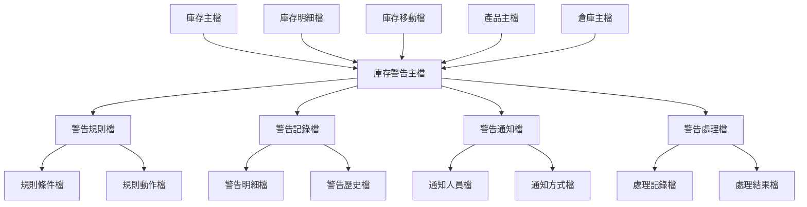
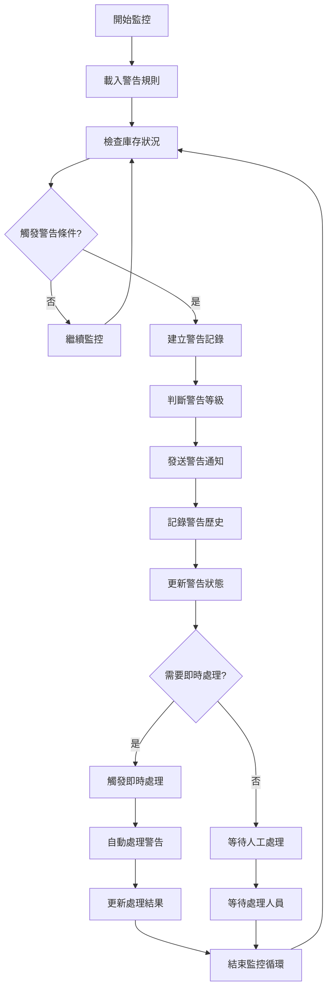
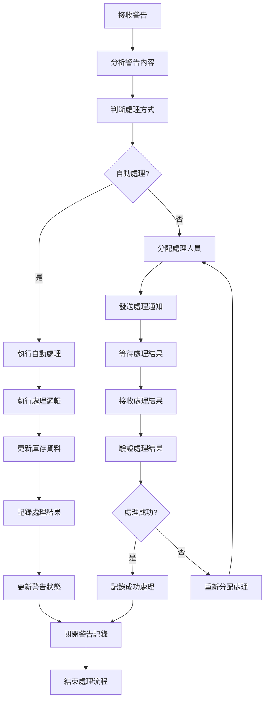
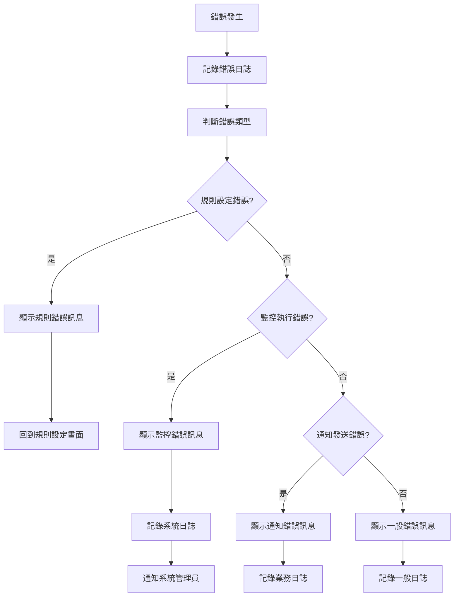

# 產品模組 程式功能規格書 - 庫存警告作業

## 文件基本資訊

| 項目 | 說明 |
|------|------|
| **文件名稱** | 產品模組程式功能規格書 - 庫存警告作業 |
| **模組代號** | PD |
| **版本** | v1.0 |
| **建立日期** | 2024年12月21日 |
| **建立人員** | 系統分析師 |
| **審核人員** | 專案經理 |
| **文件狀態** | 初稿 |
| **最後更新** | 2024年12月21日 |

---

## 目錄

1. [基本資料](#基本資料)
2. [檔案架構與關聯圖](#檔案架構與關聯圖)
3. [檔案名稱與欄位規格](#檔案名稱與欄位規格)
4. [輸出/入螢幕布局與說明](#輸出入螢幕布局與說明)
5. [處理流程程序說明](#處理流程程序說明)
6. [子程序處理邏輯說明](#子程序處理邏輯說明)
7. [錯誤處理程序說明與訊息清冊](#錯誤處理程序說明與訊息清冊)
8. [備註](#備註)
9. [附錄](#附錄)

---

## 基本資料

### 1.1 功能概述

庫存警告作業系統是產品模組庫存管理的重要監控功能，主要負責監控庫存狀況並及時發出各種警告訊息，包括庫存不足警告、庫存過剩警告、呆滯庫存警告、庫存異常警告等。系統透過設定警告規則、監控庫存變化、自動觸發警告機制，幫助企業及時發現庫存問題、預防庫存風險、優化庫存管理決策。

### 1.2 主要功能

- **庫存不足警告**：監控庫存數量低於安全庫存線的產品，及時發出補貨警告
- **庫存過剩警告**：監控庫存數量超過最大庫存線的產品，避免庫存積壓
- **呆滯庫存警告**：識別長期未動用的庫存項目，提醒處理呆滯庫存
- **庫存異常警告**：監控庫存異常變動，識別可能的庫存問題
- **警告規則管理**：設定和管理各種庫存警告的觸發條件和閾值
- **警告通知管理**：管理警告通知的發送方式、接收人員、通知頻率

### 1.3 技術架構

- **開發語言**：RPG、CL、SQL
- **資料庫**：DB2 for i (IBM i)
- **警告引擎**：規則引擎、事件驅動架構
- **通知系統**：電子郵件、簡訊、系統訊息、推播通知
- **部署環境**：IBM i 7.4

---

## 檔案架構與關聯圖

### 2.1 檔案架構圖



### 2.2 檔案關聯說明

| 主檔 | 關聯檔 | 關聯類型 | 關聯說明 |
|------|--------|----------|----------|
| **庫存主檔(INV)** | 庫存警告主檔(INVW) | 1:1 | 一個庫存記錄對應一個警告主檔記錄 |
| **庫存明細檔(INVD)** | 庫存警告主檔(INVW) | 1:N | 多個明細記錄觸發警告 |
| **庫存移動檔(INVM)** | 庫存警告主檔(INVW) | 1:N | 多個移動記錄觸發警告 |
| **庫存警告主檔(INVW)** | 警告規則檔(INVW1) | 1:N | 一個警告可有多個規則 |
| **庫存警告主檔(INVW)** | 警告記錄檔(INVW2) | 1:N | 一個警告可有多個記錄 |

---

## 檔案名稱與欄位規格

### 3.1 庫存警告主檔 (INVW)

#### 3.1.1 檔案基本資訊

| 項目 | 說明 |
|------|------|
| **檔案名稱** | 庫存警告主檔 |
| **檔案代號** | INVW |
| **檔案描述** | 儲存庫存警告相關資訊的主檔 |
| **檔案類型** | 主檔 |
| **檔案大小** | 約 600MB |
| **記錄筆數** | 約 60,000 筆 |

#### 3.1.2 欄位規格

| 欄位代號 | 欄位名稱 | 位置 | 長度 | 型態 | 屬性 | 檢核說明 |
|----------|----------|------|------|------|------|----------|
| **INVWID** | 警告編號 | 1-20 | 20 | A | PK | 主鍵，不可重複 |
| **INVWPD** | 產品編號 | 21-40 | 20 | A | M | 必填，需存在於產品主檔 |
| **INVWWH** | 倉庫代號 | 41-60 | 20 | A | M | 必填，需存在於倉庫主檔 |
| **INVWTY** | 警告類型 | 61-80 | 20 | A | M | 必填，不足/過剩/呆滯/異常 |
| **INVWST** | 警告狀態 | 81-90 | 10 | A | M | 必填，未處理/處理中/已處理/已關閉 |
| **INVWLV** | 警告等級 | 91-100 | 10 | A | M | 必填，高/中/低 |
| **INVWCR** | 建立人員 | 101-120 | 20 | A | M | 必填，系統自動填入 |
| **INVWCD** | 建立日期 | 121-130 | 10 | D | M | 必填，系統自動填入 |
| **INVWTM** | 建立時間 | 131-140 | 10 | T | M | 必填，系統自動填入 |
| **INVWDS** | 警告描述 | 141-240 | 100 | A | O | 可選填，警告詳細描述 |

### 3.2 警告規則檔 (INVW1)

#### 3.2.1 檔案基本資訊

| 項目 | 說明 |
|------|------|
| **檔案名稱** | 警告規則檔 |
| **檔案代號** | INVW1 |
| **檔案描述** | 儲存庫存警告規則的檔案 |
| **檔案類型** | 明細檔 |
| **檔案大小** | 約 400MB |
| **記錄筆數** | 約 100,000 筆 |

#### 3.2.2 欄位規格

| 欄位代號 | 欄位名稱 | 位置 | 長度 | 型態 | 屬性 | 檢核說明 |
|----------|----------|------|------|------|------|----------|
| **INVW1ID** | 規則編號 | 1-20 | 20 | A | PK | 主鍵，不可重複 |
| **INVW1TY** | 規則類型 | 21-40 | 20 | A | M | 必填，不足/過剩/呆滯/異常 |
| **INVW1PD** | 產品編號 | 41-60 | 20 | A | O | 可選填，特定產品規則 |
| **INVW1WH** | 倉庫代號 | 61-80 | 20 | A | O | 可選填，特定倉庫規則 |
| **INVW1CD** | 條件欄位 | 81-130 | 50 | A | M | 必填，觸發條件的欄位名稱 |
| **INVW1OP** | 運算符號 | 131-150 | 20 | A | M | 必填，大於/小於/等於/不等於 |
| **INVW1VL** | 條件值 | 151-250 | 100 | A | M | 必填，觸發條件的值 |
| **INVW1AC** | 動作類型 | 251-270 | 20 | A | M | 必填，通知/記錄/處理/關閉 |
| **INVW1ST** | 規則狀態 | 271-280 | 10 | A | M | 必填，啟用/停用 |
| **INVW1CR** | 建立人員 | 281-300 | 20 | A | M | 必填，系統自動填入 |
| **INVW1CD** | 建立日期 | 301-310 | 10 | D | M | 必填，系統自動填入 |

### 3.3 警告記錄檔 (INVW2)

#### 3.3.1 檔案基本資訊

| 項目 | 說明 |
|------|------|
| **檔案名稱** | 警告記錄檔 |
| **檔案代號** | INVW2 |
| **檔案描述** | 儲存庫存警告觸發記錄的檔案 |
| **檔案類型** | 明細檔 |
| **檔案大小** | 約 2GB |
| **記錄筆數** | 約 500,000 筆 |

#### 3.3.2 欄位規格

| 欄位代號 | 欄位名稱 | 位置 | 長度 | 型態 | 屬性 | 檢核說明 |
|----------|----------|------|------|------|------|----------|
| **INVW2ID** | 記錄編號 | 1-20 | 20 | A | PK | 主鍵，不可重複 |
| **INVW2IN** | 警告編號 | 21-40 | 20 | A | M | 必填，需存在於警告主檔 |
| **INVW2RU** | 規則編號 | 41-60 | 20 | A | M | 必填，觸發的規則編號 |
| **INVW2DT** | 觸發日期 | 61-70 | 10 | D | M | 必填，日期格式 |
| **INVW2TM** | 觸發時間 | 71-80 | 10 | T | M | 必填，時間格式 |
| **INVW2QT** | 觸發數量 | 81-90 | 10 | N | M | 必填，觸發時的庫存數量 |
| **INVW2VA** | 觸發值 | 91-100 | 10 | N | M | 必填，觸發條件的實際值 |
| **INVW2ST** | 記錄狀態 | 101-110 | 10 | A | M | 必填，有效/無效/已處理 |
| **INVW2CR** | 建立人員 | 111-130 | 20 | A | M | 必填，系統自動填入 |
| **INVW2CD** | 建立日期 | 131-140 | 10 | D | M | 必填，系統自動填入 |

---

## 輸出/入螢幕布局與說明

### 4.1 庫存警告主畫面

#### 4.1.1 畫面布局

```
┌─────────────────────────────────────────────────────────────┐
│                    庫存警告作業系統                          │
├─────────────────────────────────────────────────────────────┤
│ 警告類型選擇：                                              │
│  [1]警告規則管理  [2]警告監控作業  [3]警告處理作業          │
│  [4]警告通知管理  [5]警告報表作業  [6]警告設定作業          │
│  [7]警告歷史查詢  [8]警告統計分析  [9]系統參數設定          │
│  [0]離開系統                                                │
├─────────────────────────────────────────────────────────────┤
│ 快速監控：                                                  │
│  產品編號：[PD20241221001    ] [監控]                       │
│  倉庫代號：[WH001           ] [監控]                       │
│  警告類型：[全部 ▼] [監控]                                  │
├─────────────────────────────────────────────────────────────┤
│ 系統狀態：                                                  │
│  今日警告數：[45] 未處理警告：[12] 處理中警告：[8]          │
│  最後更新：[2024/12/21 14:30:00] 更新人員：[ADMIN]         │
├─────────────────────────────────────────────────────────────┤
│ 功能鍵：F1=說明  F3=離開  F4=監控  F6=新增  F8=修改  F12=取消│
└─────────────────────────────────────────────────────────────┘
```

#### 4.1.2 功能選項說明

| 選項 | 功能說明 |
|------|----------|
| **1** | 警告規則管理：設定和管理各種庫存警告的觸發條件和閾值 |
| **2** | 警告監控作業：即時監控庫存狀況，自動觸發警告 |
| **3** | 警告處理作業：處理已觸發的警告，記錄處理結果 |
| **4** | 警告通知管理：管理警告通知的發送方式、接收人員、通知頻率 |
| **5** | 警告報表作業：產生各種警告報表和統計分析 |
| **6** | 警告設定作業：設定警告系統的各種參數和配置 |
| **7** | 警告歷史查詢：查詢歷史警告記錄和處理狀況 |
| **8** | 警告統計分析：分析警告趨勢、頻率、處理效率等 |
| **9** | 系統參數設定：設定警告系統的技術參數和配置 |
| **0** | 離開系統 |

### 4.2 警告監控作業畫面

#### 4.2.1 畫面布局

```
┌─────────────────────────────────────────────────────────────┐
│                      警告監控作業                            │
├─────────────────────────────────────────────────────────────┤
│ 監控條件：                                                  │
│  產品編號：[PD20241221001    ] [查詢] [清除]               │
│  倉庫代號：[WH001           ] [查詢] [清除]               │
│  警告類型：[全部 ▼] [監控]                                  │
│  警告等級：[全部 ▼] [監控]                                  │
│  監控狀態：[全部 ▼] [監控]                                  │
├─────────────────────────────────────────────────────────────┤
│ 即時監控結果：                                              │
│ ┌─────┬──────────┬──────────┬──────────┬──────────┬────────┐ │
│ │序號 │產品編號  │警告類型  │警告等級  │警告狀態  │觸發時間│ │
│ ├─────┼──────────┼──────────┼──────────┼──────────┼────────┤ │
│ │  1  │[        ] [        ] [        ] [        ] [        ] │ │
│ │  2  │[        ] [        ] [        ] [        ] [        ] │ │
│ └─────┴──────────┴──────────┴──────────┴──────────┴────────┘ │
│ 監控統計：總警告數：[45] 高級警告：[8] 中級警告：[25] 低級警告：[12] │
│ 監控摘要：庫存不足警告[15] 庫存過剩警告[12] 呆滯庫存警告[18] │
├─────────────────────────────────────────────────────────────┤
│ 功能鍵：F1=說明  F3=離開  F4=監控  F8=修改  F12=取消      │
│ 特殊功能：F5=重新整理  F6=即時監控  F7=警告處理  F9=匯出   │
└─────────────────────────────────────────────────────────────┘
```

#### 4.2.2 監控條件說明

| 欄位名稱 | 說明 | 格式要求 |
|----------|------|----------|
| **產品編號** | 要監控的產品編號 | 最多20個字元，支援精確查詢 |
| **倉庫代號** | 要監控的倉庫代號 | 最多20個字元，支援精確查詢 |
| **警告類型** | 要監控的警告類型 | 全部/不足/過剩/呆滯/異常 |
| **警告等級** | 要監控的警告等級 | 全部/高/中/低 |
| **監控狀態** | 要監控的警告狀態 | 全部/未處理/處理中/已處理/已關閉 |

---

## 處理流程程序說明

### 5.1 警告監控流程

#### 5.1.1 流程圖



#### 5.1.2 處理步驟說明

1. **開始監控**
   - 系統啟動庫存警告監控服務
   - 載入已設定的警告規則和參數

2. **載入警告規則**
   - 從警告規則檔載入所有啟用的規則
   - 按規則類型、產品、倉庫等進行分類

3. **檢查庫存狀況**
   - 定期檢查庫存主檔和明細檔的資料
   - 計算庫存數量、庫存價值、庫存週轉等指標

4. **觸發警告條件**
   - 將庫存狀況與警告規則進行比對
   - 判斷是否觸發警告條件

5. **建立警告記錄**
   - 在警告記錄檔中建立新的警告記錄
   - 記錄觸發時間、觸發條件、觸發值等資訊

6. **判斷警告等級**
   - 根據觸發條件的嚴重程度判斷警告等級
   - 設定為高、中、低三個等級

### 5.2 警告處理流程

#### 5.2.1 流程圖



#### 5.2.2 處理步驟說明

1. **接收警告**
   - 系統接收新觸發的警告訊息
   - 解析警告內容和相關資訊

2. **分析警告內容**
   - 分析警告類型、等級、觸發條件
   - 評估警告的緊急程度和影響範圍

3. **判斷處理方式**
   - 根據警告規則判斷是否需要自動處理
   - 設定處理優先級和時限

4. **執行自動處理**
   - 對於可自動處理的警告執行預設處理邏輯
   - 如自動補貨、自動調撥等

5. **分配處理人員**
   - 對於需要人工處理的警告分配給適當的處理人員
   - 發送處理通知和相關資料

---

## 子程序處理邏輯說明

### 6.1 警告觸發檢查子程序

#### 6.1.1 程序名稱
`CHKWARN` - 警告觸發檢查子程序

#### 6.1.2 處理邏輯

```rpg
// 警告觸發檢查邏輯
// 檢查庫存狀況是否觸發警告條件

DCLF FILE(INVW1) KEYED
DCLF FILE(INVW2) KEYED
DCL VAR(&PRODUCTID) TYPE(*CHAR) LEN(20)
DCL VAR(&WAREHOUSEID) TYPE(*CHAR) LEN(20)
DCL VAR(&INVQTY) TYPE(*PACKED) LEN(10 0)
DCL VAR(&WARNTRIGGERED) TYPE(*CHAR) LEN(1)
DCL VAR(&RULEID) TYPE(*CHAR) LEN(20)

// 初始化變數
CHGVAR VAR(&WARNTRIGGERED) VALUE('N')

// 讀取警告規則
SETLL ('') INVW1
READ INVW1
DO WHILE %EOF = *OFF
  // 檢查規則是否適用於當前產品和倉庫
  IF (&INVW1PD = '' OR &INVW1PD = &PRODUCTID) AND
     (&INVW1WH = '' OR &INVW1WH = &WAREHOUSEID) AND
     (&INVW1ST = '啟用')
    
    // 檢查警告條件
    IF &INVW1CD = '庫存數量'
      IF &INVW1OP = '小於' AND &INVQTY < &INVW1VL
        CHGVAR VAR(&WARNTRIGGERED) VALUE('Y')
        CHGVAR VAR(&RULEID) VALUE(&INVW1ID)
      ENDIF
      IF &INVW1OP = '大於' AND &INVQTY > &INVW1VL
        CHGVAR VAR(&WARNTRIGGERED) VALUE('Y')
        CHGVAR VAR(&RULEID) VALUE(&INVW1ID)
      ENDIF
    ENDIF
    
    // 檢查其他條件...
  ENDIF
  READ INVW1
ENDDO

// 如果觸發警告，建立警告記錄
IF &WARNTRIGGERED = 'Y'
  CALLSUBR SUBR(CREATEWARN) PARM(&PRODUCTID &WAREHOUSEID &RULEID)
ENDIF
```

#### 6.1.3 參數說明

| 參數名稱 | 型態 | 長度 | 說明 |
|----------|------|------|------|
| **&PRODUCTID** | *CHAR | 20 | 產品編號 |
| **&WAREHOUSEID** | *CHAR | 20 | 倉庫代號 |
| **&INVQTY** | *PACKED | 10,0 | 庫存數量 |
| **&WARNTRIGGERED** | *CHAR | 1 | 是否觸發警告 |
| **&RULEID** | *CHAR | 20 | 觸發的規則編號 |

### 6.2 警告等級判斷子程序

#### 6.2.1 程序名稱
`JUDGEWARNLVL` - 警告等級判斷子程序

#### 6.2.2 處理邏輯

```rpg
// 警告等級判斷邏輯
// 根據觸發條件判斷警告等級

DCL VAR(&WARNTYPE) TYPE(*CHAR) LEN(20)
DCL VAR(&TRIGGERVALUE) TYPE(*PACKED) LEN(10 0)
DCL VAR(&THRESHOLDVALUE) TYPE(*PACKED) LEN(10 0)
DCL VAR(&WARNLEVEL) TYPE(*CHAR) LEN(10)
DCL VAR(&DEVIATION) TYPE(*PACKED) LEN(8 2)

// 計算偏差程度
CHGVAR VAR(&DEVIATION) VALUE(0)
IF &THRESHOLDVALUE > 0
  CHGVAR VAR(&DEVIATION) VALUE((&TRIGGERVALUE - &THRESHOLDVALUE) / &THRESHOLDVALUE * 100)
ENDIF

// 根據警告類型和偏差程度判斷等級
SELECT
  WHEN &WARNTYPE = '庫存不足'
    IF &DEVIATION < -50
      CHGVAR VAR(&WARNLEVEL) VALUE('高')
    ELSE
      IF &DEVIATION < -20
        CHGVAR VAR(&WARNLEVEL) VALUE('中')
      ELSE
        CHGVAR VAR(&WARNLEVEL) VALUE('低')
      ENDIF
    ENDIF
    
  WHEN &WARNTYPE = '庫存過剩'
    IF &DEVIATION > 100
      CHGVAR VAR(&WARNLEVEL) VALUE('高')
    ELSE
      IF &DEVIATION > 50
        CHGVAR VAR(&WARNLEVEL) VALUE('中')
      ELSE
        CHGVAR VAR(&WARNLEVEL) VALUE('低')
      ENDIF
    ENDIF
    
  WHEN &WARNTYPE = '呆滯庫存'
    IF &TRIGGERVALUE > 365
      CHGVAR VAR(&WARNLEVEL) VALUE('高')
    ELSE
      IF &TRIGGERVALUE > 180
        CHGVAR VAR(&WARNLEVEL) VALUE('中')
      ELSE
        CHGVAR VAR(&WARNLEVEL) VALUE('低')
      ENDIF
    ENDIF
    
  OTHERWISE
    CHGVAR VAR(&WARNLEVEL) VALUE('中')
ENDSELECT
```

#### 6.2.3 參數說明

| 參數名稱 | 型態 | 長度 | 說明 |
|----------|------|------|------|
| **&WARNTYPE** | *CHAR | 20 | 警告類型 |
| **&TRIGGERVALUE** | *PACKED | 10,0 | 觸發值 |
| **&THRESHOLDVALUE** | *PACKED | 10,0 | 閾值 |
| **&WARNLEVEL** | *CHAR | 10 | 警告等級 |
| **&DEVIATION** | *PACKED | 8,2 | 偏差程度 |

---

## 錯誤處理程序說明與訊息清冊

### 7.1 錯誤處理流程

#### 7.1.1 錯誤處理流程圖



#### 7.1.2 錯誤處理原則

1. **錯誤預防優先**
   - 在規則設定時進行即時驗證
   - 提供清楚的錯誤提示訊息

2. **錯誤記錄完整**
   - 記錄錯誤發生的時間、位置、原因
   - 記錄錯誤發生時的警告條件

3. **錯誤恢復機制**
   - 提供錯誤修正的建議
   - 支援錯誤警告的重新處理

### 7.2 錯誤訊息清冊

#### 7.2.1 規則設定錯誤

| 錯誤代碼 | 錯誤訊息 | 錯誤原因 | 解決方法 |
|----------|----------|----------|----------|
| **INVW001** | 警告規則不能為空 | 必填規則條件未填寫 | 請輸入必要的規則條件 |
| **INVW002** | 產品編號不存在 | 產品編號無效 | 請檢查產品編號 |
| **INVW003** | 倉庫代號不存在 | 倉庫代號無效 | 請檢查倉庫代號 |
| **INVW004** | 條件值格式錯誤 | 條件值格式不符合要求 | 請檢查條件值格式 |
| **INVW005** | 運算符號不支援 | 選擇的運算符號不支援 | 請選擇支援的運算符號 |

#### 7.2.2 監控執行錯誤

| 錯誤代碼 | 錯誤訊息 | 錯誤原因 | 解決方法 |
|----------|----------|----------|----------|
| **INVW101** | 監控執行失敗 | 監控邏輯執行錯誤 | 請重新執行監控 |
| **INVW102** | 資料讀取失敗 | 庫存資料讀取錯誤 | 請檢查資料庫連線 |
| **INVW103** | 規則載入失敗 | 警告規則載入錯誤 | 請檢查規則設定 |
| **INVW104** | 監控權限不足 | 使用者監控權限不足 | 請聯繫系統管理員 |
| **INVW105** | 監控服務異常 | 監控服務執行異常 | 請聯繫系統管理員 |

#### 7.2.3 通知發送錯誤

| 錯誤代碼 | 錯誤訊息 | 錯誤原因 | 解決方法 |
|----------|----------|----------|----------|
| **INVW201** | 通知發送失敗 | 通知系統異常 | 請重新發送通知 |
| **INVW202** | 接收人員不存在 | 通知接收人員無效 | 請檢查接收人員設定 |
| **INVW203** | 通知方式不支援 | 選擇的通知方式不支援 | 請選擇支援的通知方式 |
| **INVW204** | 通知內容過長 | 通知內容超過限制 | 請縮短通知內容 |
| **INVW205** | 通知頻率過高 | 通知發送頻率過高 | 請調整通知頻率設定 |

---

## 備註

### 8.1 系統限制

1. **警告規則限制**
   - 單一產品最多支援20個警告規則
   - 單一倉庫最多支援50個警告規則
   - 警告條件值最大長度為100個字元

2. **警告記錄限制**
   - 單次監控最多產生1,000個警告記錄
   - 警告歷史記錄保留期限為5年

3. **監控頻率限制**
   - 即時監控最小間隔為30秒
   - 批次監控最小間隔為5分鐘

4. **通知發送限制**
   - 單一警告最多發送給20個接收人員
   - 單一接收人員每小時最多接收50個通知

### 8.2 效能考量

1. **監控優化**
   - 建議在常用監控欄位建立資料庫索引
   - 使用適當的監控條件減少資料掃描範圍

2. **快取機制**
   - 對常用的警告規則進行快取
   - 對監控結果進行快取

3. **監控分頁**
   - 大量警告記錄使用分頁顯示
   - 支援虛擬滾動提升顯示效能

### 8.3 安全性考量

1. **監控權限控制**
   - 根據使用者角色設定不同的監控權限
   - 記錄所有監控操作的日誌

2. **資料隱私保護**
   - 敏感資料監控需要額外授權
   - 監控結果中的敏感資訊進行遮罩處理

3. **監控審計**
   - 記錄所有監控條件的審計日誌
   - 定期分析異常監控行為

---

## 附錄

### A.1 相關文件清單

- 產品模組程式功能規格書 - 庫存管理
- 產品模組程式功能規格書 - 庫存分析作業
- 庫存警告作業操作手冊
- 警告規則設定規範
- 系統整合測試報告

### A.2 修訂記錄

| 版本 | 修訂日期 | 修訂人員 | 修訂內容 | 修訂原因 |
|------|----------|----------|----------|----------|
| v1.0 | 2024/12/21 | 系統分析師 | 初始版本建立 | 新功能開發 |

### A.3 聯絡資訊

- **專案經理**：[專案經理姓名]
- **系統分析師**：[系統分析師姓名]
- **技術支援**：[技術支援聯絡方式]
- **專案信箱**：[專案信箱地址]

### A.4 常用縮寫說明

| 縮寫 | 全名 | 說明 |
|------|------|------|
| **INVW** | Inventory Warning | 庫存警告 |
| **INVW1** | Inventory Warning Rule | 庫存警告規則 |
| **INVW2** | Inventory Warning Record | 庫存警告記錄 |
| **INV** | Inventory | 庫存 |
| **PD** | Product | 產品 |
| **WH** | Warehouse | 倉庫 |
| **ERP** | Enterprise Resource Planning | 企業資源規劃 |

### A.5 系統訊息代碼

| 訊息代碼 | 訊息內容 | 說明 |
|----------|----------|------|
| **INVW001** | 警告監控啟動成功 | 庫存警告監控已成功啟動 |
| **INVW002** | 警告規則已儲存 | 警告規則已成功儲存 |
| **INVW003** | 警告通知已發送 | 警告通知已成功發送 |
| **INVW004** | 警告處理完成 | 警告處理已完成 |
| **INVW005** | 警告狀態已更新 | 警告狀態已成功更新 |
| **INVW006** | 監控服務正常 | 監控服務運行正常 |
| **INVW007** | 警告統計完成 | 警告統計分析已完成 |
| **INVW008** | 警告報表已產生 | 警告報表已成功產生 |
| **INVW009** | 系統參數已設定 | 系統參數已成功設定 |
| **INVW010** | 監控快取已更新 | 監控快取已成功更新 |

### A.6 警告類型說明

#### A.6.1 庫存不足警告

| 警告條件 | 觸發時機 | 處理建議 |
|----------|----------|----------|
| **安全庫存線** | 庫存數量低於安全庫存線 | 立即補貨或調撥 |
| **最低庫存線** | 庫存數量低於最低庫存線 | 緊急補貨 |
| **零庫存** | 庫存數量為零 | 緊急處理，避免缺貨 |

#### A.6.2 庫存過剩警告

| 警告條件 | 觸發時機 | 處理建議 |
|----------|----------|----------|
| **最大庫存線** | 庫存數量超過最大庫存線 | 暫停採購，促銷出清 |
| **呆滯庫存線** | 庫存數量超過呆滯庫存線 | 分析原因，制定處理策略 |
| **資金佔用** | 庫存價值超過預算 | 檢討採購策略，控制庫存 |

### A.7 警告處理範例

#### A.7.1 庫存不足警告處理

| 序號 | 處理步驟 | 處理內容 | 處理結果 |
|------|----------|----------|----------|
| **1** | 接收警告 | 接收庫存不足警告通知 | 確認警告內容 |
| **2** | 分析狀況 | 分析庫存不足原因和影響 | 評估緊急程度 |
| **3** | 制定對策 | 制定補貨或調撥方案 | 確定處理方式 |
| **4** | 執行處理 | 執行補貨或調撥作業 | 更新庫存資料 |
| **5** | 驗證結果 | 驗證處理結果和效果 | 確認問題解決 |
| **6** | 記錄處理 | 記錄處理過程和結果 | 更新警告狀態 |

#### A.7.2 庫存過剩警告處理

| 序號 | 處理步驟 | 處理內容 | 處理結果 |
|------|----------|----------|----------|
| **1** | 接收警告 | 接收庫存過剩警告通知 | 確認警告內容 |
| **2** | 分析原因 | 分析庫存過剩原因 | 找出根本問題 |
| **3** | 制定策略 | 制定庫存消化策略 | 確定處理方向 |
| **4** | 執行措施 | 執行促銷、調撥等措施 | 減少庫存數量 |
| **5** | 檢討改進 | 檢討採購和庫存策略 | 預防再次發生 |
| **6** | 記錄總結 | 記錄處理經驗和教訓 | 更新處理記錄 |

### A.8 監控效能優化建議

#### A.8.1 資料庫索引建議

| 欄位名稱 | 索引類型 | 說明 |
|----------|----------|------|
| **產品編號** | 主鍵索引 | 產品編號是主鍵，自動建立索引 |
| **倉庫代號** | 單欄索引 | 常用於倉庫範圍監控 |
| **警告類型** | 單欄索引 | 常用於警告類型篩選 |
| **警告狀態** | 單欄索引 | 常用於警告狀態篩選 |
| **觸發日期** | 單欄索引 | 常用於時間範圍監控 |
| **產品編號+倉庫代號** | 複合索引 | 常用於產品和倉庫組合監控 |

#### A.8.2 監控算法優化建議

| 優化項目 | 建議內容 | 說明 |
|----------|----------|------|
| **規則快取** | 將常用規則載入記憶體 | 減少資料庫查詢次數 |
| **批次處理** | 使用批次處理減少系統負載 | 提升監控效率 |
| **非同步處理** | 使用非同步處理提升響應速度 | 改善使用者體驗 |
| **智慧觸發** | 根據歷史資料智慧觸發警告 | 減少誤報和漏報 |
| **優先級管理** | 根據警告等級設定處理優先級 | 提升處理效率 |
