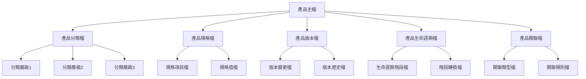
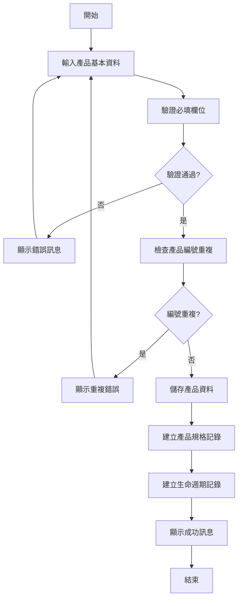
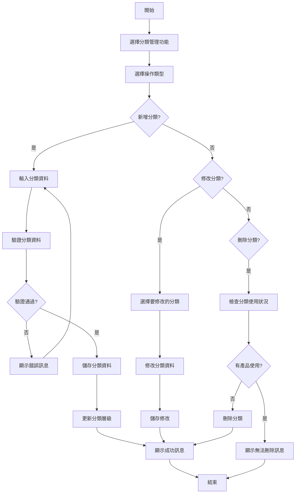
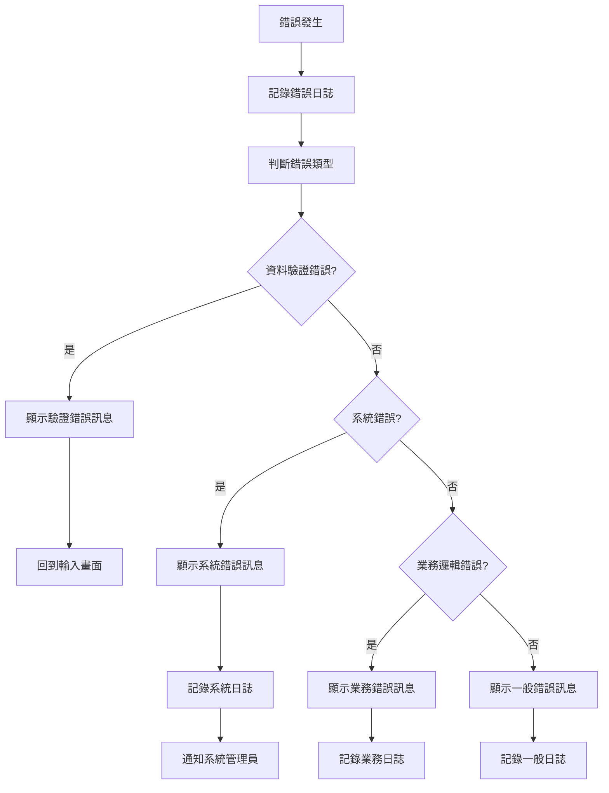
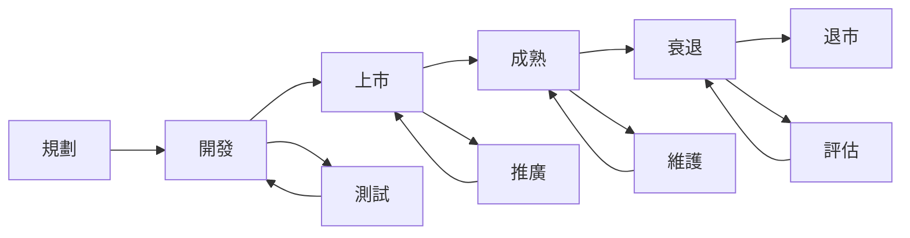

# 產品模組 程式功能規格書 - 產品管理

## 文件基本資訊

| 項目 | 說明 |
|------|------|
| **文件名稱** | 產品模組程式功能規格書 - 產品管理 |
| **模組代號** | PD |
| **版本** | v1.0 |
| **建立日期** | 2024年12月21日 |
| **建立人員** | 系統分析師 |
| **審核人員** | 專案經理 |
| **文件狀態** | 初稿 |
| **最後更新** | 2024年12月21日 |

---

## 目錄

1. [基本資料](#基本資料)
2. [檔案架構與關聯圖](#檔案架構與關聯圖)
3. [檔案名稱與欄位規格](#檔案名稱與欄位規格)
4. [輸出/入螢幕布局與說明](#輸出入螢幕布局與說明)
5. [處理流程程序說明](#處理流程程序說明)
6. [子程序處理邏輯說明](#子程序處理邏輯說明)
7. [錯誤處理程序說明與訊息清冊](#錯誤處理程序說明與訊息清冊)
8. [備註](#備註)
9. [附錄](#附錄)

---

## 基本資料

### 1.1 功能概述

產品管理系統是企業資源規劃(ERP)系統的核心模組之一，主要負責管理企業的產品資訊、產品分類、產品規格、產品生命週期等業務。系統提供完整的產品生命週期管理，從產品規劃、設計、開發、上市到退市的全程追蹤。

### 1.2 主要功能

- **產品資訊管理**：管理產品基本資訊、規格、屬性
- **產品分類管理**：管理產品分類體系、層級結構
- **產品規格管理**：管理產品技術規格、參數設定
- **產品生命週期管理**：追蹤產品從規劃到退市的全程
- **產品版本管理**：管理產品版本更新、變更記錄
- **產品關聯管理**：管理產品間的關聯關係

### 1.3 技術架構

- **開發語言**：RPG、CL、SQL
- **資料庫**：DB2 for i (IBM i)
- **開發環境**：IBM i
- **報表工具**：IBM Cognos、Crystal Reports
- **部署環境**：IBM i 7.4

---

## 檔案架構與關聯圖

### 2.1 檔案架構圖



### 2.2 檔案關聯說明

| 主檔 | 關聯檔 | 關聯類型 | 關聯說明 |
|------|--------|----------|----------|
| **產品主檔(PD)** | 產品分類檔(PDC) | 1:N | 一個產品可屬於多個分類 |
| **產品主檔(PD)** | 產品規格檔(PDS) | 1:N | 一個產品可有多個規格項目 |
| **產品主檔(PD)** | 產品版本檔(PDV) | 1:N | 一個產品可有多個版本 |
| **產品主檔(PD)** | 產品生命週期檔(PDL) | 1:1 | 一個產品對應一個生命週期狀態 |
| **產品主檔(PD)** | 產品關聯檔(PDR) | M:N | 產品間可建立多對多關聯關係 |

---

## 檔案名稱與欄位規格

### 3.1 產品主檔 (PD)

#### 3.1.1 檔案基本資訊

| 項目 | 說明 |
|------|------|
| **檔案名稱** | 產品主檔 |
| **檔案代號** | PD |
| **檔案描述** | 儲存產品基本資訊的主檔 |
| **檔案類型** | 主檔 |
| **檔案大小** | 約 2GB |
| **記錄筆數** | 約 100,000 筆 |

#### 3.1.2 欄位規格

| 欄位代號 | 欄位名稱 | 位置 | 長度 | 型態 | 屬性 | 檢核說明 |
|----------|----------|------|------|------|------|----------|
| **PDID** | 產品編號 | 1-20 | 20 | A | PK | 主鍵，不可重複 |
| **PDNM** | 產品名稱 | 21-70 | 50 | A | M | 必填，不可為空 |
| **PDDS** | 產品描述 | 71-270 | 200 | A | O | 可選填 |
| **PDCT** | 產品分類 | 271-290 | 20 | A | M | 必填，需存在於分類檔 |
| **PDST** | 產品狀態 | 291-300 | 10 | A | M | 必填，啟用/停用/開發中 |
| **PDTP** | 產品類型 | 301-320 | 20 | A | M | 必填，實體/數位/服務 |
| **PDBR** | 品牌 | 321-350 | 30 | A | O | 可選填 |
| **PDMD** | 型號 | 351-380 | 30 | A | O | 可選填 |
| **PDSP** | 規格 | 381-430 | 50 | A | O | 可選填 |
| **PDUN** | 單位 | 431-450 | 20 | A | M | 必填，個/件/套等 |
| **PDCR** | 建立人員 | 451-470 | 20 | A | M | 必填，系統自動填入 |
| **PDCD** | 建立日期 | 471-480 | 10 | D | M | 必填，系統自動填入 |
| **PDUR** | 更新人員 | 481-500 | 20 | A | O | 可選填 |
| **PDUD** | 更新日期 | 501-510 | 10 | D | O | 可選填 |
| **PDVR** | 版本號 | 511-520 | 10 | A | M | 必填，預設1.0 |
| **PDLC** | 生命週期 | 521-530 | 10 | A | M | 必填，規劃/開發/上市/成熟/衰退/退市 |

### 3.2 產品分類檔 (PDC)

#### 3.2.1 檔案基本資訊

| 項目 | 說明 |
|------|------|
| **檔案名稱** | 產品分類檔 |
| **檔案代號** | PDC |
| **檔案描述** | 儲存產品分類資訊 |
| **檔案類型** | 主檔 |
| **檔案大小** | 約 100MB |
| **記錄筆數** | 約 5,000 筆 |

#### 3.2.2 欄位規格

| 欄位代號 | 欄位名稱 | 位置 | 長度 | 型態 | 屬性 | 檢核說明 |
|----------|----------|------|------|------|------|----------|
| **PDCID** | 分類編號 | 1-20 | 20 | A | PK | 主鍵，不可重複 |
| **PDCNM** | 分類名稱 | 21-70 | 50 | A | M | 必填，不可為空 |
| **PDCPR** | 父分類編號 | 71-90 | 20 | A | O | 可選填，建立層級結構 |
| **PDCLV** | 分類層級 | 91-100 | 10 | N | M | 必填，1-5層 |
| **PDCDS** | 分類描述 | 101-300 | 200 | A | O | 可選填 |
| **PDCST** | 分類狀態 | 301-310 | 10 | A | M | 必填，啟用/停用 |
| **PDCSQ** | 排序順序 | 311-320 | 10 | N | M | 必填，數字排序 |
| **PDCCR** | 建立人員 | 321-340 | 20 | A | M | 必填，系統自動填入 |
| **PDCCD** | 建立日期 | 341-350 | 10 | D | M | 必填，系統自動填入 |

### 3.3 產品規格檔 (PDS)

#### 3.3.1 檔案基本資訊

| 項目 | 說明 |
|------|------|
| **檔案名稱** | 產品規格檔 |
| **檔案代號** | PDS |
| **檔案描述** | 儲存產品規格資訊 |
| **檔案類型** | 明細檔 |
| **檔案大小** | 約 500MB |
| **記錄筆數** | 約 200,000 筆 |

#### 3.3.2 欄位規格

| 欄位代號 | 欄位名稱 | 位置 | 長度 | 型態 | 屬性 | 檢核說明 |
|----------|----------|------|------|------|------|----------|
| **PDSID** | 規格編號 | 1-20 | 20 | A | PK | 主鍵，不可重複 |
| **PDSPD** | 產品編號 | 21-40 | 20 | A | M | 必填，需存在於產品主檔 |
| **PDSNM** | 規格名稱 | 41-90 | 50 | A | M | 必填，不可為空 |
| **PDSVL** | 規格值 | 91-190 | 100 | A | M | 必填，不可為空 |
| **PDSTP** | 規格類型 | 191-210 | 20 | A | M | 必填，文字/數字/日期/布林 |
| **PDSUN** | 規格單位 | 211-230 | 20 | A | O | 可選填 |
| **PDSST** | 規格狀態 | 231-240 | 10 | A | M | 必填，啟用/停用 |
| **PDSCR** | 建立人員 | 241-260 | 20 | A | M | 必填，系統自動填入 |
| **PDSCD** | 建立日期 | 261-270 | 10 | D | M | 必填，系統自動填入 |

---

## 輸出/入螢幕布局與說明

### 4.1 產品管理主畫面

#### 4.1.1 畫面布局

```
┌─────────────────────────────────────────────────────────────┐
│                    產品管理系統                              │
├─────────────────────────────────────────────────────────────┤
│ 功能選項：                                                  │
│  [1]產品資訊管理  [2]產品分類管理  [3]產品規格管理          │
│  [4]產品生命週期管理  [5]產品版本管理  [6]產品關聯管理      │
│  [7]產品查詢  [8]產品報表  [9]系統設定  [0]離開            │
├─────────────────────────────────────────────────────────────┤
│ 系統狀態：                                                  │
│  總產品數量：[15,234] 啟用產品：[12,567] 停用產品：[2,667]  │
│  開發中產品：[156] 上市產品：[11,234] 退市產品：[1,277]     │
│  最後更新：[2024/12/21 14:30:00] 更新人員：[ADMIN]         │
├─────────────────────────────────────────────────────────────┤
│ 快速功能：                                                  │
│  [新增產品] [產品查詢] [分類管理] [規格管理]                │
├─────────────────────────────────────────────────────────────┤
│ 功能鍵：F1=說明  F3=離開  F4=查詢  F6=新增  F8=修改  F12=取消│
└─────────────────────────────────────────────────────────────┘
```

#### 4.1.2 功能選項說明

| 選項 | 功能說明 |
|------|----------|
| **1** | 產品資訊管理：管理產品基本資訊 |
| **2** | 產品分類管理：管理產品分類體系 |
| **3** | 產品規格管理：管理產品技術規格 |
| **4** | 產品生命週期管理：追蹤產品生命週期 |
| **5** | 產品版本管理：管理產品版本更新 |
| **6** | 產品關聯管理：管理產品間關聯關係 |
| **7** | 產品查詢：查詢產品相關資訊 |
| **8** | 產品報表：產生產品相關報表 |
| **9** | 系統設定：設定產品管理相關參數 |
| **0** | 離開系統 |

### 4.2 產品資訊維護畫面

#### 4.2.1 畫面布局

```
┌─────────────────────────────────────────────────────────────┐
│                      產品資訊維護                            │
├─────────────────────────────────────────────────────────────┤
│ 產品基本資料：                                              │
│  產品編號：[PD20241221001    ] *必填                        │
│  產品名稱：[智慧型手機      ] *必填                        │
│  產品描述：[新一代智慧型手機  ]                             │
│  產品分類：[電子產品 ▼] [查詢] *必選                       │
│  產品狀態：[啟用 ▼] *必選                                   │
│  產品類型：[實體 ▼] *必選                                   │
│  品牌     ：[品牌名稱        ]                             │
│  型號     ：[產品型號        ]                             │
│  規格     ：[產品規格        ]                             │
│  單位     ：[個 ▼] *必選                                   │
│  版本號   ：[1.0            ] *必填                        │
│  生命週期：[上市 ▼] *必選                                   │
├─────────────────────────────────────────────────────────────┤
│ 功能鍵：F1=說明  F3=離開  F10=儲存  F12=取消              │
└─────────────────────────────────────────────────────────────┘
```

#### 4.2.2 必填欄位說明

| 欄位名稱 | 說明 | 格式要求 |
|----------|------|----------|
| **產品編號** | 產品的唯一識別碼 | 最多20個字元，不可重複 |
| **產品名稱** | 產品的中文名稱 | 最多50個字元 |
| **產品分類** | 產品所屬的分類 | 需選擇有效的分類 |
| **產品狀態** | 產品的當前狀態 | 啟用/停用/開發中 |
| **產品類型** | 產品的類型 | 實體/數位/服務 |
| **單位** | 產品的計量單位 | 個/件/套/台等 |
| **版本號** | 產品的版本號 | 格式：X.Y 或 X.Y.Z |
| **生命週期** | 產品的生命週期階段 | 規劃/開發/上市/成熟/衰退/退市 |

---

## 處理流程程序說明

### 5.1 產品新增流程

#### 5.1.1 流程圖



#### 5.1.2 處理步驟說明

1. **輸入產品基本資料**
   - 使用者輸入產品的基本資訊
   - 系統自動產生產品編號（可手動修改）

2. **驗證必填欄位**
   - 檢查所有必填欄位是否已填寫
   - 驗證資料格式是否正確

3. **檢查產品編號重複**
   - 查詢資料庫確認產品編號是否重複
   - 如重複則要求重新輸入

4. **儲存產品資料**
   - 將產品基本資料儲存到產品主檔
   - 記錄建立人員和建立時間

5. **建立相關記錄**
   - 建立產品規格記錄
   - 建立產品生命週期記錄

### 5.2 產品分類管理流程

#### 5.2.1 流程圖



#### 5.2.2 處理步驟說明

1. **新增分類**
   - 輸入分類名稱、描述等基本資料
   - 選擇父分類建立層級結構
   - 設定分類狀態和排序順序

2. **修改分類**
   - 選擇要修改的分類
   - 修改分類資料
   - 儲存修改內容

3. **刪除分類**
   - 檢查分類是否被產品使用
   - 如有產品使用則無法刪除
   - 如無產品使用則可刪除

---

## 子程序處理邏輯說明

### 6.1 產品編號產生子程序

#### 6.1.1 程序名稱
`GENPDID` - 產品編號產生子程序

#### 6.1.2 處理邏輯

```rpg
// 產品編號產生邏輯
// 格式：PD + YYYYMMDD + 序號(3位)
// 範例：PD20241221001

DCLF FILE(PD) KEYED
DCL VAR(&PDID) TYPE(*CHAR) LEN(20)
DCL VAR(&DATE) TYPE(*CHAR) LEN(8)
DCL VAR(&SEQ) TYPE(*PACKED) LEN(3 0)
DCL VAR(&TODAY) TYPE(*CHAR) LEN(8)

// 取得今天日期
CHGVAR VAR(&TODAY) VALUE(%CHAR(%DATE()))
CHGVAR VAR(&DATE) VALUE(%SUBSTR(&TODAY 1 8))

// 查詢今天已產生的序號
CHAIN (PDCD) PD
IF %FOUND
  CHGVAR VAR(&SEQ) VALUE(&SEQ + 1)
ELSE
  CHGVAR VAR(&SEQ) VALUE(1)
ENDIF

// 組合產品編號
CHGVAR VAR(&PDID) VALUE('PD' + &DATE + %CHAR(&SEQ))
```

#### 6.1.3 參數說明

| 參數名稱 | 型態 | 長度 | 說明 |
|----------|------|------|------|
| **&PDID** | *CHAR | 20 | 產生的產品編號 |
| **&DATE** | *CHAR | 8 | 當前日期 |
| **&SEQ** | *PACKED | 3,0 | 序號 |

### 6.2 產品分類層級更新子程序

#### 6.2.1 程序名稱
`UPDCATLV` - 產品分類層級更新子程序

#### 6.2.2 處理邏輯

```rpg
// 分類層級更新邏輯
// 根據父分類自動計算子分類的層級

DCLF FILE(PDC) KEYED
DCL VAR(&CATID) TYPE(*CHAR) LEN(20)
DCL VAR(&PARENT) TYPE(*CHAR) LEN(20)
DCL VAR(&LEVEL) TYPE(*PACKED) LEN(2 0)

// 取得分類資料
CHAIN (&CATID) PDC
IF %FOUND
  CHGVAR VAR(&PARENT) VALUE(&PDCPR)
  
  // 計算層級
  IF &PARENT = ' '
    CHGVAR VAR(&LEVEL) VALUE(1)
  ELSE
    // 遞迴計算父分類層級
    CALL PGM(UPDCATLV) PARM(&PARENT &LEVEL)
    CHGVAR VAR(&LEVEL) VALUE(&LEVEL + 1)
  ENDIF
  
  // 更新分類層級
  UPDATE PDC
  CHGVAR VAR(&PDCLV) VALUE(&LEVEL)
  ENDUPDATE
ENDIF
```

#### 6.2.3 參數說明

| 參數名稱 | 型態 | 長度 | 說明 |
|----------|------|------|------|
| **&CATID** | *CHAR | 20 | 分類編號 |
| **&PARENT** | *CHAR | 20 | 父分類編號 |
| **&LEVEL** | *PACKED | 2,0 | 分類層級 |

---

## 錯誤處理程序說明與訊息清冊

### 7.1 錯誤處理流程

#### 7.1.1 錯誤處理流程圖



#### 7.1.2 錯誤處理原則

1. **錯誤預防優先**
   - 在資料輸入時進行即時驗證
   - 提供清楚的錯誤提示訊息

2. **錯誤記錄完整**
   - 記錄錯誤發生的時間、位置、原因
   - 記錄錯誤發生時的系統狀態

3. **錯誤恢復機制**
   - 提供錯誤修正的建議
   - 支援錯誤操作的復原

### 7.2 錯誤訊息清冊

#### 7.2.1 資料驗證錯誤

| 錯誤代碼 | 錯誤訊息 | 錯誤原因 | 解決方法 |
|----------|----------|----------|----------|
| **PD001** | 產品編號不能為空 | 必填欄位未填寫 | 請輸入產品編號 |
| **PD002** | 產品名稱不能為空 | 必填欄位未填寫 | 請輸入產品名稱 |
| **PD003** | 產品編號已存在 | 產品編號重複 | 請使用不同的產品編號 |
| **PD004** | 產品分類不存在 | 選擇的分類無效 | 請選擇有效的產品分類 |
| **PD005** | 產品狀態無效 | 狀態值不正確 | 請選擇有效的產品狀態 |

#### 7.2.2 系統錯誤

| 錯誤代碼 | 錯誤訊息 | 錯誤原因 | 解決方法 |
|----------|----------|----------|----------|
| **PD101** | 資料庫連線失敗 | 資料庫服務異常 | 請聯繫系統管理員 |
| **PD102** | 檔案存取權限不足 | 使用者權限不足 | 請聯繫系統管理員 |
| **PD103** | 系統資源不足 | 記憶體或磁碟空間不足 | 請聯繫系統管理員 |
| **PD104** | 程式執行異常 | 程式邏輯錯誤 | 請聯繫系統管理員 |
| **PD105** | 網路連線異常 | 網路連線中斷 | 請檢查網路連線 |

#### 7.2.3 業務邏輯錯誤

| 錯誤代碼 | 錯誤訊息 | 錯誤原因 | 解決方法 |
|----------|----------|----------|----------|
| **PD201** | 無法刪除已使用的分類 | 分類下有產品資料 | 請先移除產品或變更分類 |
| **PD202** | 產品狀態變更失敗 | 狀態變更規則不符 | 請檢查狀態變更規則 |
| **PD203** | 產品版本更新失敗 | 版本號格式不正確 | 請使用正確的版本號格式 |
| **PD204** | 產品關聯建立失敗 | 關聯規則不符 | 請檢查關聯建立規則 |
| **PD205** | 生命週期轉換失敗 | 轉換條件不符 | 請檢查轉換條件 |

---

## 備註

### 8.1 系統限制

1. **產品編號長度限制**
   - 產品編號最大長度為20個字元
   - 建議使用有規律的編號格式

2. **分類層級限制**
   - 產品分類最多支援5層結構
   - 每層分類名稱最大長度為50個字元

3. **規格項目限制**
   - 每個產品最多可設定100個規格項目
   - 規格值最大長度為100個字元

4. **版本號格式限制**
   - 版本號格式：X.Y 或 X.Y.Z
   - X、Y、Z為數字，最大為999

### 8.2 效能考量

1. **資料庫索引**
   - 建議在產品編號、產品分類、產品狀態等欄位建立索引
   - 定期維護資料庫統計資訊

2. **查詢優化**
   - 使用適當的查詢條件減少資料掃描範圍
   - 避免在大量資料上進行模糊查詢

3. **快取機制**
   - 對常用的分類資料進行快取
   - 對產品基本資訊進行快取

### 8.3 安全性考量

1. **資料存取控制**
   - 根據使用者角色設定不同的存取權限
   - 記錄所有資料存取和修改的日誌

2. **資料完整性**
   - 使用資料庫約束確保資料完整性
   - 定期檢查資料一致性

3. **備份策略**
   - 定期備份產品相關資料
   - 建立資料恢復機制

---

## 附錄

### A.1 相關文件清單

- 產品模組操作手冊
- 產品分類管理規範
- 產品生命週期管理規範
- 產品規格管理規範
- 系統整合測試報告

### A.2 修訂記錄

| 版本 | 修訂日期 | 修訂人員 | 修訂內容 | 修訂原因 |
|------|----------|----------|----------|----------|
| v1.0 | 2024/12/21 | 系統分析師 | 初始版本建立 | 新功能開發 |

### A.3 聯絡資訊

- **專案經理**：[專案經理姓名]
- **系統分析師**：[系統分析師姓名]
- **技術支援**：[技術支援聯絡方式]
- **專案信箱**：[專案信箱地址]

### A.4 常用縮寫說明

| 縮寫 | 全名 | 說明 |
|------|------|------|
| **PD** | Product | 產品 |
| **PDC** | Product Category | 產品分類 |
| **PDS** | Product Specification | 產品規格 |
| **PDV** | Product Version | 產品版本 |
| **PDL** | Product Lifecycle | 產品生命週期 |
| **PDR** | Product Relation | 產品關聯 |
| **ERP** | Enterprise Resource Planning | 企業資源規劃 |

### A.5 系統訊息代碼

| 訊息代碼 | 訊息內容 | 說明 |
|----------|----------|------|
| **PD001** | 產品新增成功 | 產品資料已成功新增 |
| **PD002** | 產品修改成功 | 產品資料已成功修改 |
| **PD003** | 產品刪除成功 | 產品資料已成功刪除 |
| **PD004** | 分類新增成功 | 產品分類已成功新增 |
| **PD005** | 分類修改成功 | 產品分類已成功修改 |
| **PD006** | 分類刪除成功 | 產品分類已成功刪除 |
| **PD007** | 規格新增成功 | 產品規格已成功新增 |
| **PD008** | 規格修改成功 | 產品規格已成功修改 |
| **PD009** | 規格刪除成功 | 產品規格已成功刪除 |
| **PD010** | 生命週期更新成功 | 產品生命週期已成功更新 |

### A.6 產品生命週期流程圖

#### A.6.1 基本生命週期流程



#### A.6.2 狀態轉換規則

| 當前狀態 | 可轉換狀態 | 轉換條件 | 備註 |
|----------|------------|----------|------|
| **規劃** | 開發 | 產品規劃完成 | 需有完整的產品規劃文件 |
| **開發** | 測試 | 產品開發完成 | 需通過開發階段審查 |
| **測試** | 開發 | 測試發現問題 | 需修正問題後重新測試 |
| **測試** | 上市 | 測試通過 | 需通過品質審查 |
| **上市** | 推廣 | 產品正式銷售 | 需有銷售計畫 |
| **推廣** | 成熟 | 市場接受度高 | 需達到銷售目標 |
| **成熟** | 維護 | 產品穩定運行 | 需持續改進 |
| **成熟** | 衰退 | 市場需求下降 | 需分析市場趨勢 |
| **衰退** | 評估 | 銷售持續下滑 | 需評估產品前景 |
| **評估** | 退市 | 決定停止銷售 | 需有退市計畫 |
| **評估** | 成熟 | 產品仍有價值 | 需調整行銷策略 |

### A.7 產品分類結構範例

#### A.7.1 電子產品分類

```
電子產品
├── 電腦設備
│   ├── 桌上型電腦
│   ├── 筆記型電腦
│   ├── 平板電腦
│   └── 伺服器
├── 通訊設備
│   ├── 智慧型手機
│   ├── 傳統手機
│   ├── 平板手機
│   └── 通訊配件
├── 家電產品
│   ├── 廚房家電
│   ├── 清潔家電
│   ├── 個人護理
│   └── 娛樂家電
└── 辦公設備
    ├── 印表機
    ├── 掃描器
    ├── 投影機
    └── 辦公配件
```

#### A.7.2 軟體產品分類

```
軟體產品
├── 系統軟體
│   ├── 作業系統
│   ├── 驅動程式
│   ├── 系統工具
│   └── 安全軟體
├── 應用軟體
│   ├── 辦公軟體
│   ├── 設計軟體
│   ├── 開發工具
│   └── 多媒體軟體
├── 網路軟體
│   ├── 瀏覽器
│   ├── 通訊軟體
│   ├── 網路工具
│   └── 安全防護
└── 遊戲軟體
    ├── 動作遊戲
    ├── 策略遊戲
    ├── 角色扮演
    └── 休閒遊戲
```

### A.8 產品規格範例

#### A.8.1 智慧型手機規格

| 規格項目 | 規格值 | 單位 | 說明 |
|----------|--------|------|------|
| **螢幕尺寸** | 6.1 | 吋 | 對角線長度 |
| **螢幕解析度** | 2532x1170 | 像素 | 螢幕像素密度 |
| **處理器** | A15 Bionic | - | 晶片型號 |
| **記憶體** | 128 | GB | 儲存容量 |
| **電池容量** | 3240 | mAh | 電池容量 |
| **相機畫素** | 12 | MP | 主相機畫素 |
| **作業系統** | iOS 15 | - | 系統版本 |
| **重量** | 174 | 公克 | 產品重量 |
| **尺寸** | 146.7x71.5x7.65 | mm | 長x寬x高 |

#### A.8.2 筆記型電腦規格

| 規格項目 | 規格值 | 單位 | 說明 |
|----------|--------|------|------|
| **螢幕尺寸** | 15.6 | 吋 | 對角線長度 |
| **螢幕解析度** | 1920x1080 | 像素 | 螢幕像素密度 |
| **處理器** | Intel i7-1165G7 | - | 處理器型號 |
| **記憶體** | 16 | GB | 記憶體容量 |
| **硬碟容量** | 512 | GB | 固態硬碟容量 |
| **顯示卡** | Intel Iris Xe | - | 內建顯示卡 |
| **作業系統** | Windows 11 | - | 系統版本 |
| **重量** | 1.8 | 公斤 | 產品重量 |
| **電池續航** | 8 | 小時 | 電池使用時間 |
| **網路** | WiFi 6 | - | 無線網路標準 |
